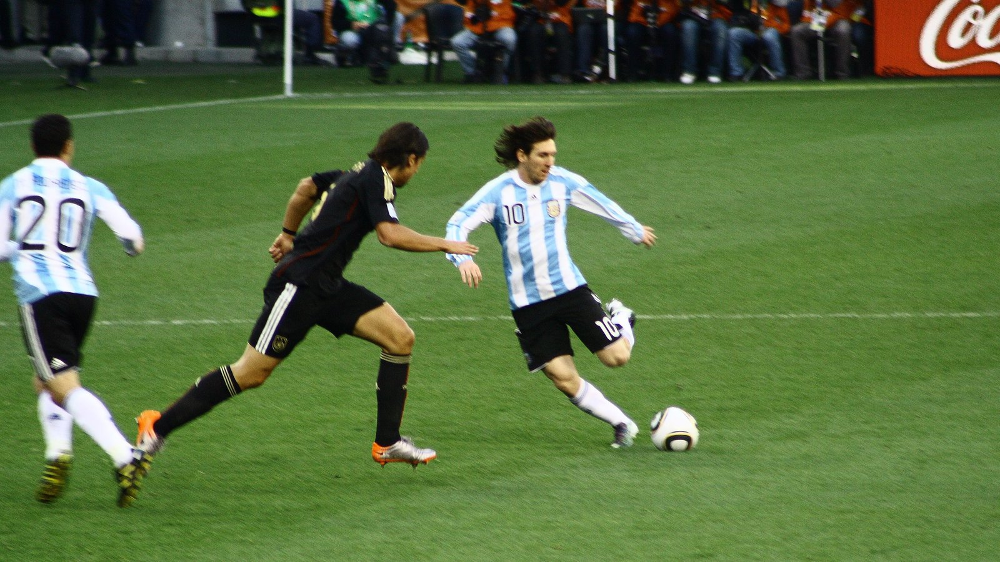

# Аргентина – Иордания 3:1: Месси установил рекорд и вывел команду в плей-офф с первого места

_Аргентина обыграла Иорданию 3:1 и выиграла группу J с максимумом очков. Лионель Месси забил со штрафного и стал первым в истории, кто отличался в семи матчах чемпионатов мира подряд._

- **type:** match_report  
- **category:** Отчёты о матчах  
- **slug:** argentina-3-1-jordan-messi-record-wc2026

---

Сборная Аргентины обыграла Иорданию со счётом 3:1 в заключительном матче группы J чемпионата мира 2026 и завершила групповой этап с идеальными девятью очками. Капитан действующих чемпионов мира Лионель Месси вышел на замену и установил новый рекорд турнира, отличившись со штрафного на 80-й минуте.

Встреча на «АТ&Т Стэдиум» в Арлингтоне (Даллас) собрала 70 649 зрителей. Аргентина контролировала игру с первых минут и повела уже к середине первого тайма.

## Ход матча: два мяча за полчаса

Счёт на 19-й минуте открыл Джовани Ло Чельсо, исполнивший точный штрафной удар. На 31-й минуте преимущество удвоил Лаутаро Мартинес, реализовав пенальти, назначенный после фола на Маркосе Сенеси. К перерыву аргентинцы вели 2:0.

После перерыва Иордания сократила отставание: на 55-й минуте отличился Мусa Ат-Тамари, у которого это был один из немногих по-настоящему острых моментов сборной. Однако точку в матче поставил Месси.

| Минута | Команда | Автор гола | Счёт |
|--------|---------|-----------|------|
| 19' | Аргентина | Джовани Ло Чельсо | 0:1 |
| 31' | Аргентина | Лаутаро Мартинес (пен.) | 0:2 |
| 55' | Иордания | Муса Ат-Тамари | 1:2 |
| 80' | Аргентина | Лионель Месси | 1:3 |

## Месси переписывает историю

Месси появился на поле примерно на 60-й минуте и спустя двадцать минут забил со штрафного. Это был его шестой гол на турнире и 19-й в карьере на чемпионатах мира – Месси остаётся лучшим бомбардиром в истории мировых первенств. Кроме того, аргентинец стал первым футболистом, забивавшим в семи матчах чемпионатов мира подряд.

Лучшим игроком встречи по версии Sportbox был признан Джовани Ло Чельсо, однако все заголовки после матча достались Месси.

## Что это значит

Аргентина уверенно выиграла группу J, одержав три победы в трёх матчах при разнице мячей 8:1. Иордания, дебютировавшая на чемпионатах мира, завершила турнир без очков и покинула его уже после группового этапа.

| Поз. | Команда | И | О | Разница |
|------|---------|---|---|---------|
| 1 | Аргентина | 3 | 9 | +7 |
| 2 | Австрия | 3 | 4 | 0 |
| 3 | Алжир | 3 | 4 | −2 |
| 4 | Иордания | 3 | 0 | −5 |

В 1/16 финала аргентинцев ждёт встреча со сборной-сенсацией Кабо-Верде – матч запланирован на 3 июля в Майами.

> По информации Sky Sports, Месси стал первым игроком, забивавшим в семи матчах чемпионатов мира подряд.

Источники: Sky Sports, Wikipedia, Sportbox.

---

**sources:**
- https://www.skysports.com/football/jordan-vs-argentina/report/549833
- https://en.wikipedia.org/wiki/2026_FIFA_World_Cup_Group_J
- https://news.sportbox.ru/Vidy_sporta/Futbol/spbnews_NI2339633_Sbornaja_Argentiny_obygrala_Iordaniju_Messi_zabil_svoj_19j_mach_na_chempionatah_mira
