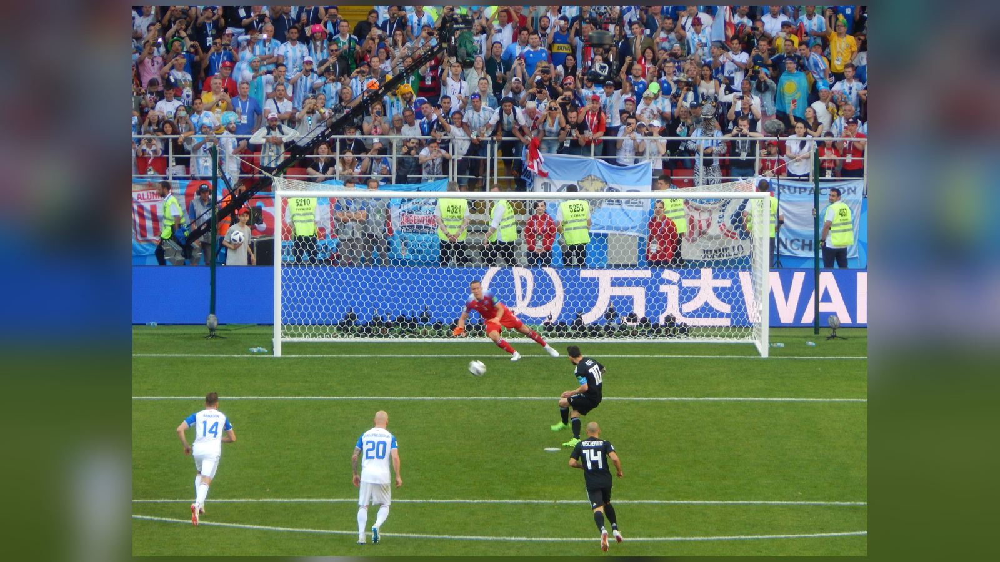

# Аргентина – Египет 3:2: Месси и Энцо Фернандес вырвали победу в концовке 1/8 финала ЧМ-2026

_Действующие чемпионы мира отыгрались со счёта 0:2 и обыграли Египет 3:2 в 1/8 финала ЧМ-2026: победный гол Энцо Фернандеса на 92-й минуте стал 3000-м в истории мировых первенств._

**Категория:** Отчёты о матчах | **Тип:** match_report | **source_type:** news

Действующие чемпионы мира сборная Аргентины вырвала победу над Египтом со счётом 3:2 в 1/8 финала чемпионата мира 2026 года на «Атланта Стэдиум», отыгравшись со счёта 0:2 в концовке матча. Победный гол Энцо Фернандеса на 92-й минуте увенчал один из самых поздних камбэков в истории мировых первенств и вывел «Альбиселесте» в четвертьфинал.

Ещё за десять минут до финального свистка казалось, что турнир преподнесёт очередную громкую сенсацию. Египет действовал дерзко, дисциплинированно и наказывал соперника за каждую ошибку, а Аргентина никак не могла найти ключи к плотной обороне африканцев. Но чемпионский характер и класс Лионеля Месси перевернули игру за считанные минуты.

## Египет шокировал фаворита

Африканская команда огорошила Аргентину уже на 15-й минуте: защитник Яссер Ибрахим первым оказался на добивании и открыл счёт. «Альбиселесте» имела шанс быстро отыграться ещё в первом тайме, однако Лионель Месси не реализовал пенальти – голкипер Мостафа Шобейр парировал удар капитана. Это был уже второй незабитый Месси пенальти на турнире, и промах словно придал египтянам уверенности.

После перерыва подопечные не сбавили оборотов. На 67-й минуте Египет удвоил преимущество усилиями Мостафы Зико, и над титулом чемпионов нависла реальная угроза досрочного вылета. Стоит напомнить, что и в 1/16 финала Аргентина испытала серьёзные проблемы, лишь на последних минутах выбив упорную Кабо-Верде, так что тревожные звоночки звучали для команды Лионеля Скалони не впервые.

## Камбэк за 13 минут

Перелом наступил на 79-й минуте, когда Кристиан Ромеро сократил отставание точным ударом головой после подачи со стандарта. Всего четыре минуты спустя Месси реабилитировался за незабитый пенальти: капитан хлёстко пробил из пределов штрафной и сравнял счёт – 2:2. «Атланта Стэдиум» взорвался, и инициатива окончательно перешла к южноамериканцам.

Развязка наступила в компенсированное время. На 92-й минуте (по таймингу – 91:55) Энцо Фернандес мощным ударом головой довершил великий камбэк. По данным Opta, этот мяч стал 3000-м голом в истории чемпионатов мира. Более того, Аргентина, уступавшая 0:2 вплоть до 78-й минуты, стала командой, отыгравшейся с наибольшим отставанием на столь позднем отрезке и победившей в основное время без овертайма.

## Статистика матча

| Показатель | Аргентина | Египет |
| --- | --- | --- |
| Итоговый счёт | 3 | 2 |
| Авторы голов | Ромеро (79'), Месси (83'), Э. Фернандес (92') | Я. Ибрахим (15'), Зико (67') |
| Нереализованные пенальти | Месси (1) | – |

## Месси – герой вечера

Лучшим игроком встречи заслуженно признан Лионель Месси. Вечер сложился для капитана Аргентины по-настоящему кинематографично: незабитый пенальти в первом тайме, гол, вернувший команду в игру, и результативная передача под решающий мяч Фернандеса. Именно Месси, лидер гонки бомбардиров турнира, снова стал тем, кто повёл чемпионов за собой в критический момент.

## Что дальше

В четвертьфинале Аргентину ждёт сборная Швейцарии, преодолевшая Колумбию в серии пенальти. Матч пройдёт 11 июля в Канзас-Сити на «Эрроухед Стэдиум». Для «Альбиселесте» это шанс продолжить защиту титула, однако египетский урок наверняка заставит Скалони серьёзно поработать над обороной и реализацией моментов.

> «Мы никогда не сдаёмся. Эта команда обладает характером чемпионов», – передаёт настроение в лагере Аргентины Sky Sports.

**Источники:** Sky Sports, ESPN, Opta Analyst.

---

**Sources:**
- https://www.skysports.com/football/news/11095/13560515/world-cup-2026-argentina-3-2-egypt-lionel-messi-and-holders-come-from-two-down-as-enzo-fernandez-wins-classic
- https://www.espn.com/soccer/match/_/gameId/760509/egypt-argentina
- https://theanalyst.com/articles/argentina-vs-egypt-stats-world-cup-2026
