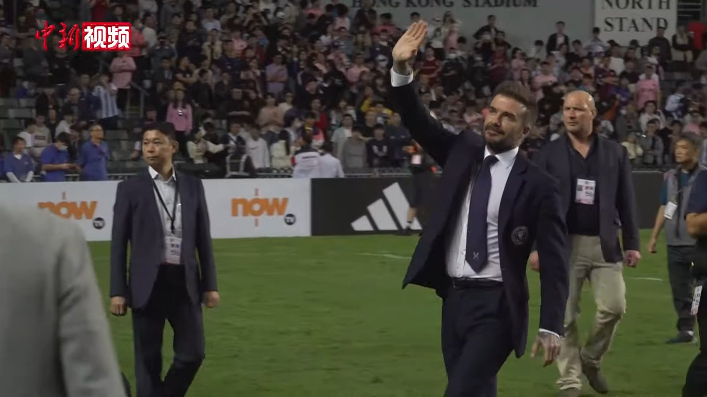

*Действующие чемпионы мира Аргентина с Лионелем Месси встречаются с Египтом Мохамеда Салаха в 1/8 финала ЧМ-2026 в Атланте – на кону путёвка в четвертьфинал.*

**Аргентина и Египет сыграют в 1/8 финала чемпионата мира 2026 во вторник, 7 июля, на «Мерседес-Бенц Стэдиум» в Атланте** – и в центре внимания противостояние двух звёзд, Лионеля Месси и Мохамеда Салаха. Начало встречи – в 12:00 по времени восточного побережья США, победитель выходит в четвертьфинал.

## Месси в ударе

Лионель Месси подходит к матчу в статусе одного из лидеров гонки бомбардиров: у капитана Аргентины семь мячей на турнире. По данным Al Jazeera, он довёл личный рекорд результативности на чемпионатах мира до 20 голов и стал первым игроком, забивавшим на восьми чемпионатах мира подряд. В 1/8 финала действующие чемпионы вышли драматично – 3:2 после дополнительного времени против Кабо-Верде, где решающий автогол случился на 111-й минуте.

Для Аргентины эта встреча – ещё один шаг в защите титула, а для Месси, вероятно, один из последних больших матчей на мировых первенствах. В 1/16 финала «Альбиселесте» пришлось нелегко: команда была близка к сенсационному вылету, но всё же вырвала победу и прошла дальше, что лишь подчёркивает цену каждого матча в плей-офф.

## Египет и фактор Салаха

Для Египта это первый в истории матч плей-офф на чемпионатах мира: сборная дебютировала на мировых первенствах ещё в 1934 году, но до стадии на выбывание добралась впервые. Путёвку в 1/8 команда Хоссама Хассана добыла, обыграв Австралию по пенальти (4:2) после ничьей 1:1, – это уже стало историческим достижением для египетского футбола.

Мохамед Салах, по информации ESPN и Al Jazeera, справляется с повреждением задней поверхности бедра, но ожидается в стартовом составе. Именно капитан – главный созидатель египтян: по данным Al Jazeera, никто из вышедших в 1/8 финала не создал больше голевых моментов, чем Салах. От того, насколько свеж будет лидер «фараонов», во многом зависят шансы команды навязать чемпионам борьбу.

## Пути команд к 1/8 финала

| Сборная | Матч плей-офф (1/16) | Результат |
| --- | --- | --- |
| Аргентина | против Кабо-Верде | 3:2 (доп. время) |
| Египет | против Австралии | 1:1, пен. 4:2 |

## Прогноз

Аналитические модели отдают Аргентине заметное преимущество – около 75%, отмечает Al Jazeera. «Альбиселесте» на этом турнире выглядит одной из самых мощных команд, а Месси – в блестящей форме, поэтому вопрос скорее в том, насколько уверенной окажется победа, а не в том, кто пройдёт дальше. Тем не менее ранняя активность Египта, предупреждают аналитики, способна доставить действующим чемпионам неудобства в первые минуты. Победитель пары встретится в четвертьфинале (12 июля, Канзас-Сити) с сильнейшим в противостоянии Швейцария – Колумбия.

Источники: Al Jazeera, ESPN, Squawka.
