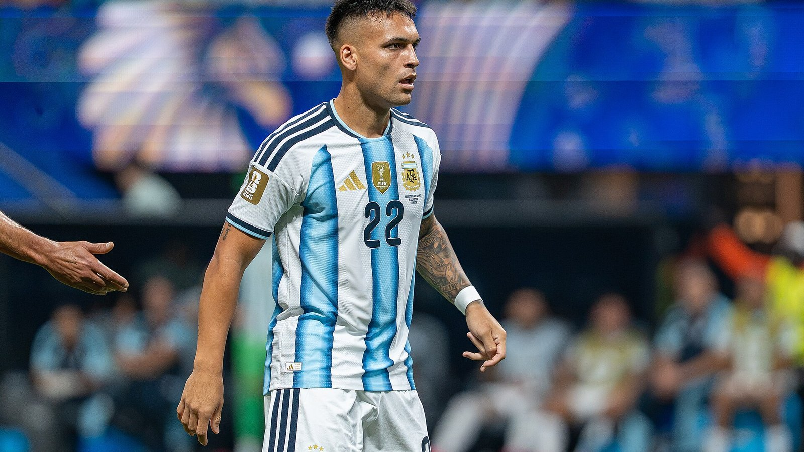

Сборная Аргентины обыграла Англию со счётом 2:1 в полуфинале чемпионата мира 2026 года и во второй раз подряд вышла в финал турнира. Оба мяча действующие чемпионы мира забили в концовке встречи, и оба – после передач Лионеля Месси. Матч прошёл 15 июля и стал одним из самых напряжённых на нынешнем мундиале.

Для Аргентины это уже второй финал чемпионата мира подряд: команда Лионеля Скалони защищает титул, завоёванный в 2022 году. Англия же снова остановилась в шаге от решающего матча – в последний раз «Три льва» играли в финале мирового первенства в далёком 1966 году.

## Осторожный первый тайм

Первый тайм получился вязким и осторожным: обе команды понимали цену ошибки на такой стадии и не спешили раскрываться. Англичане чаще владели мячом и территорию контролировали увереннее, но по-настоящему острых моментов создавали немного. Аргентина действовала в своей привычной манере плей-офф – отдавала инициативу сопернику и искала шансы в быстрых переходах через Месси и Хулиана Альвареса.

К перерыву счёт так и остался нулевым. Игра явно шла к тому, что решать её будет один эпизод – стандарт, индивидуальное мастерство или ошибка обороны.

## Гол Гордона и поздний штурм

Перелом наступил во втором тайме. На 55-й минуте вперёд вышла Англия: Морган Роджерс исполнил длинный навес с фланга, а Энтони Гордон точным ударом с лёта переправил мяч в сетку – 0:1. Команда Томаса Тухеля оказалась в 35 минутах от первого за 60 лет выхода в финал чемпионата мира, и на стадионе в Атланте запахло сенсацией.

Но чемпионы мира ответили так, как умеют только большие команды. Развязка получилась поздней, но неотразимой. На 85-й минуте Месси подал с фланга, и Энцо Фернандес головой сравнял счёт – 1:1. А уже в компенсированное время, на 90+2-й минуте, капитан вновь нашёл партнёра выверенной передачей: Лаутаро Мартинес замкнул прострел и вырвал для Аргентины победу – 2:1.

Сам Месси в этом матче не забивал, но стал автором двух голевых передач и главным творцом камбэка. По информации ESPN и Al Jazeera, оба гола аргентинцев были организованы именно навесами капитана – сначала на Фернандеса, затем на Мартинеса.

> «Аргентина вернулась в финал чемпионата мира после напряжённейшего полуфинала», – отмечает NPR в отчёте о матче.

## Статистика и герои

Ключевой фигурой встречи стал Месси: даже не отметившись голом, он оформил дубль из результативных передач и в очередной раз доказал, что способен решать судьбу матчей высшего уровня. Автором победного мяча стал Лаутаро Мартинес, а Энцо Фернандес перевёл игру в нужное русло своим точным ударом головой.

| Показатель | Аргентина | Англия |
|---|---|---|
| Итоговый счёт | 2 | 1 |
| Голы | Э. Фернандес (85'), Л. Мартинес (90+2') | Э. Гордон (55') |
| Голевые передачи | Месси (2) | М. Роджерс (1) |

## Что дальше

В финале ЧМ-2026, который состоится 19 июля на стадионе MetLife в Нью-Джерси, Аргентина сыграет против Испании – та накануне переиграла Францию со счётом 2:0. Для команды Скалони это шанс защитить чемпионский титул и повторить достижение великой аргентинской сборной 1980-х. Англия же проведёт матч за третье место против французов 18 июля в Майами.

## Значение результата

Выход в финал стал закономерным итогом турнирного пути Аргентины, которая на протяжении всего мундиаля демонстрировала характер и умение доводить сложные матчи до победы. Команда Скалони не всегда впечатляла содержанием игры, но раз за разом находила ресурсы в решающие моменты – во многом благодаря Месси, чья роль в структуре сборной остаётся определяющей даже спустя годы после первого чемпионского титула.

Полуфинал с Англией стал ещё одним подтверждением того, что опыт и хладнокровие на финише матчей – главное оружие действующих чемпионов мира. Аргентинцы уступали по ходу встречи, но не дрогнули и перевернули игру за последние пять минут. Для «Трёх львов» же поражение обернулось очередным разочарованием на большом турнире: команда снова была близка к финалу, но не сумела удержать добытое преимущество и рассыпалась в концовке.

Теперь Аргентину ждёт финал против Испании, а вместе с ним – возможность войти в историю в качестве команды, выигравшей два чемпионата мира подряд. Подобное удавалось лишь считанным сборным, и подопечные Скалони получили шанс пополнить этот элитный список.

Источники: Al Jazeera, ESPN, NPR.
