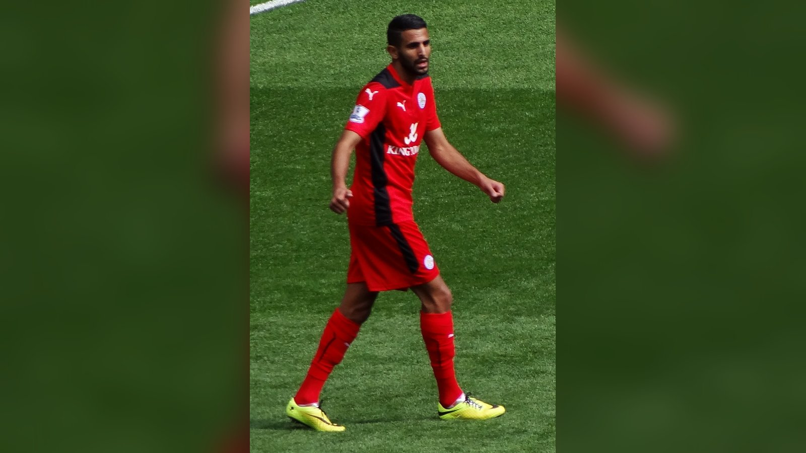

# Австрия – Алжир 3:3: безумная концовка вывела обе команды в плей-офф и выбила Иран

_Австрия и Алжир выдали триллер на шесть голов – 3:3. Гол Калайджича на 90+6-й минуте вывел в плей-офф обе сборные и оставил за бортом турнира Иран._

- **type:** match_report  
- **category:** Отчёты о матчах  
- **slug:** austria-3-3-algeria-thriller-iran-out-wc2026

---

Один из самых драматичных матчей группового этапа чемпионата мира 2026 завершился вничью: Австрия и Алжир забили на двоих шесть мячей – 3:3. Развязка на «Канзас-Сити Стэдиум» получилась невероятной: Алжир вышел вперёд на третьей добавленной минуте, но Австрия спаслась благодаря голу на 90+6-й. Этот результат вывел в плей-офф обе команды и одновременно отправил домой сборную Ирана.

## Шесть голов и сумасшедшая концовка

Австрия повела на 28-й минуте усилиями Марко Арнаутовича. Алжир сравнял счёт перед самым перерывом – отличился Рафик Бельгали (45'). Во втором тайме команды обменялись голами: Марсель Забитцер вернул австрийцам преимущество (55'), но Рияд Марез восстановил равновесие (60').

Когда казалось, что всё идёт к ничьей, Марез оформил дубль на 90+3-й минуте и вывел Алжир вперёд – 3:2. Однако вышедший на замену Саша Калайджич выиграл верховую борьбу и головой сравнял счёт на 90+6-й минуте – 3:3.

| Минута | Команда | Автор гола | Счёт |
|--------|---------|-----------|------|
| 28' | Австрия | Марко Арнаутович | 1:0 |
| 45' | Алжир | Рафик Бельгали | 1:1 |
| 55' | Австрия | Марсель Забитцер | 2:1 |
| 60' | Алжир | Рияд Марез | 2:2 |
| 90+3' | Алжир | Рияд Марез | 2:3 |
| 90+6' | Австрия | Саша Калайджич | 3:3 |

Лучшим игроком матча по версии «Чемпионата» был признан Рияд Марез, оформивший дубль.

## Как ничья изменила судьбу трёх сборных

Ничья устроила и Австрию, и Алжир. Австрия заняла второе место в группе J с четырьмя очками, опередив Алжир по разнице мячей; Алжир (тоже четыре очка) прошёл дальше как одна из лучших команд, занявших третьи места.

| Поз. | Команда | О | Разница |
|------|---------|---|---------|
| 1 | Аргентина | 9 | +7 |
| 2 | Австрия | 4 | 0 |
| 3 | Алжир | 4 | −2 |
| 4 | Иордания | 0 | −5 |

Главным проигравшим стала сборная Ирана, не игравшая в этот день. Гол Мареза на 90+3-й (3:2) по ходу матча отправлял Австрию домой и выводил Иран в число лучших третьих команд. Но поздний мяч Калайджича всё перевернул: ничья 3:3 спасла австрийцев, вывела в плей-офф Алжир и оставила Иран за бортом турнира, как отмечают ESPN и Yahoo Sports.

> По информации Yahoo Sports, безумная концовка матча Австрия – Алжир лишила Иран места в плей-офф.

Источники: Wikipedia, Fox Sports, Yahoo Sports, «Чемпионат».

---

**sources:**
- https://en.wikipedia.org/wiki/2026_FIFA_World_Cup_Group_J
- https://www.foxsports.com/stories/soccer/4-takeaways-from-wild-ending-between-austria-algeria-group-j-finale
- https://sports.yahoo.com/soccer/breaking-news/article/2026-world-cup-group-j-wild-austria-algeria-tie-locks-iran-out-of-knockout-rounds-040527645.html
- https://www.championat.com/football/article-6523942-alzhir-avstriya-3-3-obzor-matcha-3-go-tura-gruppy-j-chm-2026-goly-arnautovicha-belgali-zabitcera-mareza-28-iyunya-2026.html
