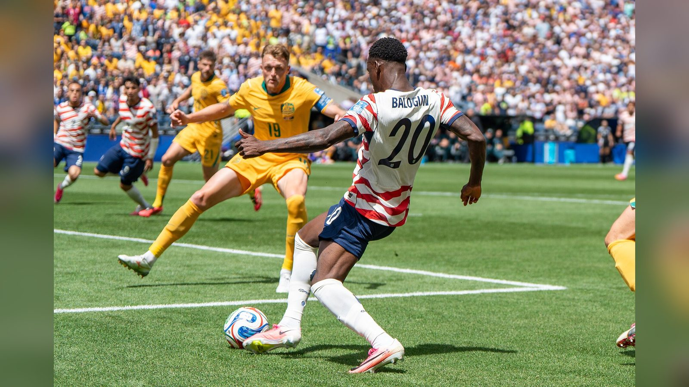

*Дисциплинарный комитет ФИФА снял дисквалификацию с форварда сборной США Фоларина Балогуна, а протест Бельгии признали неприемлемым – американец получил право сыграть в 1/8 финала ЧМ-2026.*

**Фоларин Балогун сыграет в матче 1/8 финала чемпионата мира 2026 против Бельгии:** Дисциплинарный комитет ФИФА снял с форварда сборной США дисквалификацию, а поданный бельгийской федерацией протест был отклонён как неприемлемый. Решение стало одной из главных околофутбольных новостей дня накануне матча плей-офф в Сиэтле и напрямую повлияло на расстановку сил в паре за выход в четвертьфинал.

## Что произошло

Нападающий сборной США, забивший на турнире три мяча, рисковал пропустить ключевую игру из-за наложенной ранее санкции. Однако Дисциплинарный комитет ФИФА постановил, что Балогун имеет право выйти на поле против Бельгии. Как сообщает CBS Sports, это открыло американцу дорогу в стартовый состав в матче за место в восьмёрке сильнейших – впервые с 2002 года сборная США претендует на выход в четвертьфинал чемпионата мира.

Возвращение форварда – заметное усиление атаки хозяев турнира. По данным CBS Sports, именно активность Балогуна в штрафной создаёт основную угрозу воротам соперника, и его отсутствие серьёзно ослабило бы американскую команду в игре на выбывание.

## Реакция Бельгии

Королевская бельгийская футбольная ассоциация (RBFA) осталась крайне недовольна решением и обратилась в Апелляционный комитет ФИФА, полагая, что дисквалификацию следовало сохранить. Но, как информирует NBC News, комитет признал обращение «неприемлемым на том основании, что RBFA не является стороной разбирательства и, соответственно, не имеет права на апелляцию».

Таким образом, формальные возможности бельгийской стороны оспорить допуск форварда оказались исчерпаны, и вопрос об участии Балогуна в матче был закрыт в его пользу.

> «Балогун забил на этом чемпионате три мяча, и его присутствие в атаке создаёт угрозу», – отмечает CBS Sports в материале о снятии дисквалификации.

## Что дальше

Матч США – Бельгия завершает программу 1/8 финала расширенного до 48 команд чемпионата мира. Победитель пары выйдет на соперника из противостояния Испания – Португалия и сыграет в четвертьфинале 10 июля в Лос-Анджелесе. Для сборной США, принимающей турнир вместе с Мексикой и Канадой, история с Балогуном стала одним из ключевых сюжетов плей-офф: команда сохранила своего лучшего бомбардира перед важнейшим матчем последних лет.

Источники: CBS Sports, NBC News.
