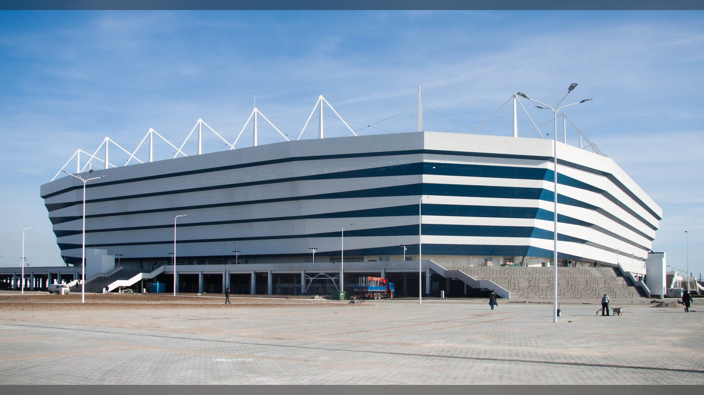

# «Балтика» обыграла московское «Динамо» 2:1 во 2-м туре РПЛ

> Калининградская «Балтика» дома переиграла московское «Динамо» со счётом 2:1 в матче 2-го тура РПЛ 2026/27. Победу хозяевам принесли голы во втором тайме.

**Категория:** Отчёты о матчах | **Тип:** match_report

Калининградская «Балтика» одержала домашнюю победу над московским «Динамо» со счётом 2:1 в матче 2-го тура Российской Премьер-лиги 2026/27. Встреча прошла 1 августа 2026 года на «Ростех Арене» в Калининграде и завершилась результативным вторым таймом, в котором и решилась судьба трёх очков.

## Ход матча
Первый тайм остался за оборонительными действиями обеих команд и голов зрителям не принёс. После перерыва инициативу перехватили хозяева. По данным «Чемпионата», на 57-й минуте счёт открыл полузащитник «Балтики» Титков, а на 75-й минуте калининградцы удвоили преимущество – точный удар с пенальти нанёс Хиль. Москвичи тут же ответили: на 76-й минуте один мяч отыграл Гомес, однако на большее гостей уже не хватило.

| Минута | Команда | Событие |
|---|---|---|
| 57' | «Балтика» | Гол – Титков |
| 75' | «Балтика» | Гол с пенальти – Хиль |
| 76' | «Динамо» (М) | Гол – Гомес |

## Ключевые факты матча

| Показатель | Значение |
|---|---|
| Турнир | РПЛ 2026/27, 2-й тур |
| Дата | 1 августа 2026 |
| Стадион | «Ростех Арена», Калининград |
| Итоговый счёт | «Балтика» 2:1 «Динамо» (М) |

## Что это значит
Победа во 2-м туре позволила «Балтике» набрать очки и закрепиться в верхней половине таблицы на старте сезона, тогда как для московского «Динамо» поражение стало неприятным сигналом: команда потеряла важные очки уже во втором матче чемпионата. Впереди у обоих клубов – продолжение затяжной дистанции РПЛ, где ранние осечки могут дорого стоить в борьбе за еврокубковую зону.

Отдельно стоит отметить домашнюю атмосферу в Калининграде: «Балтика», вернувшаяся в элиту, снова показала, что на своём поле способна огорчить более статусного соперника. Подробные протокол и статистика матча доступны на сайте «Чемпионата».

Источники: «Чемпионат», Sports.ru.

