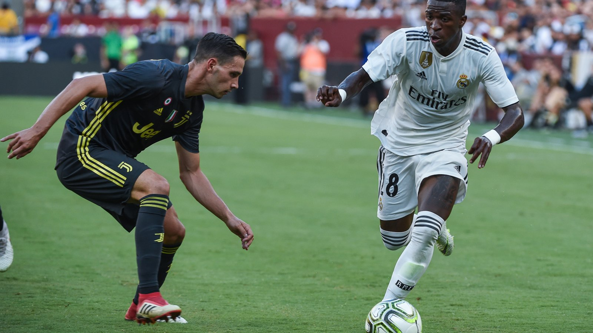

# Бразилия – Марокко: Анчелотти стартует на ЧМ-2026 без Неймара против обидчиков 2023 года

_Бразилия Карло Анчелотти стартует на ЧМ-2026 матчем группы C против Марокко – команды, которая три года назад впервые в истории обыграла «селесао». Превью, ключевые игроки и прогноз._

**type:** preview | **category:** ЧМ-2026 | **source_type:** news | **db_slug:** brazil-morocco-world-cup-2026-preview-group-c

Бразилия начинает чемпионат мира 2026 года матчем группы C против Марокко. Игра пройдёт на стадионе «МетЛайф» в Ист-Резерфорде (штат Нью-Джерси) и начнётся в 18:00 по времени Восточного побережья США 13 июня – то есть в ночь на 14 июня по времени Казахстана и Москвы. Это один из самых ожидаемых матчей стартового тура, и интрига здесь не только в статусе соперников.

## Что на кону

Для «селесао» это первый крупный турнир под руководством Карло Анчелотти. Бразилия не выигрывала чемпионат мира с 2002 года и приехала в Северную Америку с прицелом на рекордный шестой титул. Марокко же входит в число главных «тёмных лошадок»: на ЧМ-2022 в Катаре африканцы добрались до полуфинала, совершив исторический прорыв и став первой арабской и африканской командой, дошедшей до этой стадии.

| Параметр | Значение |
| --- | --- |
| Турнир | ЧМ-2026, группа C, 1-й тур |
| Стадион | «МетЛайф», Ист-Резерфорд (Нью-Джерси) |
| Начало | 13 июня, 18:00 ET (ночь на 14 июня по времени РК/МСК) |
| Главный арбитр | Славко Винчич (Словения) |

## Кадровые потери Бразилии

Анчелотти подходит к старту с ослабленным составом. По информации российских и зарубежных СМИ, сборная недосчитается ряда исполнителей из-за травм – под вопросом участие Неймара, а также называются имена Родриго и Эдера Милитао. Тем не менее атакующая обойма «селесао» остаётся одной из самых грозных на турнире: ключевые роли отводятся Винисиусу Жуниору и Рафинье, способным решить эпизод в одиночку. Анчелотти, имеющий богатый опыт работы со звёздами в «Реале», постарается выстроить игру вокруг скоростных флангов.

## Чем опасно Марокко

Марокко обладает по-настоящему сбалансированным составом. Лидеры команды – защитник Ашраф Хакими, полузащитник Брахим Диас и Нуссаир Мазрауи, выступающие за топовые европейские клубы. При этом и у африканцев есть проблемы в обороне, связанные с повреждением центрального защитника Найефа Агерда. Тренерский штаб Марокко делает ставку на дисциплину, плотную игру в центре поля и быстрые контратаки – именно за счёт этого команда добивалась громких результатов в последние годы.

| Команда | Ключевые игроки |
| --- | --- |
| Бразилия | Винисиус Жуниор, Рафинья, Каземиро |
| Марокко | Ашраф Хакими, Брахим Диас, Нуссаир Мазрауи |

## История встреч

У соперников есть свежий и крайне болезненный для бразильцев сюжет. В марте 2023 года в товарищеском матче в Танжере Марокко впервые в истории обыграло Бразилию – 2:1. Как сообщал Sky Sports, голы хозяев забили Софиан Буфаль и Абдельхамид Сабири, а единственный мяч «селесао» провёл Каземиро. Тогда марокканцы одержали первую в истории победу над пятикратными чемпионами мира, и теперь у Бразилии появляется возможность взять реванш на самой большой сцене.

## Прогноз

Несмотря на потери, Бразилия остаётся фаворитом по оценке экспертов и букмекеров: «селесао» превосходят соперника глубиной состава и качеством решений в финальной трети. Однако Марокко уже не раз доказывало, что способно удивлять грандов, поэтому ждать лёгкой прогулки не стоит. Наиболее вероятным выглядит упорный, плотный матч с минимальным преимуществом южноамериканцев – и любой результат здесь во многом определит расклад в группе C, где также играют Шотландия и Гаити.

Источники: ESPN, «Чемпионат», Sky Sports.

