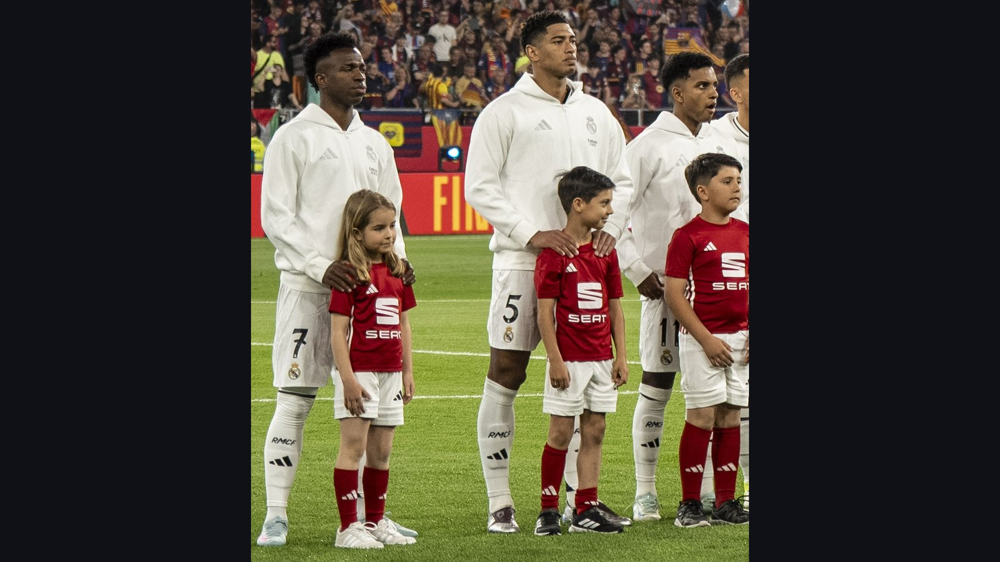

# Бразилия – Марокко: Анчелотти и Винисиус стартуют на ЧМ-2026 без Неймара

> В ночь с 13 на 14 июня по московскому времени Бразилия Карло Анчелотти стартует на ЧМ-2026 против Марокко на «MetLife Стэдиум». Винисиус готов вести атаку, но Неймар матч пропустит.

*Категория: ЧМ-2026 · Тип: preview · news*

Один из главных матчей стартового тура чемпионата мира 2026 года – **Бразилия** против **Марокко** на «MetLife Стэдиум» в Нью-Джерси (в ночь с 13 на 14 июня по московскому времени). Это дебют команды Карло Анчелотти на турнире и встреча двух очень разных по стилю, но амбициозных сборных в группе C.

## Бразилия: новый порядок Анчелотти

Под руководством Анчелотти Бразилия выглядит более структурированной и сбалансированной, чем импровизационные составы прошлых лет. По данным Sports Mole, итальянец делает ставку на прямой, атакующий футбол, а лидером и главной звездой остаётся Винисиус Жуниор в статусе одного из лучших игроков мира.

Главная потеря – Неймар: из-за травмы икроножной мышцы он пропустит матч открытия. Зато у Анчелотти приятная головная боль в нападении: за место в составе конкурируют Кунья и Эндрик, каждый из которых предлагает свой набор качеств.

## Марокко: без двух лидеров, но с Хакими

Марокко после исторического полуфинала 2022 года остаётся крепким и неуступчивым соперником, и в центре их игры – Ашраф Хакими. Однако накануне турнира марокканцы понесли потери: по информации ESPN, из-за повреждений выбыли защитник Найеф Агерд и форвард Абде Эззальзули, вместо которых в заявку вызваны Марван Саадане и Амин Сбаи.

| Команда | Тренер | Звезда | Контекст |
| --- | --- | --- | --- |
| Бразилия | Карло Анчелотти | Винисиус Жуниор | Без Неймара (травма) |
| Марокко | – | Ашраф Хакими | Без Агерда и Эззальзули |

## Контекст группы C и амбиции Бразилии

Помимо Марокко, в группе C выступают Шотландия и Гаити, но именно матч с африканцами считается главной проверкой для «селесао» на старте. Бразилия не выигрывала чемпионат мира с 2002 года – по меркам пятикратных чемпионов это настоящая засуха, и под руководством Анчелотти страна снова мечтает о шестом титуле. Для Марокко же, дошедшего в 2022 году до полуфинала, любой результат против Бразилии станет мощным заявлением.

## Прогноз

Аналитики Opta отдают Бразилии явное предпочтение: по их симуляциям, «селесао» выходят из группы C в 96,9% случаев и занимают первое место в 60,2%. Но Марокко – далеко не та команда, которую можно недооценивать: организованная оборона и скорость Хакими на фланге способны наказать бразильцев при первой же расслабленности. Даже без двух важных игроков африканцы остаются крайне неудобным соперником, поэтому старт обещает быть по-настоящему зрелищным.

> По информации ESPN, Неймар пропустит матч открытия из-за травмы икры, а Марокко выйдет на игру без Найефа Агерда и Абде Эззальзули.

**Источники:** ESPN, Sports Mole, The Analyst (Opta).
