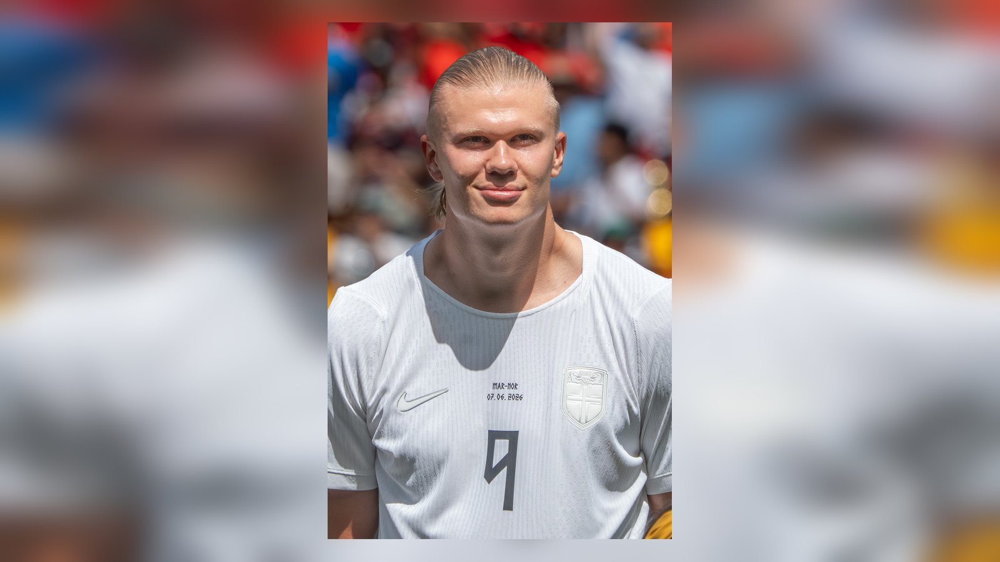

# Бразилия – Норвегия: превью матча 1/8 финала ЧМ-2026, Холанд против «селесао»

_5 июля на «МетЛайф Стэдиум» Бразилия Карло Анчелотти сыграет с Норвегией Эрлинга Холанда в 1/8 финала ЧМ-2026. Разбираем форму, ключевые дуэли и кадровые потери._

**Тип:** preview · **Категория:** ЧМ-2026 · **source_type:** news

Один из главных матчей 1/8 финала чемпионата мира 2026 пройдёт 5 июля на «МетЛайф Стэдиум» в Ист-Ратерфорде: пятикратные чемпионы мира из Бразилии сыграют против Норвегии Эрлинга Холанда. Это противостояние атакующей мощи «селесао» и лучшего бомбардира сборной скандинавов, к которому в регионе КЗ и СНГ приковано особое внимание – Холанд остаётся одной из самых узнаваемых звёзд мирового футбола.

Матч пройдёт на той же арене, что и финал турнира 19 июля, поэтому для обеих команд это ещё и возможность заранее почувствовать атмосферу решающей стадии. Победитель пары выходит в четвертьфинал, где сыграет с победителем встречи Мексика – Англия.

## Как команды дошли до стадии плей-офф

Бразилия под руководством Карло Анчелотти в 1/16 финала вырвала победу над Японией со счётом 2:1 – решающий мяч на 95-й минуте забил вингер «Арсенала» Габриэл Мартинелли. «Селесао» не выигрывали мировое первенство с 2002 года и рассчитывают прервать затянувшуюся серию без титулов, которая давно тяготит самую титулованную сборную планеты. Опытный итальянский специалист Анчелотти, возглавивший бразильцев, сделал ставку на баланс между яркой атакой и надёжностью в обороне.

Норвегия впервые с чемпионата мира 1998 года вернулась на мировое первенство и сразу добралась до плей-офф, обыграв в 1/16 финала Кот-д'Ивуар 2:1: сначала эффектным закрученным ударом отличился Антонио Нуса, а победный мяч на 86-й минуте забил Эрлинг Холанд. Для скандинавов сам факт выхода в нокаут-раунд после столь долгого отсутствия на мундиалях – уже большой успех.

| Сборная | Матч 1/16 финала | Счёт | Авторы голов |
| --- | --- | --- | --- |
| Бразилия | против Японии | 2:1 | Мартинелли (95') и др. |
| Норвегия | против Кот-д'Ивуара | 2:1 | Нуса, Холанд (86') |

## Ключевое противостояние: Холанд против Габриэла

Если кто и любит дуэли с Эрлингом Холандом, так это центральный защитник Бразилии и «Арсенала» Габриэл Магальяэнс. По данным превью Goal и Yahoo Sports, эти двое встречались на поле 11 раз в составах «Арсенала» и «Манчестер Сити», и Холанд забил в этих матчах шесть мячей. Ещё один центрбек «селесао» Маркиньос играл против норвежца трижды – и все три раза Холанд отличался голом. Эта личная история добавляет поединку остроты: бразильская оборона хорошо знает главную угрозу, но сдержать норвежца в очных встречах удавалось далеко не всегда.

Сам форвард сборной Норвегии оценил шансы своей команды сдержанно. «Не знаю, пройдём ли мы дальше», – Холанд назвал шансы норвежцев «очень призрачными», приводит его слова Fox Sports. Тем не менее наставник скандинавов Столе Сульбаккен входил в состав сборной Норвегии, обыгравшей Бразилию 2:1 на чемпионате мира 1998 года, и мечтает повторить тот давний подвиг. Опыт того успеха – дополнительный психологический козырь для аутсайдера пары.

## Кадровые потери

У Бразилии на этот матч, по информации превью, не сыграют Рафинья и Лукас Пакета – оба выбыли из-за повреждений, что заметно ослабляет атакующую линию «селесао» и потребует от Анчелотти перестановок в созидании.

## Прогноз

Бразилия выглядит фаворитом за счёт глубины состава и класса исполнителей, однако присутствие Холанда в атаке и опыт Сульбаккена делают Норвегию неудобным соперником. Многое решит дуэль скандинавского форварда с центром обороны «селесао»: если бразильцы нейтрализуют Холанда, их атакующий потенциал должен принести результат. Но один эпизод с участием норвежского бомбардира способен изменить ход всей встречи.

Источники: Goal, Yahoo Sports, Fox Sports.
