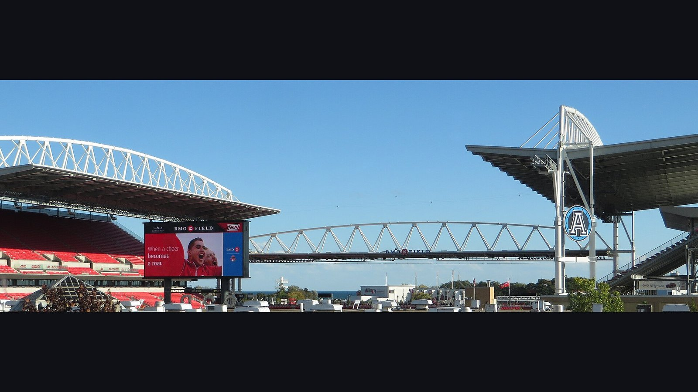

# Канада – Босния: хозяева ЧМ-2026 открывают турнир дома в Торонто

> 12 июня Канада проведёт домашний матч открытия ЧМ-2026 против Боснии и Герцеговины на «BMO Филд» в Торонто. Разбираем форму команд, ключевых игроков и кадровые потери перед стартом в группе B.

*Категория: ЧМ-2026 · Тип: preview · news*

12 июня сборная **Канады** проведёт один из самых важных матчей в своей истории: команда Джесси Марша открывает домашний чемпионат мира 2026 года против **Боснии и Герцеговины** на стадионе «BMO Филд» в Торонто. Для хозяев турнира это шанс задать тон всей группе B, в которой также выступают Швейцария и Катар.

## Канада: ставка на прессинг и Джонатана Дэвида

С приходом Джесси Марша в 2024 году Канада превратилась в команду высокого прессинга и быстрых вертикальных атак. По данным Sports Mole, подопечные Марша не проигрывают в 2026 году и подходят к турниру с серией из восьми матчей без поражений.

Главная кадровая интрига – состояние капитана Альфонсо Дэвиса. Защитник «Баварии» восстанавливается после повреждения и, как сообщает ESPN, не сыграл за сборную в течение всего года; на матч открытия он, скорее всего, не выйдет. Под вопросом и Муаз Бомбито, получивший повреждение в товарищеской встрече с Узбекистаном, а полузащитник Марсело Флорес выбыл из заявки из-за разрыва крестообразных связок.

Зато готов к игре Джонатан Дэвид: 39 голов за сборную делают его главным козырем канадской атаки. В воротах Марш определился с первым номером – им стал Максим Крепо.

## Босния: опыт Джеко против молодой Канады

Босния и Герцеговина приезжает на свой второй чемпионат мира в истории. Первый был в 2014 году: тогда боснийцы уступили в стартовых матчах Аргентине и Нигерии, но напоследок обыграли Иран – 3:1. Команду по-прежнему ведёт за собой 40-летний Эдин Джеко, ныне выступающий за «Шальке», – рекордсмен сборной по матчам (146) и голам (72). Под руководством Сергея Барбареза боснийцы пробились на турнир через стыковые матчи, заняв второе место в отборочной группе H вслед за Австрией. Любопытно, что из состава 2014 года в заявке остались лишь Джеко и Сеад Колашинац – это во многом обновлённое, новое поколение.

| Команда | Тренер | Лидер атаки | Статус перед ЧМ |
| --- | --- | --- | --- |
| Канада | Джесси Марш | Джонатан Дэвид | 8 матчей без поражений в 2026 |
| Босния | Сергей Барбарез | Эдин Джеко | Выход через стыки |

## Контекст группы B

Помимо этой пары, в группе B играют Швейцария и Катар, поэтому очки на старте имеют для обеих команд особую цену: и Канада, и Босния понимают, что хороший результат в первом туре резко повышает шансы на плей-офф расширенного 48-командного турнира.

## Прогноз

Преимущество своего поля, поддержка переполненного «BMO Филд» и агрессивный, прессинг-ориентированный стиль Марша делают Канаду фаворитом, даже если Дэвис не сыграет. Но опыт Джеко и боснийская дисциплина в обороне способны доставить хозяевам немало проблем, особенно на старте, когда нервы решают не меньше, чем класс. Многое будет зависеть от того, удастся ли Канаде с первых минут навязать высокий темп.

> По информации ESPN и Sports Mole, Альфонсо Дэвис, скорее всего, пропустит матч открытия, тогда как Джонатан Дэвид готов вести атаку Канады.

**Источники:** ESPN, Sports Mole, FIFA.
