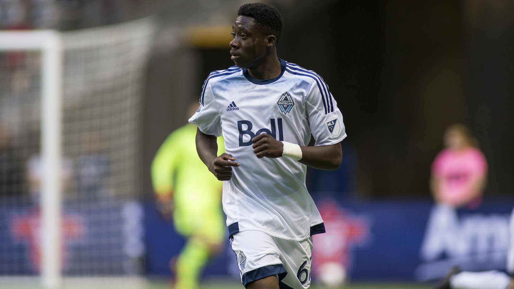

# Канада – ЮАР: чемпионат мира 2026 открывает плей-офф, Дэвис готов вернуться

_28 июня Канада и ЮАР откроют стадию плей-офф чемпионата мира 2026. Для обеих сборных это исторический дебют в нокаут-раундах, а Альфонсо Дэвис готов вернуться после травмы._

- **type:** preview  
- **category:** ЧМ-2026  
- **slug:** canada-vs-south-africa-round-of-32-wc2026-preview

---

Плей-офф чемпионата мира 2026 стартует матчем 1/16 финала между Канадой и ЮАР. Игра пройдёт в воскресенье, 28 июня, на стадионе «СоФай» в Инглвуде (Лос-Анджелес) и начнётся в 15:00 по восточному времени США (12:00 по тихоокеанскому). Для обеих сборных это первый в истории выход в стадию плей-офф чемпионата мира.

## Как команды дошли до плей-офф

Канада, одна из стран-хозяек турнира, заняла второе место в группе B с четырьмя очками. Подопечные Джесси Марша начали с ничьей против Боснии и Герцеговины (1:1), затем разгромили Катар (6:0) благодаря хет-трику Джонатана Дэвида, но в последнем туре уступили Швейцарии (1:2), которая и выиграла группу.

ЮАР финишировала второй в группе A, также набрав четыре очка. «Бафана-Бафана» под руководством Хьюго Брооса стартовали с поражения от Мексики (0:2), затем сыграли вничью с Чехией (1:1) и вырвали победу у Южной Кореи (1:0): победный мяч на счету Тапело Масеко.

| Форма (3 матча) | Результаты |
|-----------------|-----------|
| Канада | 1:1 Босния, 6:0 Катар, 1:2 Швейцария |
| ЮАР | 0:2 Мексика, 1:1 Чехия, 1:0 Южная Корея |

## История встреч

Команды встречались лишь однажды: в товарищеском матче в ноябре 2007 года в Дурбане ЮАР победила 2:0, дубль на счету Теко Модисе. Воскресная игра станет вторым очным противостоянием в истории.

| Дата | Матч | Счёт |
|------|------|------|
| Ноябрь 2007 | ЮАР – Канада | 2:0 |

## Ключевые игроки и кадровые новости

Главная хорошая новость для Канады – возвращение Альфонсо Дэвиса. По информации FOX Sports, защитник «Баварии» восстановился после повреждения подколенного сухожилия, из-за которого пропустил все три матча группового этапа, и готов сыграть. В атаке канадцев выделяется Джонатан Дэвид («Ювентус»), забивший три мяча на турнире. При этом Канада точно не сможет рассчитывать на Исмаэля Коне, выбывшего до конца турнира из-за перелома.

У ЮАР дисквалификацию отбывает Темба Зване, удалённый в матче с Мексикой, зато в строй возвращается отбывший дисквалификацию Тебохо Мокоэна. В числе лидеров «Бафана-Бафана» – автор победного гола с Южной Кореей Тапело Масеко и хавбек Релебохиле Мофокенг.

## Прогноз и турнирная сетка

По предварительной сетке победитель пары Канада – ЮАР в 1/8 финала встретится с победителем матча Нидерланды – Марокко. Канада подходит к игре фаворитом за счёт глубины состава и возвращения Дэвиса, однако дисциплинированная оборона ЮАР, не пропускавшая в двух из трёх матчей группы, обещает упорную борьбу.

Источники: Sports Illustrated, FOX Sports, Goal.com, Olympics.com.

---

**sources:**
- https://www.si.com/soccer/every-confirmed-round-of-32-match-2026-world-cup
- https://www.foxsports.com/stories/soccer/alphonso-davies-playing-today-canada-stars-status-vs-south-africa
- https://www.goal.com/en/news/south-africa-canada-world-cup-preview/blt7b092fc81d7fdc79
- https://www.olympics.com/en/news/south-africa-fifa-world-cup-2026-football-results-scores-standings
