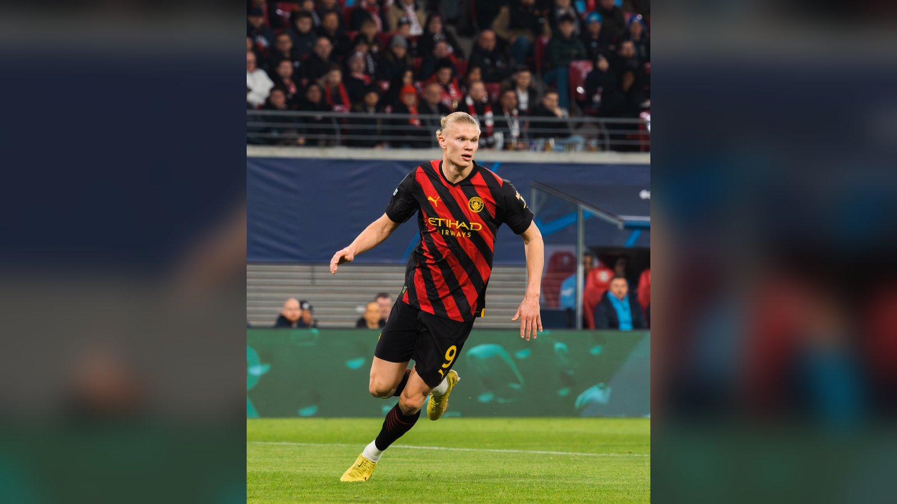

# Суперкубок Англии 2026: «Арсенал» – «Манчестер Сити» в Кардиффе

> 16 августа «Арсенал» и «Манчестер Сити» разыграют Суперкубок Англии 2026. Впервые за много лет матч пройдёт не на «Уэмбли», а в Кардиффе. Разбираем превью.

**Категория:** Тренды | **Тип:** preview

Английский футбол открывает новый сезон традиционным матчем за Суперкубок (Community Shield): 16 августа 2026 года чемпион Премьер-лиги «Арсенал» встретится с обладателем Кубка Англии «Манчестер Сити». Игра станет первым большим трофейным матчем сезона 2026/27 и генеральной репетицией перед стартом чемпионата.

## Где и когда
Как подтвердили Футбольная ассоциация Англии (FA) и сам «Арсенал», в этом году матч пройдёт не на «Уэмбли», а на «Миллениум Стэдиум» (Principality Stadium) в Кардиффе. Причина – загруженность лондонской арены в середине августа. Начало встречи запланировано на воскресенье, 16 августа, в 15:00 по британскому времени (BST).

| Параметр | Детали |
|---|---|
| Турнир | Суперкубок Англии 2026 |
| Дата | 16 августа 2026, 15:00 BST |
| Стадион | «Миллениум Стэдиум», Кардифф |
| Участники | «Арсенал» – «Манчестер Сити» |

## Как команды заслужили место в матче
«Арсенал» пробился в Суперкубок как чемпион Англии сезона 2025/26 – для «канониров» это долгожданное возвращение на вершину внутреннего футбола. «Манчестер Сити» получил путёвку как обладатель Кубка Англии: в финале на «Уэмбли» команда обыграла «Челси» со счётом 1:0 и завоевала трофей.

| Команда | Путь в Суперкубок |
|---|---|
| «Арсенал» | Чемпион АПЛ 2025/26 |
| «Манчестер Сити» | Обладатель Кубка Англии 2025/26 |

## Что покажет матч
Суперкубок Англии редко бывает показателем формы на весь сезон, но всегда даёт первые ответы на важные вопросы. Для «Арсенала» это шанс подтвердить статус чемпиона и проверить готовность лидеров после укороченной из-за чемпионата мира предсезонки. Для «Манчестер Сити» – возможность взять реванш за упущенное в прошлом первенстве и сразу же добавить трофей в коллекцию.

Отдельная интрига – атакующая мощь «горожан» во главе с Эрлингом Холандом против выверенной обороны «Арсенала». Дисциплина, стандарты и глубина составов, вероятно, и станут ключевыми факторами в Кардиффе.

## Прогноз
Матчи «Арсенала» и «Манчестер Сити» в последние годы неизменно проходят в упорной борьбе, и Суперкубок-2026 вряд ли станет исключением. Ожидается плотная, тактически насыщенная игра, где всё может решить эпизод у чужих ворот или серия пенальти. Составы и окончательная готовность игроков прояснятся ближе к стартовому свистку, а уже 21–24 августа обе команды войдут в новый сезон Премьер-лиги.

Источники: FA, официальный сайт «Арсенала», официальный сайт «Манчестер Сити», Sky Sports.

