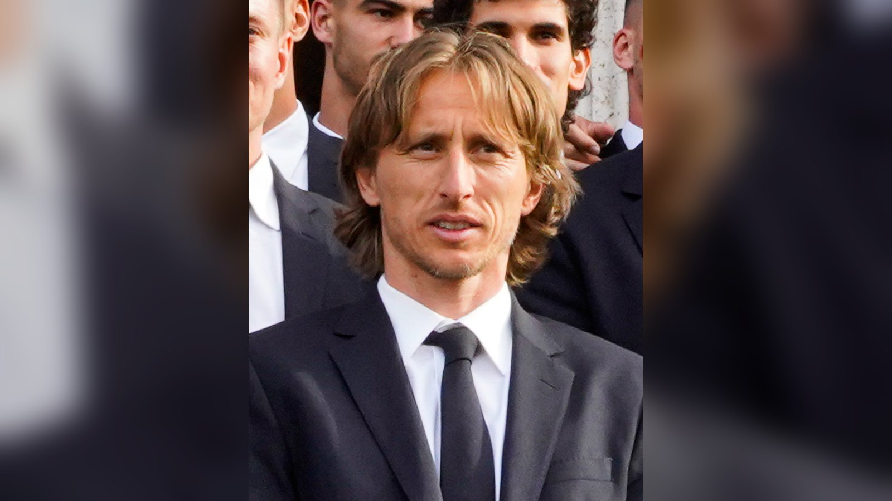

# Хорватия – Панама 1:0: гол Будимира оживил надежды вице-чемпионов

*Хорватия обыграла Панаму 1:0 благодаря голу Анте Будимира и сохранила шансы на плей-офф ЧМ-2026, а Панама вылетела с турнира.*

- **type:** match_report
- **category:** Отчёты о матчах
- **slug:** croatia-panama-1-0-budimir-chm-2026

Сборная Хорватии добыла важнейшую победу над Панамой – 1:0 – в матче второго тура группы L чемпионата мира 2026 и сохранила шансы на выход в плей-офф. Единственный гол на счету Анте Будимира. Встреча состоялась 23 июня и стала для вице-чемпионов мира 2018 года матчем, в котором отступать было уже некуда.

## Решающий мяч Будимира

После досадного поражения от Англии в стартовом туре (2:4) подопечным Златко Далича нужна была только победа. Хорваты владели инициативой и территорией, однако долго не могли распечатать ворота дисциплинированной Панамы, которая сделала ставку на оборону. Развязка наступила во втором тайме: вышедший на замену форвард Анте Будимир замкнул прострел Йосипа Станишича с дальней штанги и принёс своей команде три бесценных очка.

Гол со скамейки запасных стал примером того, как важна глубина состава на длинной дистанции турнира: свежие игроки нередко решают исход вязких матчей группового этапа. Для Хорватии, привыкшей действовать через контроль мяча и терпеливый позиционный розыгрыш, такой сценарий – с трудовой минимальной победой – оказался вполне приемлемым, ведь главное в подобной игре результат, а не содержание.

| Минута | Событие |
| --- | --- |
| 2-й тайм | Гол: Анте Будимир (1:0) |

## Панама прекращает борьбу

Для сборной Панамы поражение стало вторым подряд с одинаковым счётом 0:1 и означало вылет из турнира. Команда отчаянно боролась в обоих матчах и оборонялась самоотверженно, но так и не сумела набрать очков и завершает своё выступление уже на групповом этапе. Несмотря на результат, центральноамериканцы оставили неплохое впечатление организованной игрой в защите и самоотдачей.

Сам факт участия в финальной части мирового первенства – серьёзное достижение для панамского футбола, а расширение турнира до 48 команд дало шанс проявить себя сборным, которые прежде нечасто попадали на чемпионаты мира. Опыт игр против команд уровня Англии и Хорватии должен помочь Панаме в дальнейшем развитии и в будущих отборочных циклах. Два минимальных поражения подряд показывают, что команда была близка к тому, чтобы зацепиться за очки, и при чуть большей удаче в атаке результат мог сложиться иначе.

## Что ждёт Хорватию

Вице-чемпионы мира 2018 года во главе с ветераном Лукой Модричем вернулись в борьбу за плей-офф. После двух туров хорваты идут с тремя очками, и теперь их судьба решится в очном поединке заключительного тура против сборной Ганы, у которой четыре очка. Победа почти наверняка выведет команду Далича в следующий раунд, тогда как осечка может стоить ей места в плей-офф.

В расширенном до 48 команд формате чемпионата мира в стадию плей-офф пробиваются по две лучшие сборные из каждой группы и восемь лучших команд, занявших третьи места. Это значит, что у Хорватии при определённом раскладе остаются шансы пройти дальше даже с третьего места, однако наиболее надёжный путь – обыграть Гану напрямую и не зависеть от результатов в других группах.

Опыт и класс по-прежнему остаются сильными сторонами хорватов. В составе команды хватает футболистов, прошедших через крупнейшие турниры, а дирижёром игры остаётся Лука Модрич – один из лучших полузащитников своего поколения. Именно от того, насколько свежими лидеры подойдут к решающему матчу, во многом будет зависеть итог группового этапа.

> «Гол Будимира со скамейки поддержал надежды Хорватии перед решающим матчем с Ганой», – отмечает ESPN.

## Итог

Минимальная победа вернула Хорватии контроль над собственной судьбой. Для команды, которая ещё недавно играла в финале мирового первенства, выход из группы – задача-минимум, и заключительный матч с Ганой обещает стать одним из самых напряжённых в группе L. Цена ошибки велика: проигравший рискует завершить турнир уже после трёх матчей, а победитель сделает важный шаг к плей-офф.

Стоит отметить и характер, который хорваты проявили после неудачного старта. Поражение от Англии могло подкосить команду психологически, однако подопечные Далича сумели собраться и взять три очка в матче, где права на ошибку уже не было. Этот настрой – важный задел перед решающей игрой, ведь на больших турнирах нередко дальше проходят не самые яркие, а самые собранные и характерные команды.

Источники: ESPN, VAVEL.
