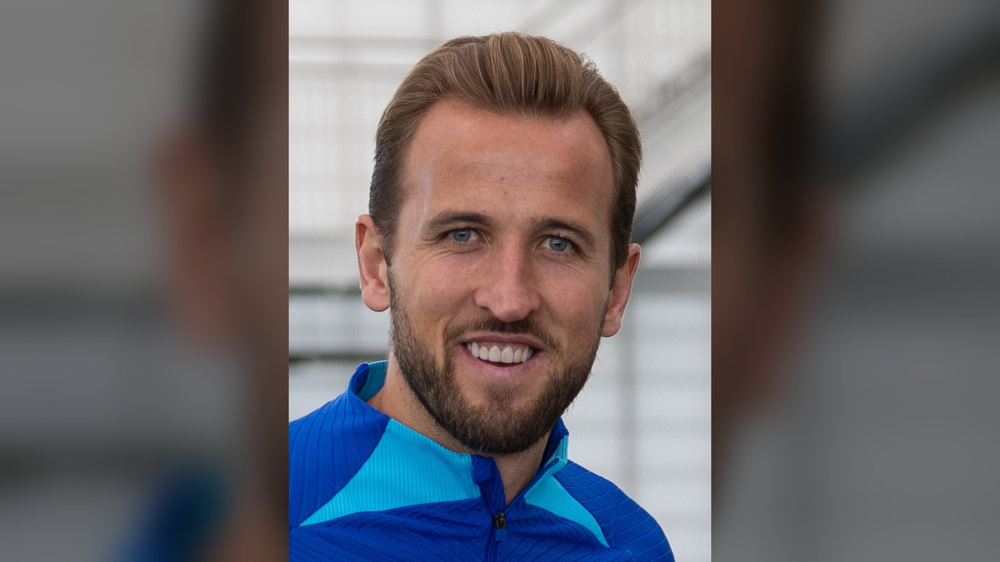

# Дубль Кейна и перебитый пенальти: Англия обыграла Хорватию 4:2 на старте ЧМ-2026

*Харри Кейн оформил дубль и догнал Гари Линекера по голам за Англию на чемпионатах мира, а сборная в результативном матче обыграла Хорватию 4:2.*

- **type:** match_report  |  **category:** Отчёты о матчах  |  **source_type:** news

Сборная Англии начала чемпионат мира 2026 года с результативной и нервной победы: в матче группы L команда обыграла Хорватию со счётом 4:2. Дубль на свой счёт записал капитан Харри Кейн, повторивший вечный рекорд Гари Линекера.

## Хронология матча

| Минута | Счёт | Автор гола |
|---|---|---|
| 12' (пен.) | 1:0 | Кейн |
| 36' | 1:1 | Батурина |
| 42' | 2:1 | Кейн |
| 45+5' | 2:2 | Муса |
| 47' | 3:2 | Беллингем |
| 85' | 4:2 | Рашфорд |

Матч начался с любопытного эпизода: после фола Луки Модрича на Нони Мадуэке арбитр Клеман Тюрпен назначил пенальти. Голкипер Хорватии Доминик Ливакович отразил первый удар Кейна, однако VAR зафиксировал, что вратарь сошёл с линии, а защитник Йошко Гвардиол слишком рано вошёл в штрафную. Пенальти перебили, и со второй попытки Кейн не промахнулся.

## Кейн догнал Линекера

Свой второй гол Кейн забил головой после подачи углового от Деклана Райса. Этим мячом капитан сборной довёл число своих голов на чемпионатах мира до 10 и сравнялся с легендарным Гари Линекером – рекордсменом Англии по голам на мундиалях.

Хорватия дважды по ходу первого тайма отыгрывалась – отличились Мартин Батурина и Петар Муса, причём второй гол влетел в компенсированное к тайму время. Но сразу после перерыва Джуд Беллингем вернул англичанам преимущество, а под занавес встречи Маркус Рашфорд снял все вопросы о победителе.

> «Только подход на максимальных оборотах может привести к успеху на чемпионате мира», – таков, по информации Sky Sports, был посыл тренера Томаса Тухеля своей команде.

Хорватия, серебряный призёр чемпионата мира 2018 года и бронзовый – 2022-го, в очередной раз показала характер и дважды отыгрывалась, но в концовке уступила в классе и физике. Опытный Лука Модрич вновь дирижировал игрой соперника, однако сдержать английскую атаку во втором тайме его команда не сумела.

Победа вывела Англию в число лидеров группы L. Несмотря на пропущенные мячи, «трёх львов» выручили класс Кейна и глубина состава – с такими исполнителями, как Беллингем и Рашфорд, команда Тухеля способна решать судьбу матчей в считанные минуты. Старт с трёх очков в нервном, но результативном поединке – именно то, что было нужно одному из фаворитов турнира.

**Источники:** FIFA, ESPN, Sky Sports.

**Источники (sources):**
- https://www.fifa.com/en/tournaments/mens/worldcup/canadamexicousa2026/articles/england-croatia-highlights-match-report
- https://www.espn.com/soccer/story/_/id/49099495/england-croatia-world-cup-2026-recap-score-harry-kane-jude-bellingham-marcus-rashford
- https://www.skysports.com/football/news/11095/13555102/england-4-2-croatia-thomas-tuchels-team-talk-reveals-the-template-for-world-cup-glory-must-be-the-full-gas-approach
