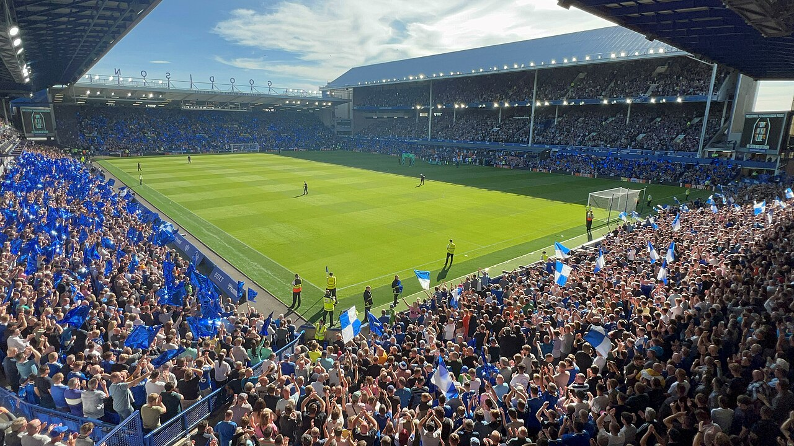

# Редкий обмен в АПЛ: Бреннан Джонсон перешёл в «Эвертон», Дуайт Макнил – в «Кристал Пэлас»

> «Эвертон» и «Кристал Пэлас» провели редкий для Премьер-лиги прямой обмен: Бреннан Джонсон переехал в «Эвертон», а Дуайт Макнил – в «Кристал Пэлас». Оба подписали четырёхлетние контракты.

- Категория: Новости игроков
- Тип: transfer
- Источник материала: news

**«Эвертон» и «Кристал Пэлас» совершили редкий прямой обмен игроками.** Бреннан Джонсон переходит на «Гудисон Парк», а Дуайт Макнил отправляется в обратном направлении – на «Селхерст Парк». Оба клуба объявили о сделке 11 августа.

## Прямой обмен без денежной доплаты

Обмен «один в один» – большая редкость для современной Премьер-лиги, где сделки обычно оформляются через выкуп. По информации Sky Sports и ESPN, и Джонсон, и Макнил подписали со своими новыми клубами четырёхлетние контракты.

> Как сообщает официальный сайт «Эвертона», Бреннан Джонсон стал игроком клуба, а Дуайт Макнил перешёл в «Кристал Пэлас».

## Почему обмены снова в моде

Прямые обмены игроками постепенно возвращаются в английский футбол не случайно. В условиях жёстких правил финансовой устойчивости (PSR) подобные сделки удобны с точки зрения бухгалтерии: клубы фиксируют доход от «продажи» и распределяют стоимость новичка на весь срок контракта. Для «Эвертона» и «Кристал Пэлас», внимательно следящих за балансом, такая схема – способ обновить состав без крупных трат «живыми» деньгами.

## Быстрый разворот в карьере Джонсона

Для валлийского вингера Бреннана Джонсона это уже второй переход за короткий срок: всего семь месяцев назад он присоединился к «Кристал Пэлас» из «Тоттенхэма» за 35 млн фунтов, однако так и не смог закрепиться в основе под руководством Оливера Глазнера. Теперь под началом Дэвида Мойеса в «Эвертоне» игрок рассчитывает вернуть себе место в старте и стабильную игровую практику.

## Возвращение к теме для Макнила

Дуайт Макнил, в свою очередь, зимой уже был близок к переходу в «Кристал Пэлас»: тогда сделка по схеме «аренда с обязательным выкупом» сорвалась из-за того, что документы не успели оформить вовремя. Теперь трансфер всё-таки состоялся, и полузащитник получит новый вызов в своей карьере – в команде, которая в последние сезоны заметно прибавила.

## Расчёт обоих клубов

Для «Эвертона» и «Кристал Пэлас» этот обмен – возможность освежить атакующую линию перед новым сезоном и решить кадровые задачи без затяжных переговоров с третьими клубами. Оба игрока хорошо знакомы с Премьер-лигой, что снижает риски адаптации. Сделка подтверждена официально.

Источники: официальный сайт «Эвертона», Sky Sports, ESPN.

Источники (URL):
- https://www.evertonfc.com/news/2026/august/11/everton-sign-johnson-as-mcneil-/
- https://www.skysports.com/football/news/11671/13571877/everton-sign-brennan-johnson-from-crystal-palace-as-dwight-mcneil-moves-to-selhurst-park-in-transfer-swap-deal
- https://www.espn.com/soccer/story/_/id/49580612/brennan-johnson-dwight-mcneil-complete-everton-crystal-palace-moves-rare-swap
