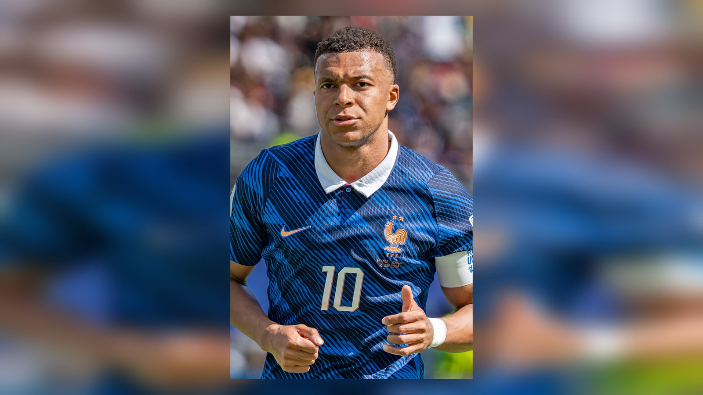

# Франция обыграла Парагвай 1:0: пенальти Мбаппе вывел «трёхцветных» в четвертьфинал ЧМ-2026

_Килиан Мбаппе реализовал пенальти на 70-й минуте и принёс Франции минимальную победу над Парагваем в 1/8 финала ЧМ-2026. В четвертьфинале французов ждёт Марокко._

**Тип:** match_report · **Категория:** Отчёты о матчах · **source_type:** news

Франция добыла трудовую победу над Парагваем – 1:0 – в матче 1/8 финала чемпионата мира 2026, прошедшем 4 июля на «Линкольн Файнэншл Филд» в Филадельфии. Единственный мяч на 70-й минуте с пенальти забил капитан «трёхцветных» Килиан Мбаппе, выведший свою команду в четвертьфинал турнира.

Фаворит группового этапа встретил на стадии плей-офф упорного соперника, готового терпеть и играть от обороны. Парагвай большую часть встречи превратил в вязкую позиционную борьбу и оборонялся всей командой, лишив французов привычного пространства для скоростных атак.

## Как забивали

Первый тайм получился скупым на моменты: Парагвай сознательно отдал мяч сопернику и выстроил плотные оборонительные линии, стремясь превратить матч в борьбу нервов. Франция много владела мячом, но раз за разом упиралась в насыщенную оборону и до перерыва так и не сумела найти брешь.

Развязка наступила во втором тайме. Диего Гомес в единоборстве попал коленом в набегавшего Дезире Дуэ, и после просмотра VAR арбитр указал на точку. К мячу подошёл Мбаппе: форвард качнул вратаря Орландо Гилла в левый угол и хладнокровно пробил в противоположный, нижний правый угол ворот, сообщает ESPN. Этого эпизода хватило, чтобы решить исход напряжённого поединка, а система видеопомощи в очередной раз сыграла ключевую роль на этом турнире.

Для Мбаппе этот гол стал седьмым на нынешнем турнире – капитан сборной Франции продолжает борьбу за «Золотую бутсу», идя в лидирующей группе бомбардиров вместе с Лионелем Месси. Реализованный пенальти в очередной раз подтвердил хладнокровие француза в ключевые моменты: даже в тяжёлом матче, где партнёры не создавали много, он взял ответственность на себя и не промахнулся.

## Статистика матча

| Показатель | Франция | Парагвай |
| --- | --- | --- |
| Владение мячом | 76% | 24% |
| Голы | 1 (пенальти) | 0 |
| Итог | Победа, выход в 1/4 | Вылет |

По данным Opta и Yahoo Sports, «трёхцветные» полностью контролировали мяч, владея им 76% игрового времени и нанеся значительно больше ударов, однако плотная оборона парагвайцев позволила французам добиться лишь минимального перевеса. Показательна разница с групповым этапом: в первых пяти матчах турнира сборная Франции забила 13 мячей, но в этот вечер соперник надолго запер её атаку и заставил чемпионов Европы поволноваться.

## Оборона решает

Победа со счётом 1:0 показала, что Франция способна добиваться результата даже в неудобных матчах, где не идёт игра впереди. Для команды, богатой атакующими талантами, умение «дожимать» соперника минимальными усилиями – важный признак турнирной зрелости. Контраст с групповым этапом разителен: там «трёхцветные» громили соперников, а здесь были вынуждены терпеливо ждать свой единственный шанс. Парагвай же, несмотря на поражение, провёл дисциплинированный поединок, заставил фаворита нервничать до последних минут и ушёл с турнира с высоко поднятой головой.

## Что дальше

В четвертьфинале Францию ждёт Марокко, которое в параллельном матче 1/8 финала разгромило Канаду 3:0 благодаря дублю Аззедина Унахи. Игра пройдёт 9 июля на «Жиллетт Стэдиум» в Фоксборо и станет одним из центральных противостояний этой стадии – встречей одного из фаворитов турнира с сильнейшей африканской командой последних лет. Для Парагвая же чемпионат мира завершён на стадии 1/8 финала, но выступление южноамериканцев на расширенном мундиале в целом можно занести им в актив.

Источники: ESPN, Yahoo Sports, Opta Analyst.
