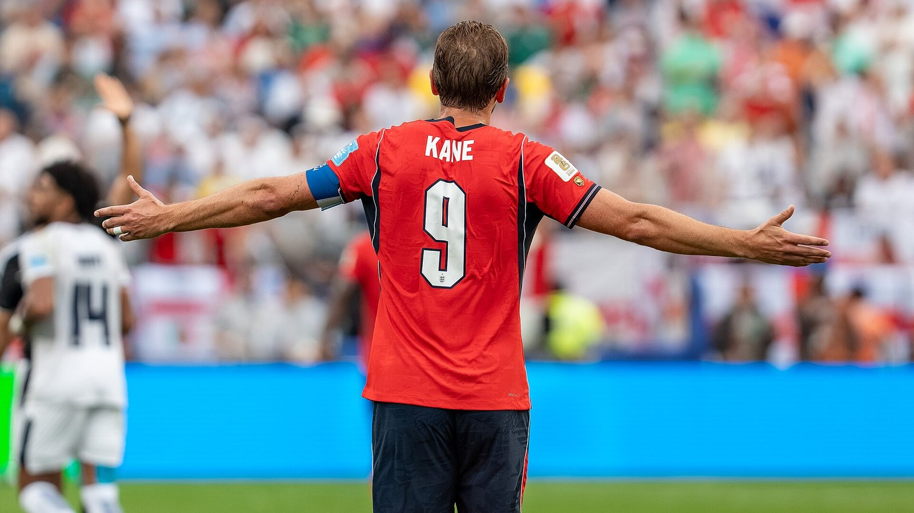

Проигравшие в полуфиналах чемпионата мира 2026 года сборные Франции и Англии встретятся в матче за третье место. «Бронзовый финал» пройдёт в субботу, 18 июля, на стадионе Hard Rock в Майами. Начало встречи – в 17:00 по времени восточного побережья США.

Обе команды подходят к игре после обидных поражений. Франция уступила Испании со счётом 0:2, так и не сумев наладить игру в атаке. Англия проиграла Аргентине 1:2, пропустив два мяча в самой концовке после того, как первой открыла счёт. Теперь соперникам, мечтавшим о финале, предстоит разыграть третью строчку турнира.

## Что на кону

Формально матч за третье место не приносит трофея, но у обеих сборных остаётся серьёзная мотивация. Для игроков это возможность завершить длинный турнир на позитивной ноте и увезти домой бронзовые медали. Для тренерских штабов – шанс дать минуты футболистам ротации и проверить резервы. А для нескольких бомбардиров это ещё и последняя возможность вмешаться в спор за индивидуальные награды.

| Команда | Полуфинал | Результат |
|---|---|---|
| Франция | против Испании | 0:2 |
| Англия | против Аргентины | 1:2 |

## Индивидуальные награды

Матч важен и в контексте гонки бомбардиров. У француза Килиана Мбаппе на турнире восемь голов, и «бронзовый финал» – его последний шанс выйти вперёд в борьбе за «Золотую бутсу», ведь лидер зачёта Лионель Месси играет в финале днём позже. У англичан Харри Кейн и Джуд Беллингем забили по шесть мячей и также могут пополнить свой актив в очной встрече с французами.

## Путь команд по турниру

Обе сборные проделали внушительный путь до полуфинала, подтвердив статус фаворитов. Франция на протяжении турнира опиралась на атакующую мощь и индивидуальное мастерство своих звёзд во главе с Килианом Мбаппе, который стал одним из лучших бомбардиров мундиаля. Англия под руководством Томаса Тухеля выстраивала игру вокруг Харри Кейна и Джуда Беллингема, а в полуфинале с Аргентиной первой открыла счёт и была близка к историческому выходу в финал.

Оба поражения получились по-своему обидными. Франция не смогла найти ключи к обороне Испании, а Англия рухнула в концовке, пропустив два мяча за последние минуты. Тем интереснее будет посмотреть, кто из соперников быстрее восстановится морально и выйдет в Майами с боевым настроем.

## История и контекст

И Франция, и Англия – команды с богатой историей на чемпионатах мира. Французы были финалистами последних турниров и остаются одной из самых мощных сборных планеты, а англичане в последние годы стабильно доходят до поздних стадий, но снова не смогли пробиться в решающий матч. Для обеих команд бронза станет утешительным, но не бессмысленным итогом.

## Чего ждать

Как правило, матчи за третье место получаются открытыми и результативными: цена ошибки ниже, чем в полуфиналах, и команды охотнее идут вперёд. К тому же на кону остаётся спортивная гордость: обе сборные захотят завершить турнир победой, а не двумя поражениями подряд. Дополнительную интригу создаёт и то, что многие ведущие футболисты обеих команд наверняка выйдут на поле, чтобы поставить точку в личных турнирных зачётах. С учётом атакующего потенциала Франции и Англии болельщиков в Майами может ждать зрелищная и богатая на голы игра.

## Настрой команд

Психологически такие матчи всегда непросты: и французы, и англичане мечтали о финале, и переключиться на игру за третье место за несколько дней тяжело. Многое будет зависеть от того, какая из команд быстрее справится с разочарованием и выйдет на поле с настоящей мотивацией. История показывает, что бронзовые матчи нередко становятся отдушиной для игроков, которым важно завершить турнир достойно и порадовать болельщиков.

Не исключено, что оба тренера дадут шанс футболистам, реже выходившим в основе по ходу мундиаля. Для молодых игроков это возможность проявить себя на большой сцене, а для лидеров – закрыть турнир на позитивной ноте.

## Взгляд на будущее

Для Франции и Англии этот чемпионат мира станет ещё одной точкой отсчёта. Обе сборные обладают глубоким составом и молодыми талантами, а значит, продолжат борьбу за трофеи и в следующих циклах. Бронзовые медали не заменят мечты о золоте, но и уезжать домой без наград никому не хочется – поэтому в Майами стоит ждать боевой и честной игры.

Не стоит забывать и об эмоциональной составляющей для болельщиков: матч за третье место – это последняя возможность увидеть звёзд Франции и Англии на этом чемпионате мира. Для многих любителей футбола в разных уголках планеты, в том числе в Казахстане и странах СНГ, где внимательно следят за европейскими сборными и их лидерами, «бронзовый финал» станет отдельным событием уик-энда, предваряющим главную битву турнира.

Финал чемпионата мира между Испанией и Аргентиной состоится днём позже, 19 июля, на стадионе MetLife в Нью-Джерси.

Источники: World Soccer Talk, Vanguard, Al Jazeera.
