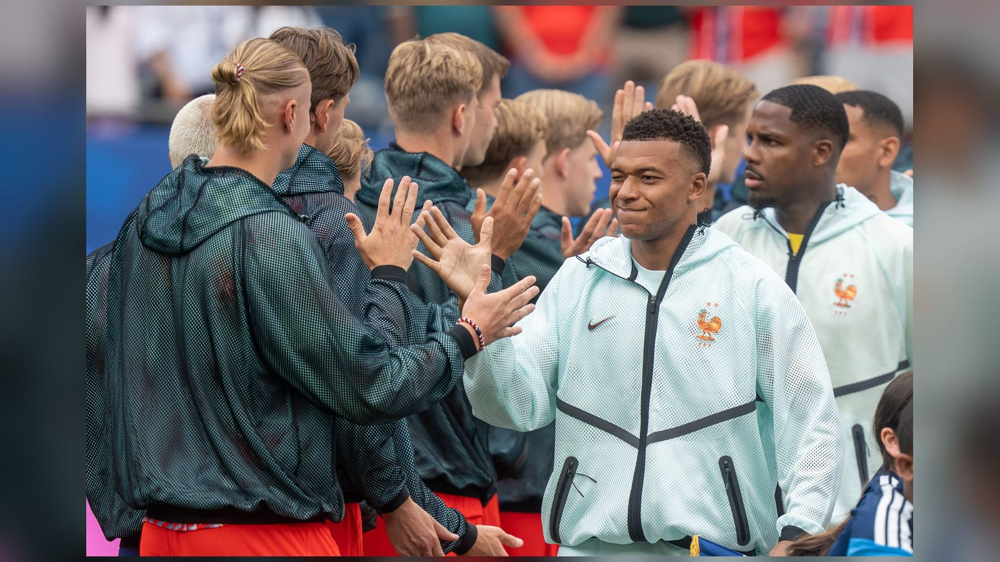

# Франция – Марокко: превью четвертьфинала ЧМ-2026 и повтор полуфинала Катара-2022

_9 июля Франция и Марокко откроют четвертьфиналы ЧМ-2026 в Бостоне. Разбираем форму команд, дуэль Мбаппе с обороной «Атласских львов» и историю личных встреч._

**Категория:** ЧМ-2026 | **Тип:** preview | **source_type:** news

Сборные Франции и Марокко открывают четвертьфиналы чемпионата мира 2026 года: матч пройдёт 9 июля на стадионе в Фоксборо под Бостоном. Это повторение полуфинала Катара-2022, в котором «трёхцветные» победили 2:0 и вышли в финал, поэтому мотивации у «Атласских львов» будет предостаточно.

Обе команды подходят к очной встрече в отличной форме, но с разными козырями: Франция ошеломляет атакующей мощью, а Марокко – невероятной стабильностью результатов и надёжностью. Именно контраст стилей делает этот четвертьфинал одним из самых ожидаемых на всей стадии плей-офф.

## Франция – самая результативная команда турнира

Действующие вице-чемпионы мира подходят к четвертьфиналу в статусе фаворита. Франция – единственная сборная, выигравшая все пять матчей на турнире в основное время, и забившая уже 14 мячей. В 1/8 финала «трёхцветные» обыграли Парагвай со счётом 1:0, в очередной раз показав умение доводить дело до победы даже в вязких матчах.

Лидер атаки Килиан Мбаппе с семью голами делит верхние строчки в гонке за «Золотую бутсу». Не менее опасен обладатель «Золотого мяча» Усман Дембеле, оформивший хет-трик в матче группового этапа против Норвегии и записавший на свой счёт четыре гола на турнире. Скорость и индивидуальное мастерство этой пары – главная угроза для любой обороны.

## Марокко не проигрывает 34 матча подряд

«Атласские львы» остаются одной из главных сенсаций мирового футбола последних лет и не терпят поражений уже в 34 играх подряд. Путь Марокко к четвертьфиналу впечатляет: команда прошла Нидерланды в серии пенальти в 1/16 финала и уверенно разобралась с одним из хозяев турнира по ходу плей-офф.

В основе команды – капитан Ашраф Хакими, которого многие эксперты считают лучшим правым защитником мира. Именно его подключения по флангу и лидерские качества во многом определяют игру марокканцев.

Тревожная новость для Марокко – состояние нападающего Исмаэля Сайбари, получившего повреждение задней поверхности бедра. По информации The National и Yahoo Sports, форвард, забивавший в каждом матче группового этапа, остаётся под вопросом на четвертьфинал, и его возможное отсутствие ослабит атаку «львов».

## Форма команд (последние 5 матчей)

| Команда | Форма | Ключевой результат |
| --- | --- | --- |
| Франция | В В В В В | 1:0 с Парагваем в 1/8 финала |
| Марокко | без поражений в 34 матчах | победа над Нидерландами по пенальти |

## Личные встречи

| Турнир | Матч | Счёт |
| --- | --- | --- |
| ЧМ-2022, 1/2 финала | Франция – Марокко | 2:0 |

## Ключевые фигуры

| Франция | Марокко |
| --- | --- |
| Килиан Мбаппе (7 голов) | Ашраф Хакими (капитан) |
| Усман Дембеле (4 гола) | Исмаэль Сайбари (под вопросом) |

## Прогноз

Букмекеры считают Францию явным фаворитом, однако Марокко уже не раз опровергало прогнозы на крупных турнирах и в 2022 году дошло до полуфинала. Ключевыми факторами станут готовность лидеров «Атласских львов» и способность их обороны сдержать скорость Мбаппе и Дембеле. Если Марокко удастся сыграть в свой фирменный дисциплинированный футбол и использовать редкие шансы в контратаках, интрига в этом четвертьфинале сохранится до последних минут.

**Источники:** Al Jazeera, Goal, Olympics.com.

---

**Sources:**
- https://www.aljazeera.com/sports/2026/7/8/france-vs-morocco-key-talking-points-mbappe-world-cup-quarterfinal-what-we-know
- https://www.goal.com/en-gb/news/france-morocco-world-cup-preview/bltf89b962959710dc1
- https://www.olympics.com/en/news/fifa-world-cup-2026-watch-france-vs-morocco-quarter-finals-head-to-head-full-schedule
