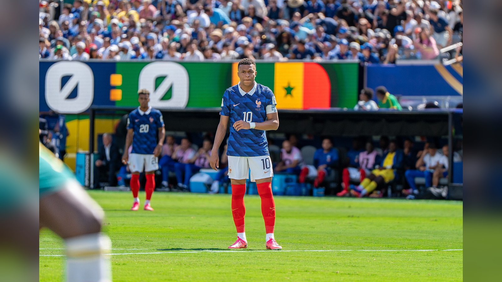

*Впервые в истории сразу трое игроков забили по семь мячей на одном чемпионате мира. Разбираем расклад в гонке за «Золотую бутсу» ЧМ-2026 после 1/8 финала.*

**Борьба за «Золотую бутсу» чемпионата мира 2026 достигла редкой развязки: сразу трое игроков забили по семь мячей.** По данным Al Jazeera, это первый случай в истории турниров, когда после стадии 1/8 финала три футболиста имеют по семь и более голов. Ниже – расклад в гонке бомбардиров на 6 июля.

Критерий распределения мест при равенстве голов – число результативных передач, а затем время, за которое набраны очки. Именно ассистенции сейчас выводят вперёд француза. Ниже – сводная таблица лидеров гонки, а затем разбор каждого претендента.

| Место | Игрок | Сборная | Голы | Передачи |
| --- | --- | --- | --- | --- |
| 1 | Килиан Мбаппе | Франция | 7 | 2 |
| 2 | Лионель Месси | Аргентина | 7 | 0 |
| 3 | Эрлинг Холанд | Норвегия | 7 | 0 |
| 4 | Гарри Кейн | Англия | 6 | 1 |
| 5 | Усман Дембеле | Франция | 4 | 2 |
| 6 | Микель Ойарсабаль | Испания | 4 | 1 |

## 1. Килиан Мбаппе (Франция) – 7 голов, 2 передачи

Нападающий сборной Франции возглавляет список благодаря дополнительному показателю. Свой седьмой мяч Мбаппе забил в матче 1/8 финала против Парагвая, а две голевые передачи выводят его вперёд в равной тройке лидеров.

## 2. Лионель Месси (Аргентина) – 7 голов

Капитан действующих чемпионов мира сравнялся с Мбаппе по голам. Седьмой мяч Месси провёл в драматичном матче против Кабо-Верде (3:2 в дополнительное время) – это стал его рекордный 20-й гол на чемпионатах мира в карьере.

## 3. Эрлинг Холанд (Норвегия) – 7 голов

Норвежец ворвался в тройку лидеров благодаря дублю в сенсационной победе над Бразилией (2:1). Оба мяча – в последние 11 минут встречи – подняли его личный счёт на турнире до семи.

## 4. Гарри Кейн (Англия) – 6 голов, 1 передача

Капитан сборной Англии отстаёт от тройки лидеров всего на один мяч. Свой шестой гол Кейн забил с пенальти в триллере против Мексики (3:2).

## 5. Усман Дембеле (Франция) – 4 гола, 2 передачи

Партнёр Мбаппе по сборной Франции – в числе преследователей с четырьмя голами и двумя передачами.

## 6. Микель Ойарсабаль (Испания) – 4 гола, 1 передача

Форвард «Красной фурии» замыкает шестёрку сильнейших бомбардиров турнира.

## Что дальше

С учётом того, что Аргентина, Франция и Норвегия остаются в розыгрыше, тройка лидеров сохраняет прямое влияние на исход гонки. Судьбу «Золотой бутсы», вероятно, решат матчи плей-офф – четвертьфиналы пройдут с 9 по 12 июля.

Источники: Al Jazeera, ESPN, FOX Sports.
