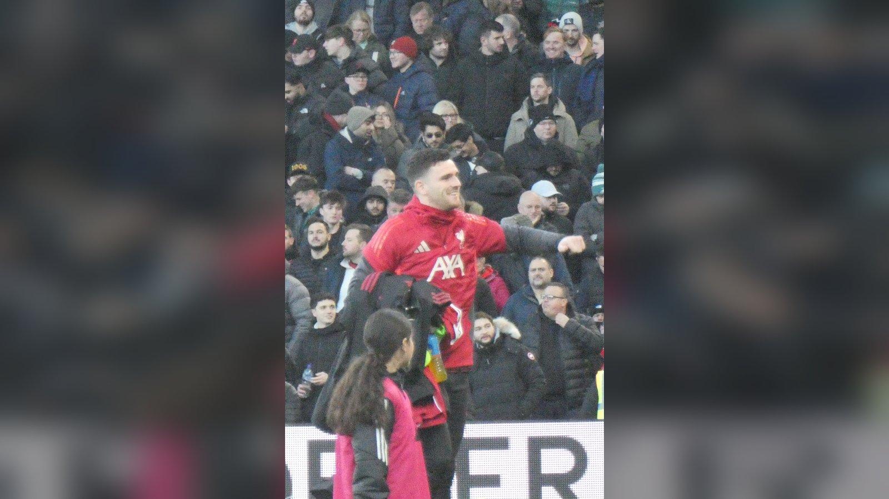

# Гаити – Шотландия: историческое возвращение на ЧМ-2026 и потеря Гилмора

_13 июня Шотландия впервые с 1998 года сыграет на чемпионате мира, а Гаити вернётся на турнир спустя 52 года. Превью матча группы C, потеря Билли Гилмора и прогноз._

**type:** preview | **category:** ЧМ-2026 | **source_type:** news | **db_slug:** haiti-scotland-world-cup-2026-preview-group-c

Матч группы C между сборными Гаити и Шотландии – одна из самых трогательных историй стартового тура чемпионата мира 2026 года. Игра пройдёт на стадионе «Жиллетт» в Фоксборо под Бостоном вечером 13 июня по местному времени (ночь на 14 июня по времени Казахстана и Москвы).

## Возвращение спустя десятилетия

Для обеих команд сам факт участия в турнире – уже достижение. Шотландия играет на чемпионате мира впервые с 1998 года, прервав 28-летнее ожидание, на протяжении которого болельщики не раз были близки к мечте, но срывались в решающих матчах. Гаити пробилось на мундиаль лишь во второй раз в истории и впервые с 1974 года. Поэтому каждое очко в этом матче несёт огромный символический вес, а сама атмосфера встречи обещает быть по-настоящему праздничной.

| Параметр | Значение |
| --- | --- |
| Турнир | ЧМ-2026, группа C, 1-й тур |
| Стадион | «Жиллетт», Фоксборо (Бостон) |
| Начало | 13 июня, 21:00 ET (ночь на 14 июня по РК/МСК) |
| Контекст | стартовый матч группы для обеих сборных |

## Шотландия потеряла Гилмора

Главная кадровая новость – потеря Билли Гилмора. Как сообщает ESPN, полузащитник выбыл из заявки на чемпионат мира из-за травмы колена, полученной в контрольном матче с Кюрасао (4:1). Его место в составе занял молодой хавбек «Манчестер Юнайтед» Тайлер Флетчер. Для шотландцев это ощутимая потеря: Гилмор – один из самых техничных распасовщиков команды, способный задавать темп в центре поля. Лидерские функции теперь во многом ложатся на капитана и левого защитника Энди Робертсона, от которого ждут не только надёжной игры в обороне, но и подключений к атакам.

## Чего ждать от Гаити

По данным Sports Mole, у Гаити нет проблем с составом, и команда может выйти в той же схеме 4-4-2, что и в последних контрольных матчах. Для карибской сборной это шанс заявить о себе на крупнейшей сцене мирового футбола: ставка, вероятно, будет сделана на компактную оборону и быстрые переходы из защиты в атаку.

| Команда | Статус |
| --- | --- |
| Шотландия | без Билли Гилмора (травма колена); капитан – Робертсон |
| Гаити | без кадровых проблем, вероятная схема 4-4-2 |

## Прогноз

Группа C – одна из самых сложных на турнире: помимо этой пары, в ней играют Бразилия и Марокко, считающиеся явными фаворитами квартета. Поэтому очки в личной встрече для Гаити и Шотландии особенно ценны – вполне возможно, что именно результат этого матча определит, кто из аутсайдеров сохранит шансы на выход в плей-офф. Шотландцы выглядят чуть предпочтительнее за счёт опыта и качества состава, но недооценивать мотивированное Гаити нельзя. Логичным итогом видится упорная и нервная игра с небольшим перевесом европейцев, хотя ничья никого не удивит.

Источники: ESPN, Sports Mole, Sports Illustrated.

