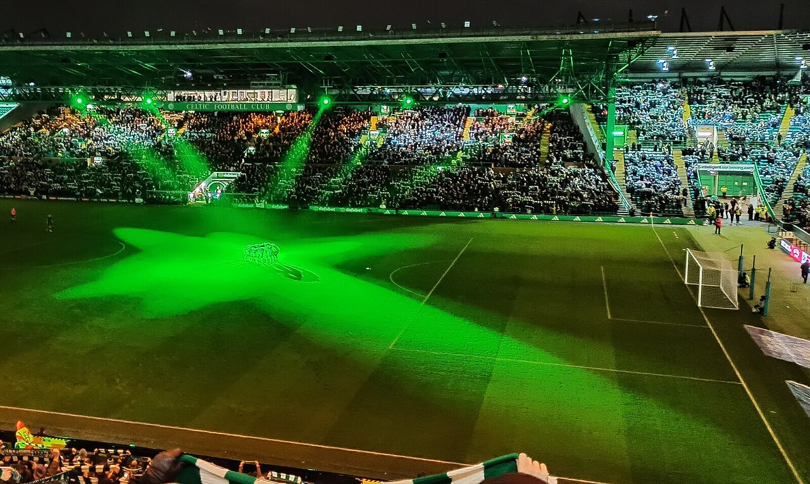

# Раунд плей-офф Лиги чемпионов 2026/27: кто разыграет последние путёвки в общий этап

> 18–19 августа стартует раунд плей-офф квалификации Лиги чемпионов 2026/27. На кону – последние путёвки в общий этап главного клубного турнира Европы. Разбираем формат, даты и главные пары.

- Категория: Тренды
- Тип: preview
- Источник материала: news

**Раунд плей-офф Лиги чемпионов 2026/27** – последний барьер на пути в общий этап самого престижного клубного турнира Европы. Первые матчи пройдут 18 и 19 августа, ответные встречи запланированы на 25 и 26 августа. Именно эта стадия определит, кто из претендентов присоединится к грандам, попавшим в общий этап напрямую.

## Что разыгрывается

По информации UEFA, победители пар раунда плей-офф пробьются в общий этап Лиги чемпионов и присоединятся к клубам, квалифицировавшимся автоматически. Проигравшие при этом не остаются ни с чем: они продолжат выступление в общем этапе Лиги Европы. Таким образом, каждая пара – это матч не только за место в элите, но и за многомиллионные доходы: одно только участие в общем этапе Лиги чемпионов приносит клубам крупные премиальные, не говоря уже о телевизионных и коммерческих поступлениях.

## Формат и даты

| Стадия | Первые матчи | Ответные матчи |
|---|---|---|
| Раунд плей-офф | 18–19 августа 2026 | 25–26 августа 2026 |
| Жеребьёвка общего этапа | конец августа 2026 | – |

Квалификация разделена на два пути – «путь чемпионов» (для чемпионов своих стран) и «путь представителей лиг». Такое разделение традиционно повышает шансы клубов из некрупных ассоциаций пробиться в общий этап, поскольку они соперничают между собой, а не с грандами топ-лиг. Напомним, что правило выездного гола в еврокубках отменено, поэтому при равенстве по сумме двух матчей судьбу пары решат дополнительное время и серия пенальти.

## Главные пары

По итогам жеребьёвки, состоявшейся в начале августа, в числе участников оказались как титулованные, так и амбициозные клубы. Среди заметных противостояний:

- **«Селтик» – ЛАСК.** Чемпион Шотландии принимает крепкий австрийский клуб. «Селтик Парк» в Глазго – одна из самых атмосферных арен Европы, и хозяева будут считаться фаворитами пары.
- **АЕК (Афины) – победитель пары «Левски» / «Кайрат».** Греческий клуб ждал соперника из квалификации, где казахстанский «Кайрат» уступил софийскому «Левски» и выбыл из борьбы за Лигу чемпионов.
- **Пары с участием «Фенербахче», «Штурма», «Спарты» и «Лиона».** В «пути представителей лиг» встречаются известные европейские бренды, для которых квалификация – вопрос престижа и финансов.

## На что обратить внимание

Для клубов вроде «Селтика» выход в общий этап – это ежегодная цель и подтверждение статуса, тогда как для менее богатых участников подобная путёвка способна изменить бюджет на годы вперёд. Отдельная интрига – судьба грандов, вынужденных пробиваться через сито квалификации: любое поражение отбросит их в Лигу Европы, что для клубов такого уровня считается разочарованием.

Ключевыми факторами в двухматчевых противостояниях станут результат домашней игры, дисциплина в обороне и физическая готовность – многие команды только набирают форму после межсезонья и параллельно ведут матчи национальных чемпионатов.

## Итог

Раунд плей-офф 18–26 августа – кульминация летней еврокубковой квалификации. На кону последние места в общем этапе Лиги чемпионов, и борьба обещает быть предельно напряжённой. Полный список пар и точное расписание опубликованы на официальных ресурсах UEFA.

Источники: UEFA.com, Yahoo Sports, Vanguard.

Источники (URL):
- https://www.uefa.com/uefachampionsleague/news/02a7-2133e87717bc-9913021d47f2-1000--uefa-champions-league-play-off-draw/
- https://sports.yahoo.com/articles/champions-league-playoff-draw-full-095521783.html
- https://www.vanguardngr.com/2026/08/full-fixtures-uefa-champions-league-play-off-draw-2/
