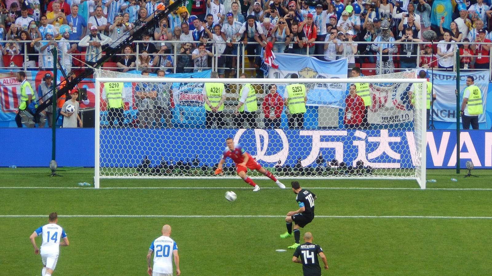

Лионель Месси установил исторический рекорд чемпионатов мира. По данным FOX Sports, капитан сборной Аргентины довёл число забитых мячей на мундиалях до 21 за карьеру и стал лучшим бомбардиром за всю историю турнира. Достижение особенно символично на фоне того, что 2026 год стал для аргентинца, по информации СМИ, уже шестым чемпионатом мира.

Прежний рекорд принадлежал немцу Мирославу Клозе, забившему 16 мячей на четырёх мундиалях с 2002 по 2014 год. Месси прошёл эту отметку по ходу нынешнего турнира: в стартовом матче против Алжира он оформил хет-трик, сравнявшись с Клозе на цифре 16, а затем ушёл в отрыв.

## Как складывался рекорд

На ЧМ-2026 Месси забил восемь мячей – этого хватило не только для покорения вечного рекорда, но и для лидерства в гонке бомбардиров конкретно этого турнира. Каждый новый гол капитана всё дальше отодвигал предыдущее историческое достижение, и теперь планка поднята на недосягаемую для соперников по этому мундиалю высоту.

> «Месси продолжает переписывать рекорды в своём шестом чемпионате мира», – отмечает FOX Sports.

## Гонка бомбардиров ещё открыта

В таблице лучших снайперов турнира-2026 Месси делит первую строчку с французом Килианом Мбаппе – у обоих по восемь голов. Аргентинец лидирует за счёт тай-брейка: по регламенту при равенстве мячей учитываются голевые передачи, а их у Месси больше – четыре против трёх у Мбаппе. Об этом сообщает Yahoo Sports.

Судьба индивидуального приза «Золотая бутса» окончательно решится в ближайшие дни. Аргентина сыграет в финале против Испании 19 июля, а сборная Франции с Мбаппе проведёт матч за третье место, где у француза будет последний шанс догнать соперника. Но рекорд по общему числу голов за всю историю чемпионатов мира Месси уже обеспечил себе вне зависимости от исхода оставшихся встреч.

Для 39-летнего аргентинца, которому в июне исполнилось 39 лет, этот мундиаль стал очередным подтверждением феноменального долголетия на высшем уровне.

## Долголетие на высшем уровне

Рекорд Месси – это не только о голах, но и о феноменальной стабильности на протяжении почти двух десятилетий. Свой первый мяч на чемпионатах мира аргентинец забил ещё в 2006 году, будучи совсем юным игроком, а теперь возглавляет исторический список бомбардиров турнира. Мало кому из футболистов удавалось оставаться решающей фигурой сборной на шести мундиалях подряд.

Для болельщиков в Казахстане и странах СНГ, где Месси остаётся одним из самых популярных футболистов, этот рекорд стал очередным поводом следить за финалом с особым интересом. Каждое его выступление на нынешнем турнире воспринимается как возможность увидеть игру легенды, переписывающего рекорды на глазах у всего мира.

Источники: FOX Sports, Sports Illustrated, Yahoo Sports.
