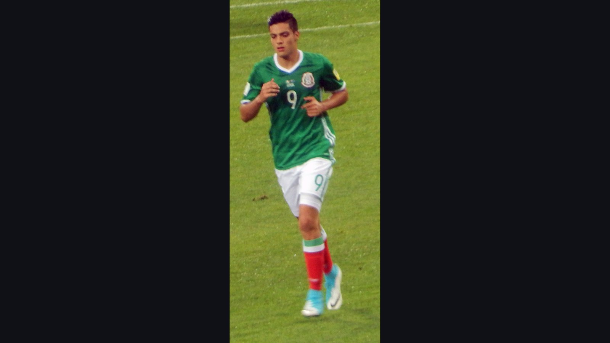

# Мексика разгромила ЮАР в матче открытия ЧМ-2026: 2:0 и три красные карточки

> Сборная Мексики обыграла ЮАР со счётом 2:0 в матче открытия чемпионата мира 2026 года на «Ацтеке». Первый гол турнира забил Хулиан Киньонес, а встреча вошла в историю тремя удалениями.

*Категория: Отчёты о матчах · Тип: match_report · news*

**Мексика** обыграла **ЮАР** со счётом **2:0** в матче открытия чемпионата мира 2026 года, который 11 июня прошёл на легендарном стадионе «Ацтека» в Мехико. Дублем команды Хавьера Агирре отметились Хулиан Киньонес и Рауль Хименес, а сама встреча запомнилась тремя красными карточками – такого в стартовом матче мирового первенства ещё не случалось.

Этот матч стал особенным и для самого стадиона: «Ацтека» вошёл в историю как первая арена, принявшая сразу три церемонии открытия чемпионата мира. Для Мексики турнир-2026 – первый домашний мундиаль с 1986 года, и старт получился именно таким, о каком мечтали болельщики.

## Как развивался матч

Хозяева повели быстро: уже на 9-й минуте Хулиан Киньонес открыл счёт и стал автором первого гола всего турнира. Натурализованный форвард не дал ЮАР времени освоиться, а «Ацтека», собравшая 80 824 зрителя, мгновенно превратилась в одну сплошную волну поддержки.

Во втором тайме игра поломалась. На 49-й минуте первую красную карточку увидел защитник ЮАР Яя Ситоле, оставив свою команду в меньшинстве почти на весь оставшийся отрезок. Воспользоваться численным преимуществом мексиканцы смогли на 67-й минуте: 35-летний ветеран Рауль Хименес удвоил преимущество и снял все вопросы о победителе.

Концовка получилась нервной. На 84-й минуте вторую красную карточку у ЮАР заработал Темба Зване, а уже в компенсированное время (90+2) поле досрочно покинул и мексиканец Сесар Монтес. Итог – 2:0 и сразу три удаления в дебютном матче турнира.

## Статистика матча

| Показатель | Мексика | ЮАР |
| --- | --- | --- |
| Голы | 2 | 0 |
| Удары | 16 | 3 |
| Владение мячом | 60% | 40% |
| Красные карточки | 1 | 2 |

Цифры полностью отражают ход встречи: 16 ударов против трёх и 60% владения у Мексики против 40% у соперника. ЮАР, вынужденная большую часть матча играть в меньшинстве, так и не сумела создать ничего серьёзного у ворот хозяев.

## Герой матча

Лучшим игроком встречи был признан Хулиан Киньонес: он не только забил первый мяч чемпионата мира, но и стал главным двигателем атак хозяев. Опытный Рауль Хименес добавил к этому второй гол, подтвердив, что Агирре по-прежнему может опираться на проверенных исполнителей.

> По данным «Чемпионата» и Sports.ru, Мексика победила ЮАР 2:0; голы забили Киньонес (9-я минута) и Хименес (67-я), а в матче было показано три красные карточки.

Для Мексики это идеальный старт в группе, который сразу укрепил позиции хозяев в борьбе за плей-офф. А вот ЮАР после такого поражения и двух удалений придётся быстро перестраиваться – и психологически, и по составу – перед следующими матчами группового этапа.

**Источники:** «Чемпионат», Sports.ru, ESPN.
