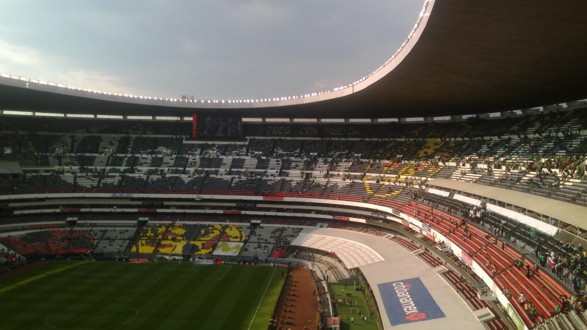

# Мексика – Англия: превью матча 1/8 финала ЧМ-2026 на «Ацтеке»

_5 июля Англия Томаса Тухеля сыграет против хозяйки турнира Мексики на высокогорной «Ацтеке» в 1/8 финала ЧМ-2026. Фактор высоты 2240 метров может стать решающим._

**Тип:** preview · **Категория:** ЧМ-2026 · **source_type:** news

Сборная Англии проведёт один из самых сложных матчей 1/8 финала чемпионата мира 2026: 5 июля на легендарном стадионе «Ацтека» в Мехико «трёх львов» ждёт хозяйка турнира – Мексика. Игра на высоте более двух километров над уровнем моря обещает стать серьёзным испытанием для команды Томаса Тухеля и одним из самых атмосферных поединков этой стадии.

Для Мексики это шанс использовать все преимущества родных стен, для Англии – проверка на прочность в непривычных условиях. Ставки высоки: победитель выходит в четвертьфинал, где сыграет с победителем пары Бразилия – Норвегия.

## Форма соперников

Англия пробилась в 1/8 финала благодаря поздней победе над ДР Конго – 2:1: спасать команду вновь пришлось капитану Гарри Кейну, который остаётся главной надеждой «трёх львов» в атаке. Мексика же уверенно прошла свой матч 1/16 финала, обыграв Эквадор 2:0. Хозяева не проигрывают дома и не пропускают на «Ацтеке» – их домашняя серия впечатляет и служит важным психологическим фактором.

| Сборная | Матч 1/16 финала | Счёт |
| --- | --- | --- |
| Мексика | против Эквадора | 2:0 |
| Англия | против ДР Конго | 2:1 |

## Фактор «Ацтеки» и высоты

Газон «Ацтеки» расположен на высоте 2240 метров над уровнем моря. В разреженном воздухе дышать тяжелее, спортсмены быстрее устают, и это может стать проблемой для гостей, привыкших к иному ритму. Наставник Англии Томас Тухель назвал высоту «большим минусом», подчеркнув, что команда «физически не сможет адаптироваться к ней за четыре дня», приводит его слова Al Jazeera. Англичане прилетели в Мехико лишь в пятницу, и времени на акклиматизацию у них почти не было.

Мексика на «Ацтеке» неуязвима: в матчах чемпионатов мира на этом стадионе у сборной семь побед и три ничьих в десяти встречах, а с сентября 2013 года хозяева не проигрывают здесь 26 матчей подряд, отмечает Sports Mole. Такая статистика превращает арену в настоящую крепость, где даже грандам приходится нелегко.

## Историческая справка

Оба раза, когда Мексика принимала чемпионат мира – в 1970 и 1986 годах, – она доходила до четвертьфинала. Для нынешнего поколения это дополнительный стимул повторить достижение предшественников. В 1986 году именно на «Ацтеке» Англия в 1/8 финала обыграла Парагвай, так что у «трёх львов» тоже есть приятные воспоминания об этой арене. Теперь англичанам предстоит вновь испытать удачу здесь – но уже против самих хозяев.

## Ключевые фигуры

У Англии всё замыкается на капитане Гарри Кейне – именно он вытащил команду в матче с ДР Конго и остаётся главным бомбардиром «трёх львов». Мексика же опирается на дисциплинированную командную игру и невероятную поддержку домашних трибун, которая на «Ацтеке» способна завести хозяев и деморализовать соперника. Психологическое давление от 26-матчевой беспроигрышной серии на этой арене – ещё один фактор не в пользу англичан.

Важным станет и управление физическим состоянием: на высоте команды быстрее устают, поэтому концовки таймов и грамотные замены могут сыграть решающую роль. Тренерский поединок Томаса Тухеля с наставником мексиканцев обещает быть не менее интересным, чем борьба на поле.

## Прогноз

Класс исполнителей Англии в целом выше, но высота, оглушительная поддержка трибун и домашняя серия делают Мексику крайне неудобным соперником. Многое будет зависеть от того, как гости перенесут разреженный воздух и сумеют ли реализовать свои моменты в те отрезки, когда хватит сил на прессинг. Если Кейн и партнёры справятся с физическим вызовом, шансы «трёх львов» на выход в четвертьфинал выглядят предпочтительными. Но недооценивать хозяев на «Ацтеке» не стоит – история этой арены полна разочарований для грандов.

Источники: Al Jazeera, Sports Mole, Olympics.com.
