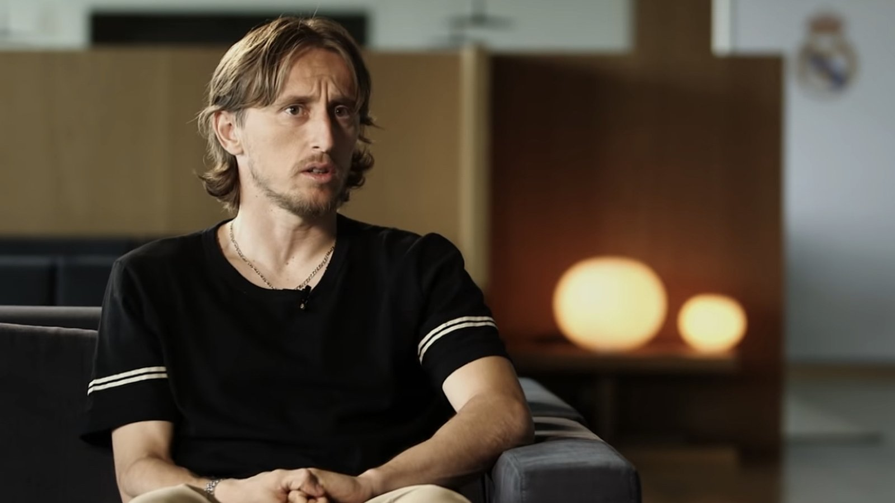

# Лука Модрич завершит карьеру после ЧМ-2026 и может войти в руководство «Реала» – СМИ

_По информации инсайдера Николо Скиры, 40-летний хорватский полузащитник Лука Модрич объявит об окончании карьеры после чемпионата мира 2026 года. Сообщается и о возможной руководящей роли в «Реале»._

**type:** transfer | **category:** Новости игроков | **source_type:** news | **db_slug:** modric-retirement-after-world-cup-2026-real-madrid

Легендарный хорватский полузащитник Лука Модрич объявит о завершении игровой карьеры после чемпионата мира 2026 года. Об этом, по информации инсайдера Николо Скиры, сообщает ряд СМИ. 40-летний футболист, кроме того, может войти в руководящую структуру мадридского «Реала».

По данным журналистов, действующий чемпионат мира станет для Модрича прощальным турниром. Хорват сыграет за национальную сборную в группе L, где соперниками станут Англия, Гана и Панама. Стартовая встреча с Англией обещает быть особенно символичной – это повторение полуфинала ЧМ-2018, в котором хорваты тогда оказались сильнее и впервые в истории вышли в финал мирового первенства.

Сообщается, что Модрич уже определился с решением, а после завершения карьеры может получить руководящую должность в «Реале». Подчёркиваем: речь идёт о сообщениях СМИ со ссылкой на инсайдерскую информацию – официального подтверждения от самого игрока или клубов на данный момент нет, поэтому к деталям стоит относиться осторожно.

## Карьера длиною в эпоху

Модрич выступал за «Реал» с 2012 по 2025 год и стал одним из самых титулованных игроков в истории клуба. В его активе многочисленные победы в Лиге чемпионов, чемпионские титулы Испании и «Золотой мяч» 2018 года, который прервал многолетнюю гегемонию Лионеля Месси и Криштиану Роналду в борьбе за главную индивидуальную награду. Летом 2025-го хорват покинул Мадрид и продолжил карьеру в итальянском «Милане», однако, судя по сообщениям, и этот сезон станет для него последним на профессиональном уровне.

> По информации инсайдера Николо Скиры (через испанские и итальянские СМИ). На момент публикации официального заявления не поступало.

Модрич остаётся капитаном и безусловным лидером сборной Хорватии, которая на двух последних чемпионатах мира неизменно доходила до медалей: финал в 2018-м и бронза в 2022-м. Многое в выступлении хорватов на ЧМ-2026 вновь будет зависеть от того, в какой форме подойдёт к турниру их главный дирижёр в центре поля.

Если информация о завершении карьеры подтвердится, ЧМ-2026 станет красивым финалом великого пути одного из лучших полузащитников своего поколения. А переход в руководящие структуры «Реала» позволил бы хорвату остаться в большом футболе и после ухода с поля. За прощальным турниром Модрича будут с особым вниманием следить в Казахстане и СНГ, где у хорватского капитана множество поклонников.

Источники: Sportbox, Football España, Yahoo Sports.

