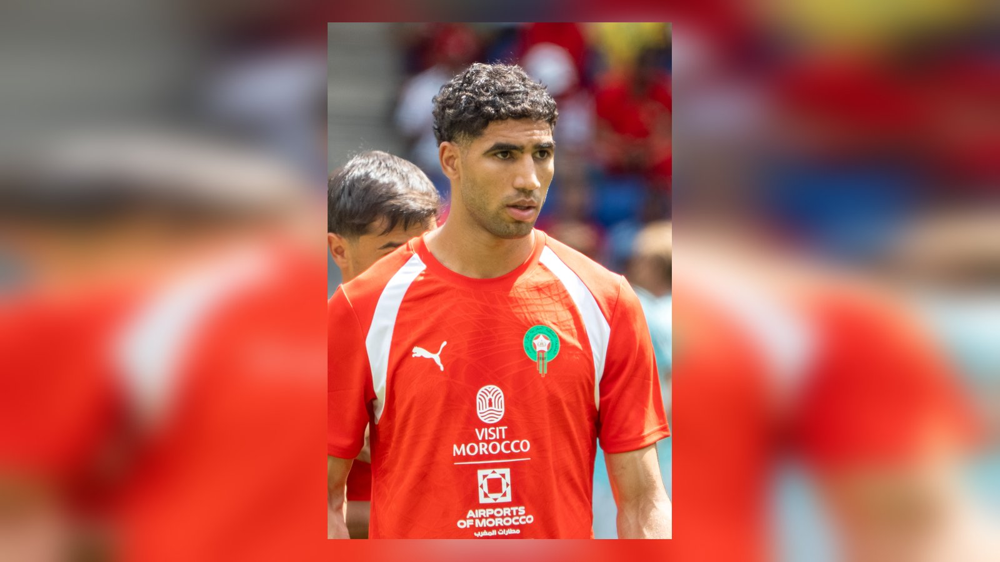

# Марокко разгромило Канаду 3:0 и вышло в четвертьфинал ЧМ-2026

_Дубль Аззедина Унахи и гол Суфиана Рахими принесли Марокко победу над хозяйкой турнира Канадой 3:0 в 1/8 финала ЧМ-2026. В четвертьфинале «атласных львов» ждёт Франция._

**Тип:** match_report · **Категория:** Отчёты о матчах · **source_type:** news

Марокко уверенно вышло в четвертьфинал чемпионата мира 2026: «атласские львы» обыграли одного из хозяев турнира – Канаду – со счётом 3:0 в матче 1/8 финала, прошедшем 4 июля на «NRG Стэдиум» в Хьюстоне. Полузащитник Аззедин Унахи оформил дубль во втором тайме, а точку в поединке в добавленное время поставил Суфиан Рахими. Этой победой Марокко открыло стадию 1/8 финала расширенного мундиаля и подтвердило статус сильнейшей африканской команды турнира.

Полуфиналисты прошлого чемпионата мира начали встречу вязко: первый тайм получился равным и осторожным, без явных моментов. Канада, впервые в истории принимающая мировое первенство вместе с США и Мексикой, действовала дисциплинированно и надёжно перекрывала подступы к своим воротам. После перерыва Марокко заметно прибавило в движении и быстро нашло свою игру, прижав соперника к штрафной.

## Дубль Унахи решил исход

Первый гол пришёл после розыгрыша штрафного удара: Ашраф Хакими скинул мяч в штрафную на Аззедина Унахи, и хавбек «Жироны» протолкнул мяч низом сквозь скопление игроков мимо голкипера Максима Крепо. Гол придал «атласским львам» уверенности, и территориальное преимущество марокканцев стало подавляющим.

Во втором отрезке Унахи воспользовался растянутой обороной канадцев и оформил дубль точным ударом, фактически сняв вопросы о победителе. Полузащитник, ставший главным героем встречи, весь второй тайм был самым заметным игроком на поле и раз за разом находил свободные зоны между линиями соперника.

В компенсированное время окончательный счёт установил Суфиан Рахими, вышедший на замену ещё до перерыва вместо получившего повреждение Исмаэля Саиби. Голевую передачу отдал Брахим Диас – это его четвёртая результативная передача на чемпионатах мира, что стало новым рекордом для игроков из африканских сборных, как сообщает Sky Sports. Именно связка опытных исполнителей – Хакими, Диас, Унахи – раз за разом вскрывала оборону канадцев.

## События матча

| Минута | Событие |
| --- | --- |
| 2-й тайм | Гол: Аззедин Унахи (пас – Ашраф Хакими), 1:0 |
| 2-й тайм | Гол: Аззедин Унахи, 2:0 |
| 90+ | Гол: Суфиан Рахими (пас – Брахим Диас), 3:0 |

## Крепость обороны и класс в атаке

Итоговый счёт 3:0 отразил игровое превосходство Марокко во втором тайме. Команда подтвердила, что её успех на прошлом мундиале, где африканцы дошли до полуфинала, не был случайностью: те же принципы – надёжная игра сзади, дисциплина и быстрые переходы в атаку через фланги – работают и на этом турнире. Хакими на правом краю остаётся одним из ключевых игроков сборной, сочетая оборонительные функции с постоянной поддержкой атаки, а средняя линия во главе с Унахи обеспечивает контроль мяча.

Отдельного внимания заслуживает глубина состава: даже вынужденная замена из-за травмы не выбила «атласских львов» из колеи – вышедший на поле Рахими сумел отличиться. Это говорит о том, что у Марокко есть ресурсы, чтобы выдерживать плотный график расширенного мундиаля с матчами на разных аренах и в разных часовых поясах.

Для Канады турнир завершился на стадии 1/8 финала. Дебютный для страны выход в плей-офф домашнего чемпионата мира всё же стал шагом вперёд для канадского футбола, однако против опытного и мотивированного Марокко хозяева не сумели создать достаточно моментов, чтобы рассчитывать на иной исход.

## Что дальше

Победа вывела Марокко в четвертьфинал, где 9 июля на «Жиллетт Стэдиум» в Фоксборо команду ждёт встреча с Францией, которая в параллельном матче 1/8 финала минимально обыграла Парагвай. Это будет одно из центральных противостояний четвертьфинальной стадии – африканский гранд против одного из главных фаворитов турнира.

> По оценке отчётов ESPN и FIFA, после пассивного первого тайма Марокко заметно прибавило во втором и добилось заслуженной победы.

Источники: Sky Sports, ESPN, FIFA.
