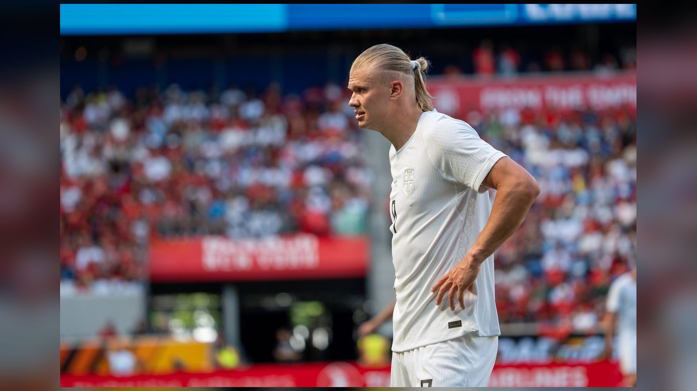

# Норвегия – Англия: превью четвертьфинала ЧМ-2026 и дуэль Холанда с Кейном

_11 июля Норвегия впервые в истории сыграет в четвертьфинале крупного турнира – против Англии. В центре внимания дуэль бомбардиров Эрлинга Холанда и Гарри Кейна._

**Категория:** ЧМ-2026 | **Тип:** preview | **source_type:** news

Сборные Норвегии и Англии сыграют в четвертьфинале чемпионата мира 2026 года 11 июля на «Хард Рок Стэдиум» в Майами. Для норвежцев это первый в истории выход в четвертьфинал крупного турнира, и добыт он был благодаря по-настоящему сенсационной победе над Бразилией.

Противостояние обещает стать одним из самых зрелищных на этой стадии: в его центре – прямая дуэль двух лучших форвардов современного футбола, Эрлинга Холанда и Гарри Кейна, которые вместе идут в лидирующей группе гонки бомбардиров.

## Норвегия сотворила историю

В 1/8 финала Норвегия обыграла Бразилию со счётом 2:1, а дубль оформил Эрлинг Холанд. Форвард «Манчестер Сити» забивает в каждом из четырёх матчей на этом чемпионате мира и с семью голами входит в тройку бомбардиров турнира. Норвежцы, которых на групповом этапе, к слову, обыграла именно Франция, сумели перегруппироваться и выдали лучший отрезок в истории своей сборной.

Впрочем, статистика встреч норвежцев с европейскими соперниками на чемпионатах мира тревожная: в шести матчах против команд из Европы – ни одной победы (2 ничьи, 4 поражения), включая поражения в плей-офф от Италии в 1938 и 1998 годах. Англия постарается использовать этот исторический расклад в свою пользу.

## Англия рассчитывает на Кейна

Англичане пробились в четвертьфинал после напряжённой победы над одним из хозяев турнира – Мексикой – со счётом 3:2. Капитан Гарри Кейн довёл свой счёт голов до шести: лишь в третий раз в истории английский футболист забивает шесть мячей на одном крупном турнире. Поддержку ему оказывает Джуд Беллингем, у которого уже четыре гола на турнире.

Сборная Англии традиционно подходит к плей-офф с большими ожиданиями и мощным подбором исполнителей, однако её главной задачей станет нейтрализация Холанда – игрока, способного решить исход матча одним касанием. Опыт крупных турниров и глубина состава – весомые аргументы «Трёх львов» в этом противостоянии.

Отдельная интрига – борьба за «Золотую бутсу»: Холанд с семью голами опережает Кейна всего на один мяч, поэтому личная дуэль форвардов в Майами может напрямую повлиять на итоговый расклад в гонке бомбардиров турнира.

## Дуэль бомбардиров

| Игрок | Сборная | Голы на ЧМ-2026 |
| --- | --- | --- |
| Эрлинг Холанд | Норвегия | 7 |
| Гарри Кейн | Англия | 6 |

## Форма команд (последние 5 матчей)

| Команда | Ключевой результат в плей-офф |
| --- | --- |
| Норвегия | победа над Бразилией 2:1 в 1/8 финала |
| Англия | победа над Мексикой 3:2 в 1/8 финала |

## Прогноз

Англия считается фаворитом пары, но Норвегия уже доказала, что способна обыграть кого угодно, отправив домой пятикратных чемпионов мира. Личная дуэль Холанда и Кейна в борьбе за «Золотую бутсу» добавляет матчу дополнительную интригу. Многое решит, сумеет ли оборона англичан сдержать главную звезду норвежцев и удастся ли самой Норвегии наконец прервать безвыигрышную серию против европейских сборных на чемпионатах мира.

**Источники:** England Football, Euronews, Olympics.com.

---

**Sources:**
- https://www.englandfootball.com/england/mens-senior-team/fixtures-results/2025-26/World-Cup/norway-england-fifa-world-cup-quarter-final-saturday-11-july-2026-match-centre
- https://www.euronews.com/2026/07/06/norway-and-england-advance-to-world-cup-quarterfinals-as-brazil-and-mexico-head-home
- https://www.olympics.com/en/news/fifa-world-cup-2026-watch-norway-england-quarter-finals-head-to-head-full-schedule
