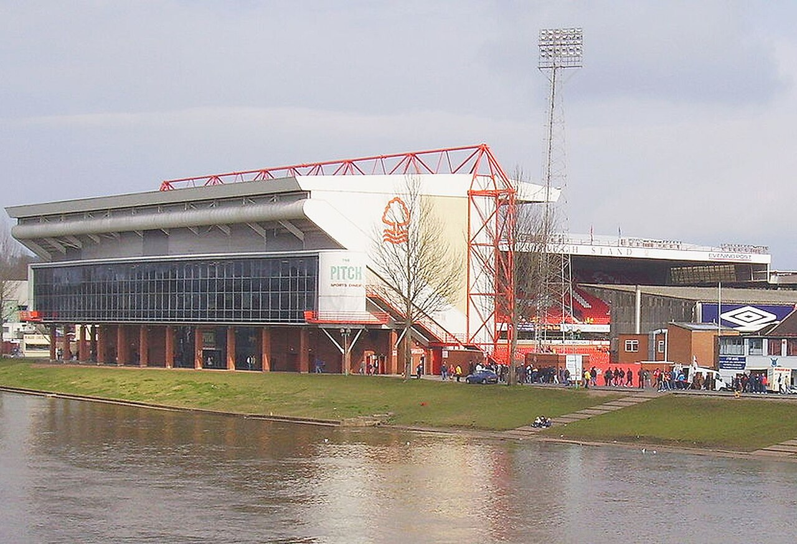

# «Ноттингем Форест» официально подписал защитника Усмана Диоманде из «Спортинга»

> «Ноттингем Форест» объявил о подписании 22-летнего ивуарийского центрального защитника Усмана Диоманде из лиссабонского «Спортинга». Сумма трансфера – около 40 млн евро.

- Категория: Новости игроков
- Тип: transfer
- Источник материала: news

**«Ноттингем Форест» официально подписал Усмана Диоманде** – 22-летний центральный защитник сборной Кот-д’Ивуара перешёл из лиссабонского «Спортинга». О завершении затянувшейся трансферной саги клуб из Премьер-лиги объявил на своём сайте 11 августа.

## Сумма и контракт

По данным Sports Mole и других источников, сумма трансфера составила около 40 млн евро (примерно 34,3 млн фунтов). Диоманде подписал с «лесниками» долгосрочный контракт – в сообщениях фигурирует соглашение на четыре года.

> Как сообщает официальный сайт «Ноттингем Форест», клуб завершил подписание Усмана Диоманде из «Спортинга».

## Ключевая роль тренера

Важную роль в переходе сыграл главный тренер «Форест» Оливер Глазнер, который давно следил за игроком и настаивал на его приобретении. За «Спортинг» ивуариец провёл около 130 матчей во всех турнирах и успел стать одним из лидеров обороны португальского гранда, а также закрепиться в национальной сборной Кот-д’Ивуара.

## Перестройка обороны

Приобретение Диоманде выглядит логичным шагом на фоне летней перестройки состава. «Ноттингем Форест» провёл активное трансферное окно, в том числе расставшись с рядом ключевых игроков средней линии, и теперь реинвестирует средства в оборону. Молодой, мощный и быстрый центральный защитник, привыкший играть с высокой линией, хорошо подходит под требования Глазнера.

Для «Спортинга», традиционно работающего по модели воспитания и продажи талантов, сделка на 40 млн евро – это солидный доход и подтверждение статуса одного из лучших «трамплинов» Европы. Лиссабонцам предстоит найти замену в центре защиты до закрытия окна.

## Амбиции клуба

Для «Ноттингем Форест» это одно из ключевых приобретений летнего трансферного окна. После заметного прогресса в последних сезонах клуб стремится закрепиться в верхней части таблицы Премьер-лиги, и надёжная оборона – важнейший элемент этих планов. Для самого Диоманде переход в Англию – шанс проявить себя в одной из сильнейших лиг мира и выйти на новый уровень.

Трансфер подтверждён официальным заявлением клуба, что делает сделку окончательной. Летнее трансферное окно в Англии остаётся открытым до 1 сентября, и «Форест» может продолжить укрепление состава.

Источники: официальный сайт «Ноттингем Форест», Sports Mole, Daily Sports.

Источники (URL):
- https://www.nottinghamforest.co.uk/news/2026/august/11/forest-complete-signing-of-ousmane-diomande/
- https://www.sportsmole.co.uk/football/nottingham-forest/transfer-talk/news/saga-over-nottingham-forest-finally-announce-diomande-signing-contract-length-revealed_602786.html
- https://dailysports.net/news/official-nottingham-forest-sign-ivory-coast-defender-ousmane-diomande-from-sporting-cp/
