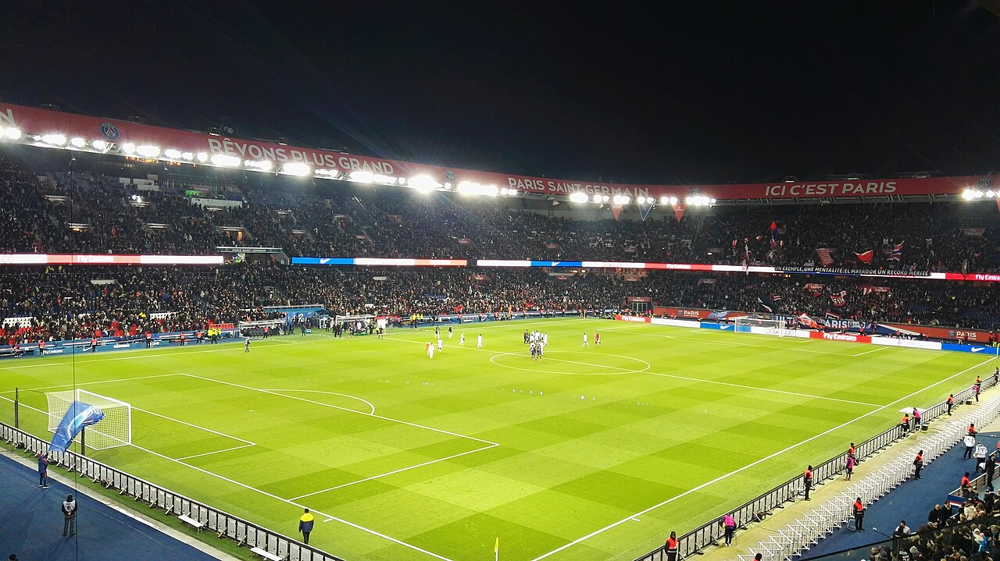

# ПСЖ договорился с «Пармой» о трансфере вратаря Зиона Судзуки за 35 млн евро

> «Пари Сен-Жермен» достиг соглашения с «Пармой» о переходе японского вратаря Зиона Судзуки за 35 млн евро. 23-летнего голкипера с высокой вероятностью отдадут в аренду в «Ювентус».

- Категория: Новости игроков
- Тип: transfer
- Источник материала: news

**Трансфер вратаря Зиона Судзуки в ПСЖ** приблизился к развязке: чемпион Франции договорился с «Пармой» о переходе 23-летнего японского голкипера. По информации итальянских и французских источников, а также журналиста Фабрицио Романо, стороны согласовали сумму сделки в районе 35 млн евро с учётом бонусов.

## Детали сделки

Судзуки, один из самых заметных вратарей минувшего сезона Серии А, подпишет с парижанами долгосрочный контракт – по данным источников, соглашение рассчитано на пять лет. «Пари Сен-Жермен» повысил предложение с первоначальных примерно 28 млн евро, чтобы окончательно убедить «Парму» отпустить игрока.

> По информации Football Italia и Fabrizio Romano, между ПСЖ и «Пармой» достигнута полная договорённость по трансферу Зиона Судзуки за сумму около 35 млн евро.

## Аренда в «Ювентус»

Ключевая деталь сделки – Судзуки, скорее всего, не будет выступать за «Парк де Пренс» уже в этом сезоне. Как сообщают источники, японца планируют отдать в аренду, и наиболее вероятным вариантом называется «Ювентус», которому нужен надёжный голкипер. Таким образом, ПСЖ фиксирует за собой перспективного вратаря на будущее, одновременно давая ему игровую практику в топ-клубе Серии А.

## Логика ПСЖ

Приобретение молодого вратаря укладывается в стратегию парижан последних лет – подписывать перспективных исполнителей на вырост и постепенно снижать средний возраст состава. Схема «покупка плюс аренда» позволяет клубу закрепить за собой права на игрока, не форсируя его интеграцию в основу и не мешая развитию через регулярную практику в сильном чемпионате.

Для «Пармы» же продажа за 35 млн евро – удачная сделка с точки зрения баланса: клуб зарабатывает солидную сумму на голкипере, который лишь недавно раскрылся на уровне Серии А. Итальянцам предстоит оперативно найти замену на трансферном рынке, который остаётся активным до начала сентября.

## Что это значит для Судзуки

Для самого японца переход в один из сильнейших клубов Европы становится важнейшим шагом в карьере, даже с учётом возможной аренды. Регулярная игра за клуб уровня «Ювентуса» позволит вратарю прибавить и подтвердить статус одного из лучших молодых голкиперов мира, а в перспективе – побороться за место в воротах ПСЖ.

Пока трансфер не подтверждён официальными заявлениями клубов, поэтому финальные параметры сделки могут измениться. Тем не менее ведущие профильные источники сходятся во мнении, что переход находится на завершающей стадии.

Источники: OneFootball, Football Italia, Yahoo Sports.

Источники (URL):
- https://onefootball.com/en/news/psg-agree-35m-deal-for-zion-suzuki-loan-to-juventus-likely-43259965
- https://football-italia.net/psg-reach-suzuki-agreement-with-parma/
- https://sports.yahoo.com/articles/psg-reach-35m-agreement-parma-094500481.html
