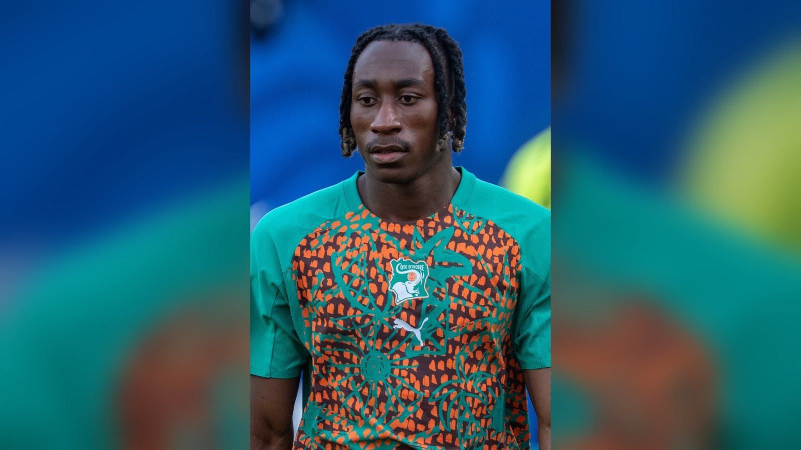

# «Реал Мадрид» предложил 100 млн евро за Яна Диоманде: «Лейпциг» отклонил первую заявку

> **Категория:** Новости игроков · **Тип:** transfer · **source_type:** news

*«Реал Мадрид» вступил в борьбу за 19-летнего вингера «РБ Лейпциг» Яна Диоманде и, по данным Sky Sports, направил предложение, которое немцы отклонили. Переговоры продолжаются.*

---

«Реал Мадрид» активизировался на трансферном рынке: клуб официально включился в гонку за одним из самых перспективных вингеров Европы – 19-летним ивуарийцем Яном Диоманде из «РБ Лейпциг». Об этом 24–25 июля сообщили сразу несколько источников.

## Детали предложения

По информации трансферного эксперта Фабрицио Романо, «Реал» сделал официальное предложение в размере 90 млн евро плюс 10 млн бонусами – в сумме около 100 млн евро. Sky Sports уточняет, что заявка (по английским данным – порядка 85 млн фунтов) была отклонена «Лейпцигом».

Немецкий клуб, как пишет Get German Football News, просит за игрока более 100 млн евро, а внутренняя оценка вингера ближе к 130 млн евро. Разрыв в ожиданиях сторон пока значительный, и это главное препятствие для быстрого завершения сделки.

## Кто такой Ян Диоманде

Диоманде – один из самых востребованных молодых футболистов этого окна. В свои 19 лет ивуарийский вингер успел заявить о себе в Бундеслиге и привлечь внимание грандов. Именно ставка на молодой талант с высоким потолком объясняет готовность топ-клубов выкладывать девятизначные суммы.

По данным Yahoo Sports и Managing Madrid, за игрока также борется «Пари Сен-Жермен», а ранее интерес проявляли клубы из Англии. Конкуренция такого уровня лишь подстёгивает цену.

> «Реал Мадрид» подал первое предложение по Диоманде, но переговоры с «Лейпцигом» продолжаются, – сообщает Managing Madrid со ссылкой на отчёты.

## Что дальше

Пока сделка не оформлена: «Лейпциг» держит высокую планку по цене, а «Реал» и другие претенденты, судя по сообщениям, готовы вернуться с улучшенными условиями. Для мадридцев подписание молодого вингера мирового уровня вписывается в стратегию последних лет – собирать таланты на перспективу, как это было с рядом молодых звёзд.

Учитывая возраст и потенциал 19-летнего футболиста, борьба за него может стать одной из самых дорогих в летнем окне. До официальных заявлений сторон информацию стоит воспринимать как переговоры, а не как завершённый трансфер.

Интересно, что «Реал» параллельно фигурирует в слухах и вокруг других игроков, что говорит об амбициозной трансферной кампании мадридцев этим летом. Для «Лейпцига» же ситуация выгодна: наличие нескольких претендентов позволяет клубу диктовать условия и удерживать цену на максимуме. Развязка этого сюжета во многом определит расстановку сил на флангах атаки у грандов европейского футбола.

**Источники:** Sky Sports, Managing Madrid, Yahoo Sports, Get German Football News.

---

**Источники (sources):**
- https://www.skysports.com/football/news/11820/13566796/yan-diomande-transfer-news-real-madrid-have-lb85m-bid-rejected-for-rb-leipzig-winger
- https://www.managingmadrid.com/real-madrid-cf-news/110445/real-madrid-send-in-offer-for-rb-leipzigs-yan-diomande-report
- https://sports.yahoo.com/articles/real-madrid-send-offer-rb-225946178.html
- https://www.getfootballnewsgermany.com/2026/yan-diomande-exit-links/
