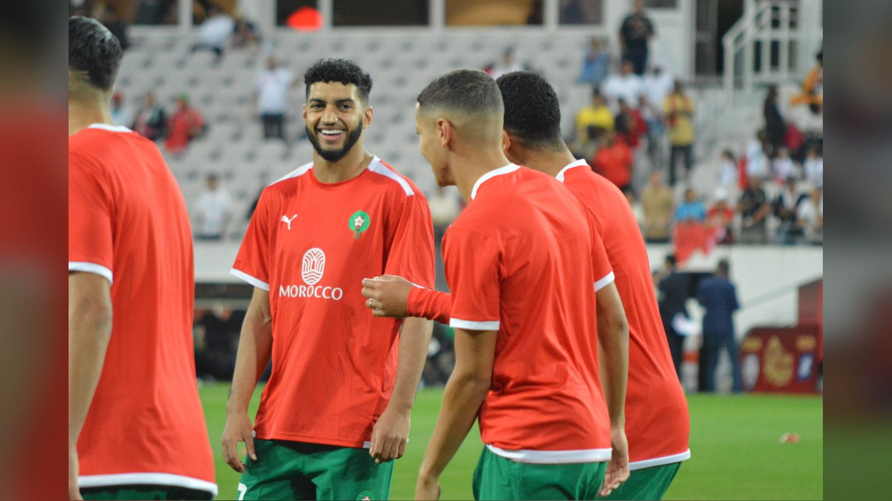

# «Бавария» подписала Исмаэля Саиби: марокканец перешёл из ПСВ

> Мюнхенская «Бавария» официально объявила о подписании марокканского полузащитника Исмаэля Саиби из ПСВ. Контракт рассчитан до 2031 года.

**Категория:** Новости игроков | **Тип:** transfer

Мюнхенская «Бавария» официально усилила среднюю линию: немецкий гранд объявил о подписании марокканского полузащитника Исмаэля Саиби из нидерландского ПСВ. Об этом сообщила пресс-служба «Баварии», уточнив, что игрок подписал долгосрочный контракт до июня 2031 года.

## Детали трансфера
По информации СМИ (Fox Sports, Yahoo Sports), сумма сделки составляет около 50 млн евро. 25-летний Саиби переходит в Мюнхен из ПСВ, с которым в последние сезоны становился чемпионом Нидерландов, и связывает своё будущее с «Баварией» на ближайшие пять лет.

> «„Бавария" объявляет о подписании Исмаэля Саиби из ПСВ», – говорится в официальном сообщении мюнхенского клуба.

## Кто такой Саиби
Саиби – техничный атакующий полузащитник, способный сыграть и в центре поля, и ближе к чужим воротам. В Нидерландах он превратился в одного из самых заметных игроков Эредивизи, а летом 2026 года привлёк внимание топ-клубов на чемпионате мира, где выступал за сборную Марокко. Именно яркая форма в составе марокканцев ускорила его переход в Бундеслигу.

## Зачем он «Баварии»
Мюнхенцы традиционно ищут универсальных футболистов, способных усилить конкуренцию в центре поля и добавить креатива в атаке. Саиби подходит под эти задачи: он приносит мобильность, продвижение мяча и результативные действия на подступах к штрафной. Для «Баварии» это вложение и в текущий результат, и в перспективу – контракт до 2031 года подчёркивает, что клуб рассчитывает на марокканца всерьёз и надолго.

Трансфер Саиби стал одним из заметных приобретений Бундеслиги этим летом и укрепил статус «Баварии» как клуба, который продолжает собирать под свои знамёна восходящих звёзд мирового футбола.

Источники: официальный сайт «Баварии», Bundesliga.com, Yahoo Sports.

