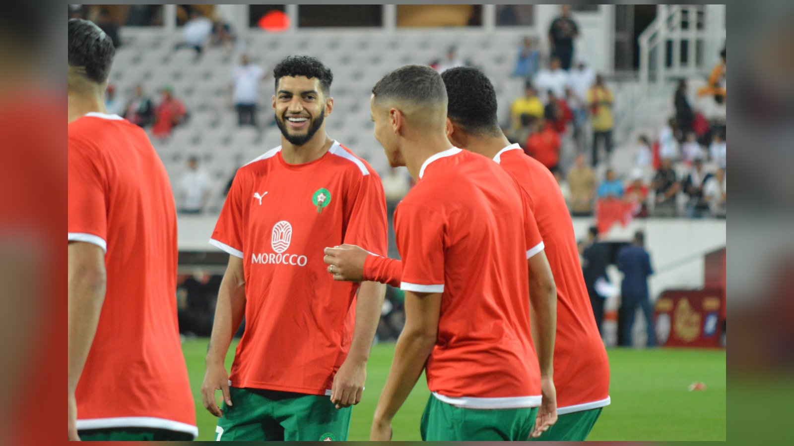

# Исмаэль Сайбари под вопросом на четвертьфинал ЧМ-2026: травма бедра у новичка «Баварии»

_Нападающий сборной Марокко и новичок «Баварии» Исмаэль Сайбари остаётся под вопросом на четвертьфинал против Франции из-за травмы бедра, полученной в матче с Канадой._

**Категория:** Новости игроков | **Тип:** transfer | **source_type:** news

Нападающий сборной Марокко Исмаэль Сайбари, по информации ряда изданий по ходу турнира перешедший в мюнхенскую «Баварию», остаётся под серьёзным вопросом на четвертьфинал чемпионата мира 2026 года против Франции из-за повреждения задней поверхности бедра. Потенциальная потеря одного из лидеров атаки – главная тревога марокканского штаба перед матчем в Бостоне.

## Что известно о травме

По данным Yahoo Sports и The National, Сайбари получил повреждение правого бедра уже на 22-й минуте матча 1/8 финала против Канады и был вынужден покинуть поле. Медицинское обследование, как сообщается, исключило серьёзную травму, а повторное МРТ показало обнадёживающую динамику.

Форвард отправился вместе со сборной Марокко в Бостон, где 9 июля пройдёт четвертьфинал против Франции. Как отмечают источники, окончательное решение о его участии тренерский штаб примет после проверки готовности игрока на предматчевой тренировке. Таким образом, до последнего момента интрига вокруг стартового состава «Атласских львов» сохраняется.

> «Марокко надеется, что Сайбари будет готов к матчу против Франции», – сообщает beIN Sports.

## Важная фигура для «Атласских львов»

Потеря Сайбари стала бы ощутимым ударом для Марокко. Форвард, о переходе которого в «Баварию» было объявлено по ходу чемпионата мира, находится в отличной форме: он забивал в каждом из трёх матчей группового этапа, а в 1/16 финала хладнокровно реализовал решающий пенальти в серии против Нидерландов, отправив свою команду в следующий раунд.

Марокко подходит к четвертьфиналу без поражений в 34 матчах подряд и рассчитывает взять реванш за поражение от Франции в полуфинале чемпионата мира 2022 года. Если Сайбари не сумеет выйти на поле или окажется не готов сыграть весь матч, тренерскому штабу придётся перекраивать атакующую линию против одной из самых мощных сборных турнира – команды, которая уже забила 14 мячей и располагает Килианом Мбаппе и Усманом Дембеле.

Для «Баварии» яркое выступление новичка на чемпионате мира – хороший знак перед стартом сезона, однако сейчас все мысли игрока и марокканского штаба сосредоточены на одном матче. Ясность в вопросе готовности Сайбари появится лишь после заключительной тренировки перед четвертьфиналом, и именно этого решения с нетерпением ждут болельщики сборной Марокко.

**Источники:** Yahoo Sports, beIN Sports, The National.

---

**Sources:**
- https://sports.yahoo.com/articles/bayern-munich-morocco-striker-ismael-010000224.html
- https://www.beinsports.com/en-us/soccer/fifa-world-cup-2026/articles/morocco-hopeful-ismael-saibari-will-be-fit-for-france-showdown-2026-07-07
- https://www.thenationalnews.com/sport/world-cup-2026/2026/07/06/ismael-saibari-fitness-concern-for-morocco-ahead-of-france-world-cup-quarter-final-clash/
