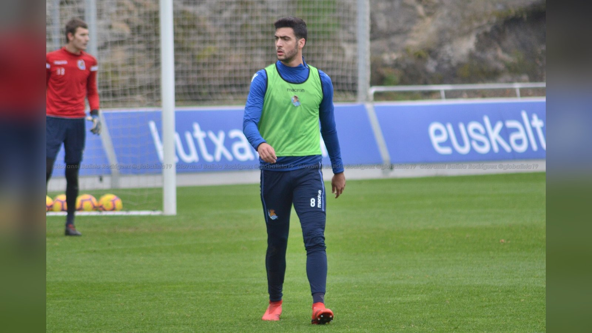

*Микель Мерино поразил ворота Португалии в первую добавленную минуту, и Испания в напряжённом иберийском дерби 1/8 финала ЧМ-2026 вырвала победу 1:0, отправив Криштиану Роналду и партнёров домой.*

**Испания обыграла Португалию со счётом 1:0 в матче 1/8 финала чемпионата мира 2026** и вышла в четвертьфинал: единственный мяч в иберийском дерби забил Микель Мерино уже в компенсированное время. Встреча в Далласе держала в напряжении до последних секунд и завершилась поздней драмой в пользу «Красной фурии».

## Иберийское дерби на выбывание

Матч соседей по Пиренейскому полуострову заранее считался одним из центральных в 1/8 финала: две команды с богатой историей и большими амбициями сошлись в игре, где право на ошибку было минимальным. Обе сборные подходили к очной встрече в статусе претендентов на дальний проход по сетке, и обе понимали, что проигравший немедленно покидает турнир.

Ход поединка это подтвердил. Долгое время соперники действовали осторожно и не могли взломать оборону друг друга: моменты возникали редко, а обе защиты работали строго. Игра всё увереннее катилась к дополнительному времени, где всё могла решить лотерея серии пенальти.

## Как решилась судьба матча

Развязка наступила на 90+1-й минуте. Микель Мерино замкнул передачу Феррана Торреса и принёс Испании победу практически на последних секундах основного времени. Как сообщает Yahoo Sports, полузащитник «доставил победный мяч сразу после того, как секундомер перешагнул отметку 90 минут». Поздний гол лишил Португалию шанса отыграться и мгновенно перевёл «Красную фурию» в следующий раунд.

## Таблица матча

| Показатель | Значение |
| --- | --- |
| Турнир | ЧМ-2026, 1/8 финала |
| Счёт | Испания 1:0 Португалия |
| Гол | Микель Мерино (90+1) |
| Голевая передача | Ферран Торрес |
| Место | Даллас, США |

## Герой момента

Микель Мерино в очередной раз подтвердил репутацию футболиста, способного решать исход матчей своими подключениями из глубины. Его гол в компенсированное время – именно тот тип позднего вмешательства, который нередко определяет судьбу игр на выбывание, где усталость и нервное напряжение достигают пика. Для «Красной фурии» такой характер в концовке – важный сигнал перед следующими раундами.

## Что это значит

Для Португалии турнир завершён: Криштиану Роналду и его партнёры покидают чемпионат мира уже на стадии 1/8 финала, и вопрос о будущем поколения португальских звёзд вновь выходит на первый план. Испания же продолжает поход за титулом и подходит к четвертьфиналу в статусе одного из фаворитов. В четвертьфинале, запланированном на 10 июля в Лос-Анджелесе, «Красная фурия» встретится с победителем пары США – Бельгия. Успех в иберийском дерби, пусть и добытый на последних секундах, способен добавить команде уверенности перед решающими матчами турнира.

> «Испания вышла в четвертьфинал после победы 1:0 над Португалией, победный мяч забил Микель Мерино», – резюмирует Yahoo Sports.

Источники: Yahoo Sports, NBC News.
