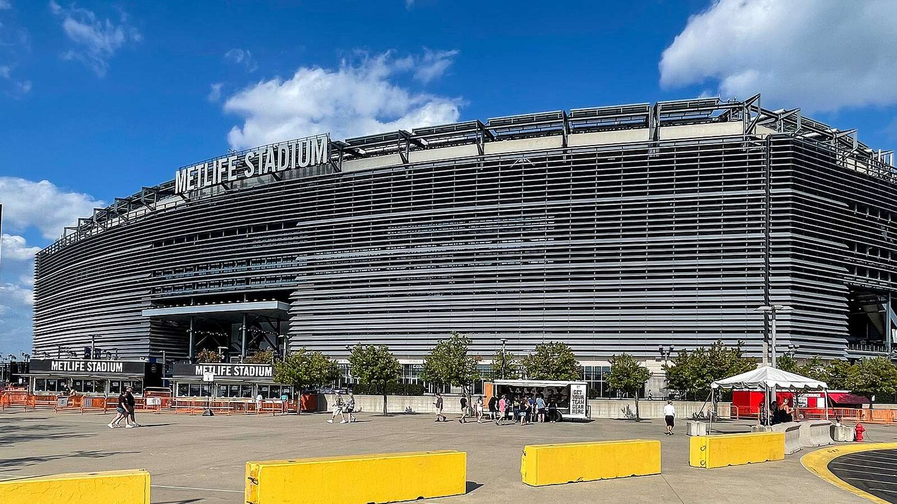

Финал чемпионата мира 2026 года подарит вывеску Испания – Аргентина. Решающий матч первого в истории мундиаля с участием 48 сборных пройдёт в воскресенье, 19 июля, на стадионе MetLife в Ист-Ратерфорде (штат Нью-Джерси), который во время турнира носит название New York New Jersey Stadium. Начало встречи – в 15:00 по времени восточного побережья США.

Это противостояние двух чемпионов мира. Аргентина защищает титул, завоёванный в 2022 году, и стремится выиграть мундиаль второй раз подряд. Испания вышла в первый финал чемпионата мира с 2010 года – именно тогда «Красная фурия» стала чемпионом, и другого титула в её истории пока нет.

## Путь к финалу

Обе команды подошли к решающему матчу в отличной форме, но разными дорогами. Испания в полуфинале уверенно разобралась с Францией – 2:0, проведя, по оценке Al Jazeera, один из самых доминирующих матчей на турнире. Аргентина прошла Англию в куда более драматичном стиле: 2:1, с двумя голами в концовке после передач Лионеля Месси.

| Команда | Полуфинал | Результат | Прежний титул |
|---|---|---|---|
| Испания | против Франции | 2:0 | 2010 |
| Аргентина | против Англии | 2:1 | 2022 |

## Ключевые фигуры Аргентины

У Аргентины всё внимание приковано к Лионелю Месси. Капитан проводит, по данным СМИ, свой шестой чемпионат мира и лидирует в гонке бомбардиров турнира. В полуфинале он не забил, но отдал два голевых паса, доказав, что по-прежнему способен решать исход больших матчей. Вокруг него выстроена команда, знающая, как играть в финалах: этот костяк уже побеждал на мундиале 2022 года.

Помимо Месси, важные роли на турнире исполняют Лаутаро Мартинес, забивший победный мяч в ворота Англии, Хулиан Альварес и Энцо Фернандес.

## Ключевые фигуры Испании

Испания сделала ставку на новое поколение во главе с Ламином Ямалем. По информации ESPN, молодой полузащитник стал одним из всего двух тинейджеров в истории, выходивших в стартовом составе полуфинала чемпионата мира. В матче с Францией голы забили Микель Оярсабаль (с пенальти) и защитник Педро Порро. Сильная сторона «Красной фурии» – контроль мяча и высокий прессинг, которыми испанцы задавили французов.

## Тактическая интрига

Финал обещает столкновение двух философий. Испания попытается владеть мячом и территорией, вынуждая соперника обороняться большими отрезками. Аргентина, напротив, привыкла отдавать инициативу и наказывать за ошибки в переходных фазах и на стандартах – именно так был сломлен сопротивление Англии.

Многое будет зависеть от того, удастся ли аргентинцам сдержать молодых испанских креативщиков и найдёт ли Месси пространство для своих фирменных передач. У Испании же задача – не позволить чемпионам мира перевести игру в вязкую, «финальную» колею, где опыт команды Скалони становится решающим фактором.

## Прогноз

Ждём равную и осторожную игру, в которой всё может решить один эпизод – стандарт, ошибка обороны или момент вдохновения от Месси либо Ямаля. Матч за третье место между Францией и Англией состоится днём ранее, 18 июля, в Майами.

## Место проведения и контекст турнира

Финал примет один из крупнейших стадионов региона – арена в Ист-Ратерфорде, расположенная в пригороде Нью-Йорка. Именно здесь завершится первый в истории чемпионат мира, в котором участвовали сразу 48 сборных и который принимали три страны – США, Канада и Мексика. Расширенный формат сделал турнир самым продолжительным и массовым за всю историю мировых первенств, и логично, что его кульминацией станет матч двух команд-чемпионов.

## Что стоит на кону

Для Аргентины это шанс закрепить статус доминирующей сборной эпохи и войти в историю как команда, выигравшая два чемпионата мира подряд. Для Лионеля Месси финал может стать ещё одним украшением и без того великой карьеры – капитан уже стал лучшим бомбардиром в истории мундиалей и возглавляет гонку снайперов турнира.

Для Испании же на кону – второй чемпионский титул в истории и подтверждение того, что новое поколение «Красной фурии» готово побеждать на самом высоком уровне. После триумфа 2010 года испанцы долго не могли вернуться в финал мирового первенства, и нынешний состав получил историческую возможность повторить успех.

## Возможные составы и факторы

Оба тренера подойдут к финалу с почти оптимальными составами. Аргентина сделает ставку на проверенный костяк, побеждавший в 2022 году, тогда как Испания – на сочетание опыта и молодой энергии Ямаля и Кубарси. Свежесть, дисциплина и игра на стандартах могут сыграть ключевую роль: в матчах такого уровня зачастую всё решают детали.

Отдельный фактор – психология. Аргентина уже проходила через горнило финала совсем недавно и знает цену каждой минуте решающего матча. Испания же выйдет на поле, ведомая дерзостью молодёжи, которой нечего терять. Именно это столкновение опыта и юности делает финал ЧМ-2026 столь интригующим. В любом случае болельщиков ждёт большой футбольный праздник, за которым будет следить весь мир.

Источники: Wikipedia (2026 FIFA World Cup final), Yahoo Sports, Al Jazeera.
