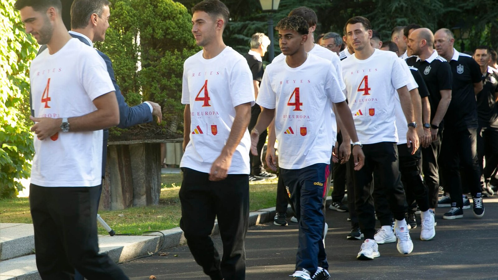

Сборная Испании переиграла Францию со счётом 2:0 в полуфинале чемпионата мира 2026 года и вышла в финал турнира – впервые с победного для себя мундиаля 2010 года. «Красная фурия» провела, по оценке Al Jazeera, один из самых доминирующих матчей на всём чемпионате. Встреча состоялась 14 июля.

Испания подтвердила статус одной из сильнейших команд турнира и теперь сыграет за свой второй в истории титул чемпионов мира. Франция же, финалист двух из трёх предыдущих мундиалей, на этот раз остановилась в полуфинале.

## Ход встречи

Испанцы захватили контроль над мячом с первых минут и не отпускали инициативу до финального свистка. Счёт был открыт уже в первом тайме: на 22-й минуте Микель Оярсабаль уверенно реализовал пенальти – 1:0. После перерыва «Красная фурия» закрепила преимущество: на 58-й минуте отличился защитник Педро Порро, доведя счёт до 2:0.

Франция, напротив, провела один из самых беспомощных матчей в атаке за долгие годы. По данным статистики ESPN, атакующие показатели французов в этой встрече стали худшими для сборной на чемпионатах мира за последние 60 лет. Команда так и не сумела наладить давление и создать реальную угрозу воротам испанцев.

## Рекорды молодых

Отдельная тема матча – молодость и дерзость испанского состава. Как сообщает ESPN, Ламин Ямаль стал вторым по молодости игроком за последние 60 лет, заработавшим пенальти в матче плей-офф чемпионата мира, – после англичанина Майкла Оуэна в 1998 году. Более того, Ямаль и Пау Кубарси оказались единственными тинейджерами в истории турнира, вышедшими в стартовом составе полуфинала чемпионата мира.

Это подчёркивает смену поколений в испанском футболе: молодёжь не просто дополняет состав, а тянет команду к вершинам.

| Показатель | Испания | Франция |
|---|---|---|
| Итоговый счёт | 2 | 0 |
| Голы | Оярсабаль (22', пен.), Порро (58') | – |

## Что дальше

В финале 19 июля Испания сыграет против Аргентины, которая днём позже прошла Англию. Франция же проведёт матч за третье место против англичан 18 июля в Майами. Для «Красной фурии» финал – шанс завоевать второй в истории титул чемпионов мира и подтвердить, что новое поколение испанского футбола готово к большим победам.

## Смена эпох

Победа над Францией стала во многом символической. Французская сборная в последние турниры считалась эталоном атакующей мощи и глубины состава, но в этом полуфинале оказалась неспособной ответить на давление молодой и голодной до побед Испании. Контраст между беспомощностью французов впереди и уверенным контролем испанцев подчеркнул, что баланс сил в мировом футболе постепенно смещается.

Испанский стиль – терпеливый контроль мяча, быстрый пас и высокий прессинг – в этом матче работал безотказно. «Красная фурия» не просто победила, а сделала это, диктуя условия на протяжении всех 90 минут и почти не позволив сопернику подойти к своим воротам.

## Дорога к финалу

Для Испании этот полуфинал стал наградой за смелую ставку на молодёжь. Тренерский штаб не побоялся доверить ключевые роли совсем юным игрокам, и решение полностью оправдалось. Теперь команде предстоит последний шаг – финал против действующих чемпионов мира, где испанцам понадобится тот же уровень концентрации и та же самоотдача, которые они показали против французов.

## Крах французских амбиций

Для Франции поражение стало болезненным ударом. Сборная, привыкшая доходить до решающих стадий и считавшаяся одним из фаворитов турнира, на этот раз так и не сумела показать свою лучшую игру в самый нужный момент. Атака французов, обычно опасная и разнообразная, в полуфинале выглядела непривычно тускло, и статистика лишь подтвердила масштаб проблем.

Теперь команде предстоит собраться перед матчем за третье место против Англии. Это не тот результат, на который рассчитывали французы, но и уезжать домой без медалей никому не хочется. Для многих игроков «бронзовый финал» станет возможностью частично реабилитироваться за неудачу в полуфинале.

Испания же, напротив, поймала кураж в идеальный момент турнира. Слаженность, дисциплина и вера в собственный стиль позволили «Красной фурии» пройти сильного соперника без особых проблем и с полным правом претендовать на второй в истории чемпионский титул.

Источники: Al Jazeera, ESPN.
