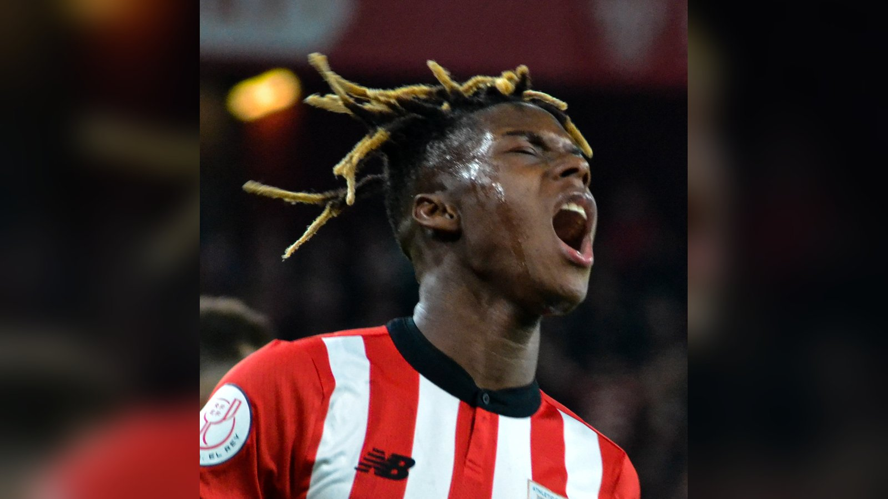

# Двойная потеря Испании: Нико Уильямс и Жереми Пино под вопросом на плей-офф ЧМ-2026

_Сборная Испании понесла двойную потерю перед плей-офф ЧМ-2026: Нико Уильямс и Жереми Пино получили травмы в матче с Уругваем, их участие в 1/16 финала под вопросом._

- **type:** transfer  
- **category:** Новости игроков  
- **slug:** spain-nico-williams-yeremy-pino-injury-wc2026

---

Сборная Испании, один из главных фаворитов чемпионата мира 2026, понесла двойную потерю накануне плей-офф. Вингеры Нико Уильямс и Жереми Пино получили повреждения в матче группового этапа против Уругвая (1:0), и их участие в стадии 1/16 финала остаётся под вопросом.

Оба футболиста покинули поле из-за травм в концовке встречи в Гвадалахаре 26 июня. На следующий день Королевская испанская федерация футбола (RFEF) опубликовала медицинское заключение.

## Что известно о повреждениях

По данным ESPN, у Нико Уильямса диагностировано мышечное повреждение приводящей мышцы правого бедра умеренной степени – травма возникла после жёсткого подката в концовке матча. У Жереми Пино – растяжение акромиально-ключичного сочленения (плечо); серьёзного перелома удалось избежать.

В RFEF подчеркнули, что оба повреждения носят умеренный характер и ни один из игроков формально не исключён из заявки – всё будет зависеть от темпов восстановления в ближайшие дни. Конкретных сроков федерация не назвала.

Сам Нико Уильямс эмоционально отреагировал на травму в социальных сетях.

> «Сегодня один из худших дней в моей жизни», – написал Нико Уильямс, добавив, что его история на этом чемпионате мира ещё не закончена. Цитата приводится по ESPN и beIN Sports.

## Почему это важно

Испания выиграла группу H и вышла в плей-офф. Уильямс и Пино – два ключевых исполнителя на флангах атаки, и потенциальная потеря обоих ставит перед главным тренером Луисом де ла Фуэнте серьёзную кадровую задачу в самый ответственный момент турнира. Окончательная ясность по их готовности появится ближе к матчу 1/16 финала.

Источники: ESPN, beIN Sports, ANI.

---

**sources:**
- https://www.espn.com/soccer/story/_/id/49200729/spain-nico-williams-injury-yeremy-pino-2026-world-cup
- https://www.beinsports.com/en-us/soccer/fifa-world-cup-2026/articles/nico-williams-heartbreaking-message-after-suffering-injury-with-spain-today-is-one-of-the-worst-days-of-my-life-2026-06-27
- https://www.aninews.in/news/sports/football/fifa-world-cup-2026-injury-worry-for-spain-as-nico-williams-yeremy-pino-limp-off-in-uruguay-victory20260628014355/
