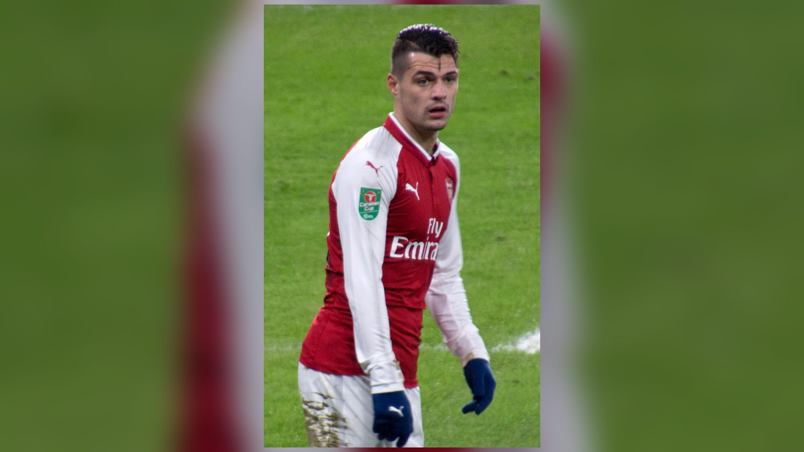

# Швейцария – Колумбия 0:0 (4:3 по пенальти): «нати» впервые с 1954 года в четвертьфинале ЧМ

_Швейцария обыграла Колумбию в серии пенальти 4:3 после нулевой ничьей и впервые с 1954 года вышла в четвертьфинал чемпионата мира. Решающий удар нанёс Рубен Варгас._

**Категория:** Отчёты о матчах | **Тип:** match_report | **source_type:** news

Сборная Швейцарии впервые с 1954 года вышла в четвертьфинал чемпионата мира, обыграв Колумбию в серии пенальти со счётом 4:3 после нулевой ничьей в основное и дополнительное время в матче 1/8 финала чемпионата мира 2026 года. «Нати» проявили железную выдержку и заслужили место в восьмёрке сильнейших команд планеты.

Матч в исполнении обеих команд получился нервным и осторожным. Швейцарцы сделали ставку на дисциплину и надёжность в обороне, а колумбийцы искали свои шансы за счёт индивидуального мастерства, но так и не смогли конвертировать территориальное преимущество в голы.

## 120 минут без голов

На протяжении всего матча Колумбия владела инициативой и создала больше опасных моментов, однако раз за разом разбивалась о плотную швейцарскую оборону и надёжную игру вратаря. В дополнительное время южноамериканцы дважды были в считанных сантиметрах от победы: Джон Лукуми пробил головой в перекладину, а Хаминтон Кампас после результативной ошибки Гранита Джаки вышел практически один на один, но отправил мяч выше ворот.

Эти эпизоды стали переломными: не сумев дожать соперника в концовке овертайма, Колумбия отдала психологическое преимущество более хладнокровным швейцарцам.

## Решающая серия

В серии пенальти нервы подвели именно колумбийцев. Давинсон Санчес пробил в перекладину, а удар Кучо Эрнандеса уверенно отразил вратарь Грегор Кобель, ставший одним из главных героев вечера. Точку в противостоянии поставил Рубен Варгас, чётко реализовав решающий пенальти и отправив Швейцарию в четвертьфинал.

Символично, что сам Варгас, автор двух голов на турнире, ранее на неделе досрочно покидал тренировку из-за физических проблем. Тем не менее он вышел на замену в концовке основного времени и в итоге взял на себя ответственность в решающий момент серии.

## Статистика матча

| Показатель | Швейцария | Колумбия |
| --- | --- | --- |
| Основное и доп. время | 0 | 0 |
| Серия пенальти | 4 | 3 |
| Решающий пенальти | Варгас | – |
| Попадания в каркас | – | Лукуми, Д. Санчес |

## Историческое достижение

Для Швейцарии выход в 1/4 финала – лучший результат на чемпионатах мира за 72 года. В последний раз «нати» играли в четвертьфинале на домашнем турнире 1954 года, и нынешнее поколение во главе с капитаном Гранитом Джакой уже вписало себя в историю национальной команды.

Теперь швейцарцев ждёт, пожалуй, самое серьёзное испытание – действующие чемпионы мира сборная Аргентины. Матч состоится 11 июля в Канзас-Сити. Для команды, построенной на дисциплине и командном духе, это будет проверка на прочность против атаки, которую возглавляет Лионель Месси.

Швейцарский футбол в очередной раз доказал, что умеет добиваться результата за счёт организации, характера и хладнокровия в решающие моменты. Пройдя горнило серии пенальти против техничной Колумбии, «нати» получили мощный заряд уверенности перед четвертьфиналом, хотя и понимают, что против Аргентины запаса прочности будет куда меньше.

> «Это исторический вечер для швейцарского футбола», – передаёт атмосферу после матча ESPN.

**Источники:** ESPN, Al Jazeera.

---

**Sources:**
- https://www.espn.com/soccer/story/_/id/49300023/switzerland-colombia-world-cup-2026-penalty-shootout-argentina
- https://www.aljazeera.com/sports/liveblog/2026/7/7/live-switzerland-vs-colombia-fifa-world-cup-2026
- https://www.espn.com/soccer/match/_/gameId/760508/colombia-switzerland
