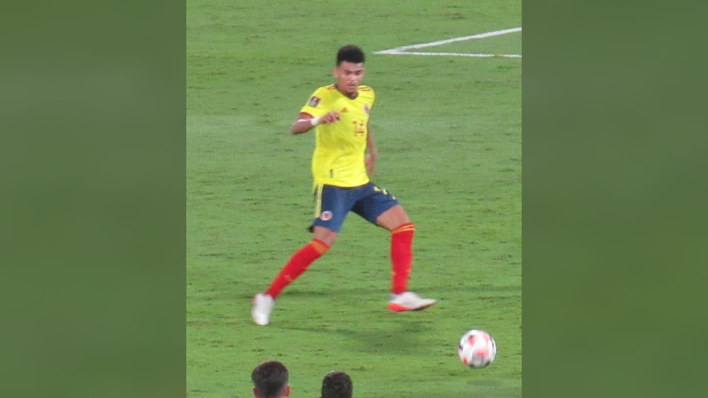

*Две неуступчивые сборные, не знавшие поражений на ЧМ-2026, встречаются в 1/8 финала в Ванкувере. Колумбия делает ставку на Луиса Диаса, Швейцария – на дисциплину.*

**Швейцария и Колумбия проведут матч 1/8 финала чемпионата мира 2026 во вторник, 7 июля, на стадионе «Би-Си Плейс» в Ванкувере.** Обе команды добрались до стадии плей-офф без поражений, и встреча обещает шахматную борьбу с ключевой фигурой – колумбийским вингером Луисом Диасом.

## Как команды дошли до 1/8 финала

По информации Squawka и Sports Mole, швейцарцы прошли дистанцию уверенно: ничья с Катаром, затем победы над Боснией и Герцеговиной (4:1), Канадой (2:1) и Алжиром (2:0) в 1/16 финала. Колумбия под руководством Нестора Лоренсо также не проигрывала: 3:1 с Узбекистаном, 1:0 с ДР Конго и нулевая ничья с Португалией в группе, а затем 1:0 над Ганой в 1/16 финала.

| Сборная | Групповой этап и 1/16 финала |
| --- | --- |
| Швейцария | ничья с Катаром; Босния 4:1, Канада 2:1, Алжир 2:0 |
| Колумбия | Узбекистан 3:1, ДР Конго 1:0, Португалия 0:0, Гана 1:0 |

## Кадровые вопросы

У Колумбии тревожные новости: Хон Кордоба был заменён на пятой минуте матча с Ганой из-за повреждения, а Хамес Родригес ушёл с поля в перерыве в своём 130-м матче за сборную и может пропустить игру. У Швейцарии отдельно от основной группы тренировались полузащитник Мишель Эбишер и защитник Лука Жакез, испытывающие мышечные проблемы.

Кадровые потери способны серьёзно повлиять на рисунок игры: без Кордобы Колумбия теряет вариативность в атаке, а возможное отсутствие Хамеса Родригеса лишает команду опытного диспетчера. Швейцарии, в свою очередь, важно сохранить целостность средней линии и обороны, на которых во многом строится её надёжность.

## Ставка на Луиса Диаса

Главным оружием Колумбии остаётся Луис Диас. По оценке аналитиков, «кафетерос» будут искать вингера на левом фланге, используя его скорость и дриблинг один в один, чтобы растягивать компактную швейцарскую оборону и создавать зоны для набегающих полузащитников. Против дисциплинированной команды, которая на групповом этапе и в 1/16 финала выглядела прочно, качество отдельных исполнителей может стать решающим фактором.

## Прогноз

Модели дают Колумбии небольшое преимущество: по оценке аналитиков, «кафетерос» несут большую угрозу в атаке, тогда как швейцарцы традиционно затрудняют сопернику игру и редко проваливаются в обороне. Встреча двух неуступчивых сборных обещает быть закрытой и вязкой, где эпизоды у чужих ворот придётся создавать терпеливо. Победитель пары выйдет в четвертьфинале (12 июля, Канзас-Сити) на сильнейшего в противостоянии Аргентина – Египет.

Источники: Squawka, Sports Mole, VAVEL.
