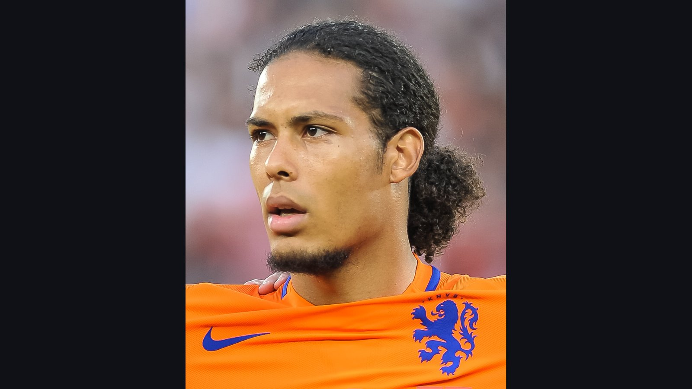

# Нидерланды теряют Тимбера: защитник пропустит ЧМ-2026 из-за травмы

> Сборная Нидерландов лишилась защитника Юррьена Тимбера: 24-летний игрок не восстановился от травмы паха и пропустит чемпионат мира 2026 года.

*Категория: Сборные · Тип: transfer · news*

Сборная **Нидерландов** понесла серьёзную потерю накануне чемпионата мира 2026 года: защитник **Юррьен Тимбер** не сыграет на турнире из-за травмы паха. Об этом сообщает трекер повреждений ESPN со ссылкой на заявление нидерландской федерации.

## Что произошло

24-летний универсальный защитник покинул расположение сборной после контрольного матча с Узбекистаном – восстановиться к старту мирового первенства он так и не успел. Решение оказалось вынужденным: риск играть на топ-турнире с недолеченным повреждением медицинский штаб посчитал неоправданным.

> «24-летний защитник недостаточно восстановился от травмы паха, чтобы принять участие в чемпионате мира без рисков для здоровья», – говорится в заявлении сборной Нидерландов, которое приводит ESPN.

## Почему это чувствительная потеря

Тимбер провёл сильный сезон в «Арсенале» и считался одним из самых ценных игроков обоймы – прежде всего за счёт универсальности. Он способен закрыть сразу несколько позиций в обороне: от правого фланга до центра и при необходимости опорной зоны. Именно такая гибкость особенно важна на длинной дистанции турнира, где из-за плотного календаря и травм тренерам приходится постоянно тасовать состав.

По информации СМИ, вместо Тимбера в заявку может быть вызван другой защитник из расширенного списка сборной. Так или иначе, тренерскому штабу придётся перекраивать оборонительные построения буквально на ходу – и делать это в первые же дни мундиаля.

## Контекст

Тимбер пополнил список заметных потерь этого чемпионата мира: ещё до старта из-за повреждений турнир пропустили игроки целого ряда ведущих сборных. Для Нидерландов, которые едут на ЧМ-2026 с серьёзными амбициями и рассчитывают как минимум уверенно пройти группу, отсутствие настолько разнопланового защитника – ощутимый удар по глубине состава. Проблема обостряется ещё и тем, что «оранжевым» предстоит непростой стартовый матч в группе против Японии, а значит, перестраивать оборону придётся сразу, без права на долгую раскачку. Теперь многое будет зависеть от того, насколько быстро партнёры Тимбера по обороне сумеют компенсировать его уход и закрыть освободившиеся зоны.

**Источники:** ESPN, Sports Illustrated.
