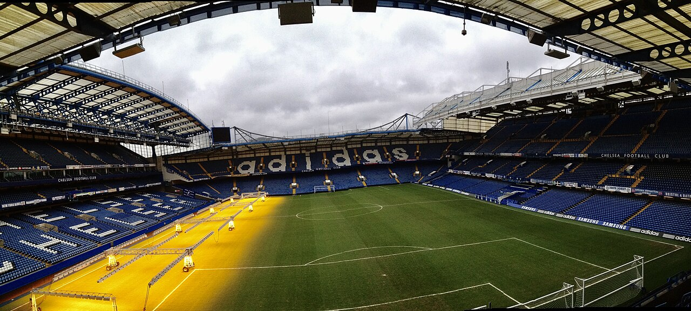

# Топ-7 самых громких трансферов лета-2026: британский рекорд «Челси» и гонка вооружений в АПЛ

> Лето-2026 превратилось в настоящую трансферную гонку вооружений. От британского рекорда «Челси» до сделок «Манчестер Сити» и ПСЖ – собрали семь самых громких переходов окна.

- Категория: Тренды
- Тип: ranking
- Источник материала: news

**Летнее трансферное окно 2026 года** запомнится рекордными суммами и настоящей гонкой вооружений в Английской премьер-лиге. Пока внимание болельщиков было приковано к чемпионату мира, клубы Европы тратили сотни миллионов. Собрали семь самых громких переходов окна – по размеру суммы и резонансу. Критерий ранжирования – заявленная стоимость трансфера и его влияние на рынок.

## 1. Морган Роджерс: «Астон Вилла» – «Челси» (около 117 млн фунтов)

Главная сделка лета и новый британский рекорд. По информации Sky Sports, «Челси» подписал 23-летнего английского форварда за сумму около 117 млн фунтов, сделав его самым дорогим британским игроком в истории. Роджерс подписал долгосрочный контракт и стал символом амбиций лондонского клуба, который продолжает масштабную перестройку состава. Ранее в борьбе за игрока называли и другие топ-клубы, но «Челси» действовал быстрее конкурентов.

## 2. Сандро Тонали: «Ньюкасл» – «Тоттенхэм» (около 85 млн фунтов)

Итальянский полузащитник перебрался в «Тоттенхэм» и, по данным английских источников, стал самым дорогим приобретением в истории «шпор». Сделка на сумму около 85 млн фунтов подчеркнула, что «Тоттенхэм» готов вкладываться в борьбу за место в верхней части таблицы и еврокубковую зону.

## 3. Эллиот Андерсон: «Ноттингем Форест» – «Манчестер Сити» (около 85 млн фунтов)

«Манчестер Сити» усилил среднюю линию английским хавбеком Эллиотом Андерсоном. По информации СМИ, сумма сделки также составила порядка 85 млн фунтов и более – ещё одно подтверждение того, что летом-2026 топ-клубы АПЛ вступили в настоящую денежную гонку. Для «Ноттингем Форест» продажа воспитанника уровня Андерсона стала источником средств для собственной перестройки.

## 4. Усман Диоманде: «Спортинг» – «Ноттингем Форест» (около 40 млн евро)

«Ноттингем Форест» компенсировал уход Андерсона, официально подписав 22-летнего ивуарийского защитника Усмана Диоманде примерно за 40 млн евро. Молодой центрбек должен стать опорой обороны команды Оливера Глазнера и одним из ключевых новичков клуба.

## 5. Зион Судзуки: «Парма» – ПСЖ (около 35 млн евро)

«Пари Сен-Жермен» договорился о переходе перспективного японского вратаря Зиона Судзуки. По данным источников, сумма сделки – около 35 млн евро, при этом голкипера, вероятно, отдадут в аренду в «Ювентус», чтобы обеспечить ему игровую практику на высоком уровне.

## 6. Лукаш Горничек: «Брага» – «Ньюкасл» (около 25,7 млн фунтов)

«Ньюкасл» укрепил вратарскую позицию, подписав чешского голкипера Лукаша Горничека из «Браги» примерно за 25,7 млн фунтов. В прошлом сезоне вратарь помог португальскому клубу дойти до полуфинала Лиги Европы, чем и привлёк внимание английского клуба.

## 7. Обмен Джонсон – Макнил: «Эвертон» и «Кристал Пэлас»

Отдельного упоминания заслуживает редкий прямой обмен: Бреннан Джонсон перешёл в «Эвертон», а Дуайт Макнил – в «Кристал Пэлас». Сделки «один в один» почти исчезли из современного футбола, и этот обмен стал одним из самых обсуждаемых сюжетов окна, в том числе из-за удобства подобной схемы для клубной бухгалтерии.

## Итог

Лето-2026 подтвердило: финансовая мощь Премьер-лиги продолжает расти, а рекорды переписываются всё чаще. Английские клубы задают тон на трансферном рынке, тогда как гранды с континента вроде ПСЖ действуют точечно и делают ставку на молодых исполнителей. Трансферное окно в Англии закрывается 1 сентября, так что список громких сделок ещё может пополниться.

Источники: Sky Sports, Football365, Premier League, TEAMtalk.

Источники (URL):
- https://www.skysports.com/football/news/11095/13564944/morgan-rogers-transfer-news-chelsea-complete-record-breaking-lb117m-deal-to-sign-forward-from-aston-villa
- https://www.football365.com/news/summer-transfer-window-2026-most-expensive-players-biggest-deals
- https://www.premierleague.com/en/news/4391327/the-biggest-transfers-between-premier-league-clubs
- https://www.teamtalk.com/news/biggest-football-transfers-summer-2026-most-expensive-players
