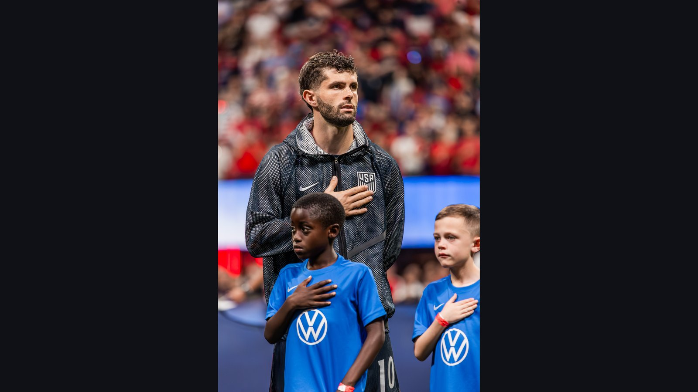

# США – Парагвай: Почеттино начинает домашний ЧМ-2026 на «SoFi Стэдиум»

> Сборная США под руководством Маурисио Почеттино стартует на домашнем ЧМ-2026 матчем против крепкого Парагвая на «SoFi Стэдиум». Разбираем форму, кадры и главные угрозы группы D.

*Категория: ЧМ-2026 · Тип: preview · news*

Сборная **США** открывает домашний чемпионат мира 2026 года матчем против **Парагвая** на «SoFi Стэдиум» в Инглвуде. Команда Маурисио Почеттино считается фаворитом группы D, но соперник подобрался крайне неудобный – и это далеко не проходной стартовый тур.

## США: давление хозяев и форма Пулишича

Почеттино выводит сборную на турнир в статусе фаворита группы, но и с грузом ожиданий: от хозяев ждут большего, чем вылет в 1/8 финала. По информации ESPN, единственный вопрос по составу – защитник Крис Ричардс, восстанавливающийся после повреждения голеностопа; впрочем, сам игрок заявил, что готов выйти на поле.

В атаке всё внимание на Кристиана Пулишича. Несмотря на непростой клубный сезон в «Милане», лидер сборной слева остаётся ключевой фигурой – хотя результативная засуха национальной команды добавляет нервозности перед стартом.

## Парагвай: восемь матчей без поражений

Парагвай Густаво Альфаро – совсем не аутсайдер. По данным Sports Mole, южноамериканцы подходят к турниру с серией из восьми матчей без поражений, в которой есть победы над Бразилией, Аргентиной и Уругваем. Их план прост: две линии по четыре, минимум пространства между линиями и быстрые выпады через Мигеля Альмирона.

| Команда | Тренер | Ключевой игрок | Форма |
| --- | --- | --- | --- |
| США | Маурисио Почеттино | Кристиан Пулишич | Хозяева турнира |
| Парагвай | Густаво Альфаро | Мигель Альмирон | 8 матчей без поражений |

Под вопросом у Парагвая остаётся креативный полузащитник Хулио Энсисо, получивший небольшое повреждение бедра в матче с Никарагуа, – но ожидается, что он всё же сыграет.

## Что решает в группе D

Для США это особенный турнир: впервые с 1994 года американцы принимают чемпионат мира, и от хозяев ждут не просто выхода из группы, а уверенного движения по сетке плей-офф. Именно поэтому давление на Почеттино огромно, а стартовый матч против неуступчивого соперника превращается в проверку нервов. Любая осечка на старте резко усложнит расклад в группе D.

## Прогноз

На бумаге и по поддержке трибун США – фавориты. Но дисциплинированный, габаритный и уверенный в себе Парагвай умеет ловить именитых соперников на контратаках, а серия из восьми матчей без поражений говорит сама за себя. Если Альмирон поймает свой ритм и поведёт партнёров вперёд, хозяевам предстоит тяжёлый вечер. Цена ошибки на старте мирового первенства всегда особенно высока – и обе команды это прекрасно понимают.

> По информации ESPN и Sports Mole, США выходят на матч фаворитами, однако Парагвай не проигрывает уже восемь встреч подряд.

**Источники:** ESPN, Sports Mole.
