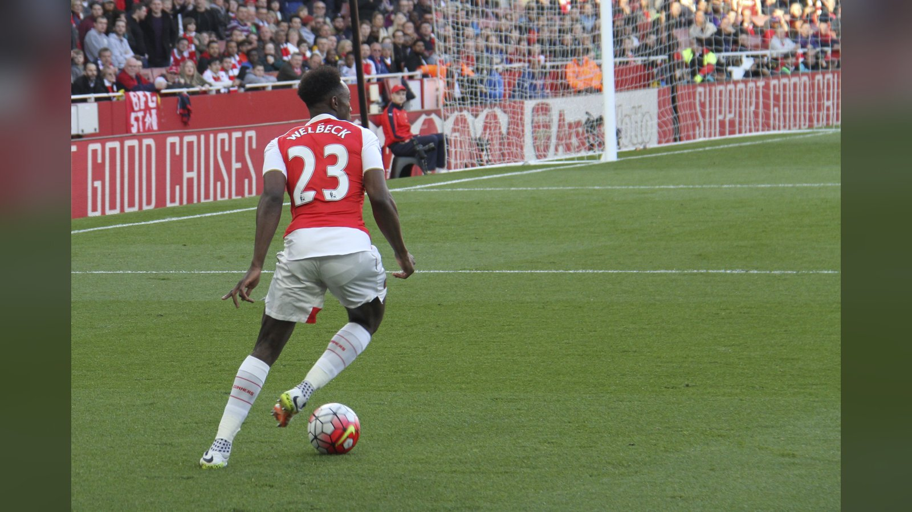

# «Челси» объявил о подписании Дэнни Уэлбека из «Брайтона»

> «Челси» усилил атаку 35-летним английским форвардом Дэнни Уэлбеком: нападающий перешёл из «Брайтона» и подписал контракт до 2028 года.

**Категория:** Новости игроков | **Тип:** transfer

«Челси» официально усилил линию атаки: лондонский клуб объявил о подписании 35-летнего английского форварда Дэнни Уэлбека, который переходит из «Брайтона». О трансфере 1 августа 2026 года сообщила пресс-служба «Челси», подтвердив, что нападающий подписал контракт до июня 2028 года.

## Детали сделки
Сумма трансфера официально не раскрывается. Как сообщает ESPN, соглашение рассчитано на два сезона, а сам переход стал частью летней перестройки состава, которую ведёт новый главный тренер «Челси» Хаби Алонсо. Для «синих», в последние годы принципиально делавших ставку на молодых футболистов, приход 35-летнего игрока стал нехарактерным, но осознанным шагом: команде не хватало габаритного форварда и глубины на острие атаки.

> «„Челси" рад объявить о подписании Дэнни Уэлбека из „Брайтон энд Хоув Альбион"», – говорится в официальном заявлении лондонского клуба.

## Что «Челси» получает
В минувшем сезоне английской Премьер-лиги Уэлбек провёл один из лучших отрезков карьеры. По данным ESPN, форвард забил 13 мячей в 37 матчах чемпионата за «Брайтон» – показатель, который в 35 лет выглядит внушительно. Воспитанник «Манчестер Юнайтед», в прошлом игрок «Арсенала», «Уотфорда» и сборной Англии, Уэлбек привозит в «Челси» опыт выступлений на самом высоком уровне, умение цепляться за мяч и завершать атаки.

## Контекст
«Брайтон» подтвердил уход своего форварда в тот же день. Хаби Алонсо ещё в ходе предсезонной подготовки говорил, что его команде нужен «баланс», и опытный нападающий призван добавить составу вариативности при позиционных атаках и при игре вторым темпом. Для самого Уэлбека переход в клуб, который нацелен на борьбу в еврокубках, – шанс завершить карьеру на высокой ноте и побороться за трофеи.

Летнее трансферное окно в Англии закрывается 1 сентября, так что «Челси» ещё может продолжить точечное усиление, однако сделка по Уэлбеку уже закрывает одну из очевидных задач лондонцев к старту сезона 2026/27.

Источники: официальный сайт «Челси», ESPN, VAVEL.

