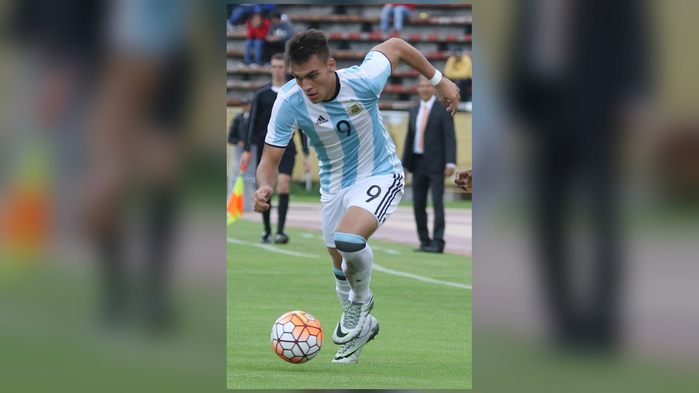

# Аргентина – Швейцария: превью четвертьфинала ЧМ-2026 с Месси в главной роли

_Действующие чемпионы мира Аргентина сыграют со Швейцарией в четвертьфинале ЧМ-2026 11 июля в Канзас-Сити. Месси лидирует в гонке бомбардиров, а «нати» мечтают о сенсации._

**Категория:** ЧМ-2026 | **Тип:** preview | **source_type:** trend

Матч Аргентина – Швейцария в четвертьфинале чемпионата мира 2026 года вызывает повышенный интерес у болельщиков в Казахстане и странах СНГ: имя Лионеля Месси остаётся одним из самых популярных футбольных запросов в регионе. Действующие чемпионы мира сыграют со Швейцарией 11 июля на «Эрроухед Стэдиум» в Канзас-Сити, и для многих в СНГ это будет матч, за которым следят прежде всего ради аргентинского капитана.

Обе команды добрались до четвертьфинала через нервные, эмоциональные матчи, но контраст в статусе очевиден: Аргентина защищает титул, а Швейцария играет свой лучший турнир за десятилетия.

## Аргентина: чемпионский состав и Месси в ударе

«Альбиселесте» подходит к матчу в статусе явного фаворита. Лионель Месси возглавляет гонку бомбардиров с восемью голами, а в распоряжении Лионеля Скалони – мощнейшая группа атаки, включая Лаутаро Мартинеса и Хулиана Альвареса. В центре поля за креатив отвечают Алексис Мак Аллистер и Энцо Фернандес, чей поздний гол принёс драматичную победу над Египтом в 1/8 финала.

Впрочем, путь чемпионов не был безоблачным: ещё в 1/16 финала Аргентина едва не вылетела, лишь на последних минутах дожав неуступчивую Кабо-Верде, а в матче с Египтом отыгрывалась со счёта 0:2. Эти эпизоды показали, что при всей звёздности состав Скалони уязвим, если соперник действует смело.

## Швейцария: сюрприз турнира

Швейцарцы уже сотворили сенсацию, впервые с 1954 года выйдя в четвертьфинал чемпионата мира. Сердце команды – 33-летний Гранит Джака, капитан со 146 матчами за сборную и одним голом на турнире. Опорная пара Дени Закария и Ремо Фройлер отвечает за баланс и разрушение чужих атак, а надёжная игра вратаря Грегора Кобеля не раз выручала «нати» в плей-офф.

Для этого поколения швейцарцев выход в полуфинал стал бы величайшим достижением в новейшей истории национальной команды, и терять им, по большому счёту, нечего.

## Форма команд

| Команда | Путь в 1/4 финала |
| --- | --- |
| Аргентина | камбэк с 0:2 и победа над Египтом 3:2 |
| Швейцария | 0:0 и победа над Колумбией 4:3 по пенальти |

## Ключевые котировки

| Исход | Оценка |
| --- | --- |
| Победа Аргентины | около 4/5 (фаворит) |
| Проход Швейцарии | считается сенсацией |

## Тактическая интрига

Главная дуэль развернётся в центре поля: прессинг аргентинцев будет нацелен на Джаку, через которого швейцарцы начинают большинство атак. Если «нати» сумеют выдержать это давление, сохранить свою фирменную дисциплину в обороне и довести матч до серии пенальти, где они уже показали характер против Колумбии, у них появится реальный шанс навязать чемпионам борьбу. Но атакующая мощь Аргентины во главе с Месси и глубина её состава делают «Альбиселесте» безусловным фаворитом этого противостояния.

**Источники:** ESPN, OneFootball, Total Football Analysis.

---

**Sources:**
- https://www.espn.com/soccer/story/_/id/49294844/fifa-world-cup-quarterfinal-preview-predictions-odds-argentina-belgium-england-france-morocco-norway-spain-switzerland
- https://onefootball.com/en/news/world-cup-2026-quarter-final-argentina-vs-switzerland-prediction-best-bets-43112859
- https://totalfootballanalysis.com/competitions/fifa-world-cup-2026/world-cup-quarter-final-argentina-switzerland-predictions
