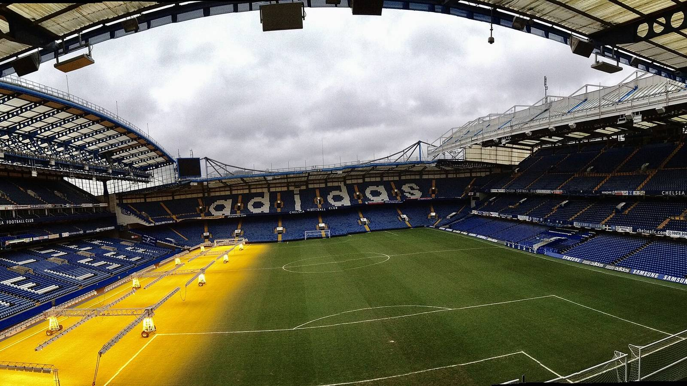

Казахстанский нападающий Дастан Сатпаев начал предсезонную подготовку в составе английского «Челси». Первые кадры игрока на тренировочной базе лондонского клуба в Кобэме опубликовал председатель наблюдательного совета «Кайрата» Кайрат Боранбаев, сообщает издание Kursiv.

Для казахстанского футбола это событие большого масштаба: один из самых талантливых воспитанников страны получает шанс закрепиться в клубе английской Премьер-лиги.

## Детали перехода

Сатпаев перешёл в «Челси» из алматинского «Кайрата». По информации СМИ, соглашение между клубами было достигнуто ещё в феврале 2025 года, а сумма трансфера оценивается примерно в 4 млн евро. Официально контракт форварда с лондонцами вступит в силу 12 августа 2026 года – в день, когда казахстанцу исполнится 18 лет.

> «Дастан Сатпаев продолжит карьеру в «Челси», – говорится в официальном сообщении ФК «Кайрат».

## Почему это важно для Казахстана

17-летний форвард считается лидером нового поколения сборной Казахстана, и его адаптация в системе «Челси» будет в центре внимания болельщиков всего региона. Успешный переход казахстанского таланта в один из грандов английского футбола – это ориентир для молодых игроков в стране и повод для гордости.

На предсезонном сборе Сатпаев готовится вместе с командой. По сообщениям СМИ, дебютные минуты за первую команду англичан возможны уже в контрольных матчах межсезонья, однако полноценно выступать за клуб он сможет только после официального оформления контракта в августе.

## Что дальше

До вступления соглашения в силу основная задача для игрока – набрать форму и влиться в требования тренерского штаба «Челси». В Казахстане за карьерой Сатпаева следят с особым вниманием: его путь в топ-чемпионат может стать образцовым для будущих поколений казахстанских футболистов.

## Ориентир для нового поколения

Переход в клуб калибра «Челси» – редкая история для казахстанского футбола, и она способна вдохновить целое поколение молодых игроков в стране. Путь Сатпаева от воспитанника «Кайрата» до футболиста, тренирующегося на базе одного из грандов Англии, показывает, что при должном таланте и работе дорога в топ-чемпионаты открыта и для игроков из региона.

Многое теперь будет зависеть от того, как форвард впишется в требования английского футбола – с его высокими скоростями, интенсивностью и конкуренцией за место в составе. Болельщики в Казахстане будут внимательно следить за каждым его шагом, а сам факт присутствия казахстанца в структуре «Челси» уже стал заметным событием для всего футбола страны.

Источники: Kursiv, официальный сайт ФК «Кайрат», Wikipedia.
