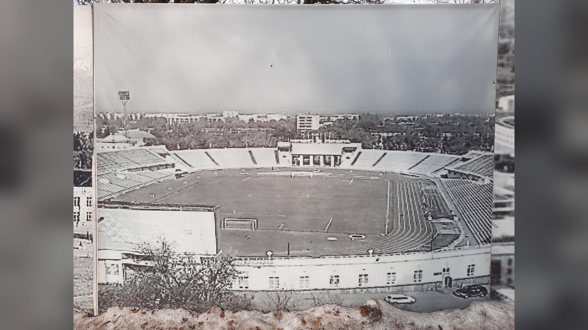

# «Кайрат» – «Левски»: превью 3-го раунда квалификации Лиги чемпионов

> Алматинский «Кайрат» продолжает поход в Лиге чемпионов: в 3-м раунде квалификации соперником стал болгарский «Левски». Первый матч – 4 августа в Софии.

**Категория:** Тренды | **Тип:** preview

Алматинский «Кайрат» продолжает своё еврокубковое лето: в третьем квалификационном раунде Лиги чемпионов 2026/27 казахстанский чемпион сыграет с болгарским «Левски». Первый матч противостояния пройдёт 4 августа в Софии, ответная встреча запланирована на 11 августа в Туркестане. Для казахстанского футбола каждый такой матч – событие национального масштаба.

## Путь «Кайрата» по квалификации
До встречи с «Левски» алматинцы прошли уже два раунда отбора. Сначала «Кайрат» выбил черногорскую «Сутьеску», а затем справился и со следующим соперником, пробившись в третий квалификационный раунд. Команда шаг за шагом приближается к заветной цели – общему этапу главного клубного турнира Европы.

| Раунд квалификации | Соперник | Итог |
|---|---|---|
| 1-й раунд | «Сутьеска» (Черногория) | Проход дальше |
| 2-й раунд | «Омония» (Кипр) | Проход дальше |
| 3-й раунд | «Левски» (Болгария) | 4 и 11 августа |

## Что нужно знать о сопернике
«Левски» – один из грандов болгарского футбола и опытный участник еврокубков. Для «Кайрата» это будет проверка на прочность: болгарский клуб традиционно силён в противостояниях подобного уровня, а домашний первый матч в Софии добавляет хозяевам мотивации. Алматинцам предстоит действовать дисциплинированно в обороне и не привезти лишнего на выезде.

## Ключевые детали противостояния

| Параметр | Детали |
|---|---|
| Турнир | Лига чемпионов 2026/27, 3-й раунд квалификации |
| Первый матч | 4 августа, София |
| Ответный матч | 11 августа, Туркестан |
| Ставка | Шаг к раунду плей-офф отбора |

## Прогноз
«Кайрат» уже доказал, что способен проходить крепких европейских соперников, и матчи с «Левски» обещают быть напряжёнными и равными. Многое решит первый выезд в Софию: если алматинцы сохранят ворота в неприкосновенности или увезут гостевой гол, домашняя встреча в Туркестане превратится в настоящий праздник для казахстанских болельщиков. Для «Кайрата» это очередная возможность войти в историю и приблизиться к общему этапу Лиги чемпионов.

Источники: «Советский спорт», Central Media 24 (KZ), Vesti.kz.

