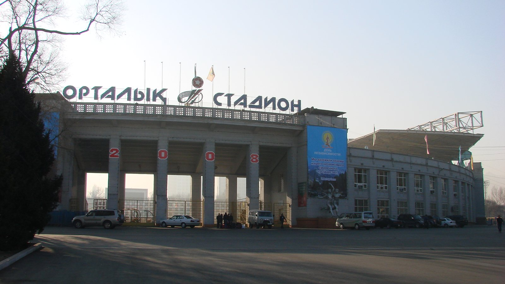

# «Кайрат» – «Омония»: ответный матч Лиги чемпионов в Алматы, алматинцам нужно отыгрывать 0:1

> **Категория:** Тренды · **Тип:** preview · **source_type:** trend

*29 июля в Алматы «Кайрат» примет кипрскую «Омонию» в ответном матче второго квалификационного раунда Лиги чемпионов. После поражения 0:1 в гостях чемпиону Казахстана нужно отыгрываться.*

---

Один из самых ожидаемых для казахстанских болельщиков вечеров этого лета: 29 июля 2026 года «Кайрат» примет никосийскую «Омонию» в ответном матче второго квалификационного раунда Лиги чемпионов. Игра пройдёт в Алматы, и алматинцам предстоит отыгрывать поражение из первого поединка.

## Что произошло в первом матче

22 июля на «ГСП Стэдиум» в Никосии «Омония» победила «Кайрат» со счётом 1:0. Как сообщают Transfermarkt и ESPN, единственный гол хозяева забили рано – на 13-й минуте отличился Панайотис Андреу. Кипрское издание Parikiaki подтверждает: «Омония» получила преимущество перед ответной встречей.

Таким образом, «Кайрату» для выхода в следующий раунд нужно побеждать в Алматы. Победа с разницей в один мяч (например, 1:0) переведёт противостояние в дополнительное время, а затем, при необходимости, в серию пенальти – напомним, правило выездного гола в еврокубках давно отменено, и значение имеет лишь итоговая разница по сумме двух матчей.

## Путь команд по квалификации

| Раунд | Матч | Итог |
|---|---|---|
| 1-й квалификационный | «Кайрат» против «Сутьески» | проход дальше |
| 2-й квалификационный (первый матч) | «Омония» – «Кайрат» | 1:0 |
| 2-й квалификационный (ответный матч) | «Кайрат» – «Омония» | 29 июля, Алматы |

Ранее, как отмечали региональные СМИ, «Кайрат» прошёл черногорскую «Сутьеску» в первом квалификационном раунде и заслуженно добрался до второй стадии отбора. Для казахстанского клуба это уже привычная еврокубковая осень – команда из Алматы регулярно доходит до поздних стадий квалификации.

## Как устроен путь наверх

Стоит напомнить, как в принципе устроена квалификация Лиги чемпионов. Чемпионы небольших ассоциаций, к которым относится и «Кайрат», стартуют с первого квалификационного раунда так называемого «чемпионского пути». Дальше их ждут второй и третий квалификационные раунды, затем – решающий раунд плей-офф. Только победители плей-офф попадают в основной, общий этап турнира, где играют сильнейшие клубы Европы.

Иными словами, «Кайрату» до заветной стадии предстоит пройти ещё несколько барьеров, и «Омония» – лишь один из них. Но именно такие двухматчевые дуэли и создают драму еврокубковой осени: цена каждого гола предельно высока, а права на ошибку у команд практически нет.

## Ставки матча

Для чемпиона Казахстана это шанс продолжить еврокубковую кампанию и приблизиться к раунду плей-офф, а в перспективе – к заветной групповой стадии (общему этапу) главного клубного турнира Европы. Цена вопроса – и спортивный престиж, и солидные призовые от УЕФА, которые критически важны для бюджета клуба.

Домашняя арена, поддержка трибун и необходимость атаковать с первых минут – всё это делает ответную встречу принципиально важной. «Омонии» же достаточно грамотно оборонять минимальное преимущество и ловить хозяев на контратаках.

## Прогноз

Учитывая счёт первого матча, «Кайрату» придётся идти вперёд большими силами, что неизбежно откроет пространство для контратак «Омонии». Ключевыми факторами станут реализация моментов и дисциплина в обороне: одна ошибка может решить судьбу всей пары. Многое будет зависеть от того, удастся ли алматинцам забить быстрый гол и завести трибуны – ранний мяч резко изменил бы психологию противостояния. Если же «Омония» проведёт первый тайм по своему сценарию и сохранит ворота на замке, отыграться «Кайрату» будет крайне тяжело. В любом случае болельщиков ждёт напряжённый вечер, где решать всё будут детали, характер и хладнокровие в ключевые моменты.

Победитель дуэли выходит в третий квалификационный раунд Лиги чемпионов. Для казахстанского футбола успех «Кайрата» стал бы важным событием и поводом для гордости всего региона.

## Почему это важно для всего региона

Для болельщиков в Казахстане и соседних странах СНГ еврокубковые матчи местных клубов – всегда особое событие. «Кайрат» на международной арене представляет не только Алматы, но и весь казахстанский футбол, а его результаты напрямую влияют на позиции страны в таблице коэффициентов УЕФА. Чем дальше проходит клуб, тем больше еврокубковых мест может получить чемпионат в будущем, а сами матчи против европейских команд – бесценный опыт для казахстанских футболистов и тренерского штаба.

Дополнительный интерес добавляет и сам соперник: «Омония» – опытный кипрский клуб с еврокубковой историей, и пройти его будет непросто. Тем ценнее станет возможный успех.

## Ключевые факторы ответного матча

На что обратить внимание перед игрой в Алматы? Во-первых, на старт: «Кайрату» жизненно важно не пропустить первым, иначе задача усложнится вдвойне. Во-вторых, на реализацию – при игре на два фронта хозяева наверняка создадут моменты, и вопрос лишь в том, сумеют ли они их использовать. В-третьих, на скамейку: свежие исполнители во втором тайме часто решают судьбу таких вязких противостояний.

Фактор своего поля и разница часовых поясов для гостей из Никосии тоже могут сыграть на руку алматинцам. Ответный матч 29 июля обещает быть нервным и открытым: «Кайрату» нужна только победа, а значит, зрителей ждёт атакующий футбол с обеих сторон. Именно за такие вечера болельщики и любят Лигу чемпионов.

**Источники:** UEFA.com, ESPN, Transfermarkt, Parikiaki.

---

**Источники (sources):**
- https://www.uefa.com/uefachampionsleague/match/2048734--kairat-almaty-vs-omonia/
- https://www.espn.com/soccer/match/_/gameId/401891862/omonia-nicosia-kairat-almaty
- https://www.transfermarkt.us/spielbericht/index/spielbericht/4897891
- https://www.parikiaki.com/2026/07/omonia-defeat-kairat-in-champions-league-qualifier/
