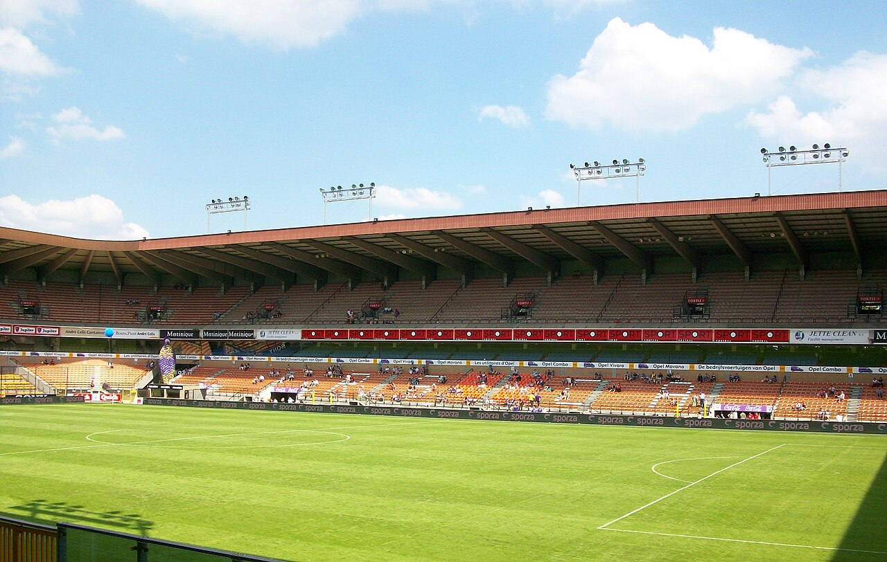

# «Кайрат» продолжит еврокубковый путь в Лиге Европы: 20 августа – первый матч плей-офф

> «Кайрат» вылетел из Лиги чемпионов, уступив софийскому «Левски», но продолжит борьбу в Лиге Европы. 20 августа алматинцы дома проведут первый матч раунда плей-офф.

- Категория: Тренды
- Тип: preview
- Источник материала: trend

**«Кайрат» продолжит еврокубковую кампанию в Лиге Европы.** Действующий чемпион Казахстана не смог пробиться дальше в Лиге чемпионов, уступив софийскому «Левски», но благодаря системе еврокубков получил вторую попытку – в раунде плей-офф Лиги Европы. Первый матч алматинцы проведут дома 20 августа.

## Как «Кайрат» покинул Лигу чемпионов

В третьем квалификационном раунде Лиги чемпионов команда Рафаэля Уразбахтина встретилась с болгарским «Левски». Первый матч в Софии 4 августа завершился поражением 0:1, а в ответной встрече 11 августа в Туркестане «Кайрат» снова уступил – 0:1. Таким образом, по сумме двух матчей болгарский клуб выиграл 2:0 и вышел в плей-офф Лиги чемпионов, где сыграет с греческим АЕК.

| Матч | Дата | Счёт |
|---|---|---|
| «Левски» – «Кайрат» (София) | 4 августа | 1:0 |
| «Кайрат» – «Левски» (Туркестан) | 11 августа | 0:1 |
| Итог по сумме | – | 0:2 |

## Соперник по плей-офф Лиги Европы

По информации казахстанских источников, в раунде плей-офф Лиги Европы «Кайрат» сыграет с победителем пары «Андерлехт» (Бельгия) – ПАОК (Греция). В первом матче этого противостояния бельгийцы добились выездной победы 1:0 в Салониках, ответная встреча прошла 13 августа.

> По данным Sports.kz и «Ферганы», «Кайрат» в раунде плей-офф Лиги Европы встретится с победителем пары «Андерлехт» – ПАОК.

## Расписание и ставки

Первый матч раунда плей-офф «Кайрат» проведёт дома 20 августа, ответная встреча запланирована на 27 августа. На кону – путёвка в общий этап Лиги Европы, что стало бы весомым достижением для казахстанского футбола и принесло бы клубу заметные премиальные и место в основной сетке престижного турнира.

| Матч | Дата | Место |
|---|---|---|
| «Кайрат» – соперник (первый матч) | 20 августа | Казахстан |
| Соперник – «Кайрат» (ответный матч) | 27 августа | в гостях |

## Историческая планка

В прошлом сезоне «Кайрат» впервые в своей истории пробился в групповую стадию Лиги чемпионов – это стало настоящим прорывом для клуба и всего казахстанского футбола. Повторить громкий успех и снова выйти в элитный турнир в этот раз не удалось. Тем не менее выход в основной раунд Лиги Европы остаётся вполне реальной и важной целью: он позволит команде провести серию матчей с сильными европейскими соперниками и сохранить международную практику.

## Чего ждать от матча

Домашняя игра 20 августа обещает собрать полные трибуны – еврокубковые вечера в Казахстане неизменно вызывают большой интерес. Для «Кайрата» принципиально важно взять запас перед выездом, ведь соперник – опытный клуб из сильного чемпионата. Многое будет зависеть от реализации моментов и надёжности обороны: в двух матчах с «Левски» алматинцы пропустили дважды и не сумели забить, поэтому вопрос результативности впереди становится ключевым.

Букмекеры и эксперты наверняка отдадут небольшое предпочтение европейскому сопернику, однако фактор своего поля и поддержка трибун способны уравнять шансы. Для казахстанских болельщиков этот матч – одно из главных футбольных событий августа.

Источники: «Фергана», Sports.kz, Vesti.kz.

Источники (URL):
- https://fergana.agency/news/148582/
- https://www.sports.kz/news/s-kem-syigraet-kayrat-v-pley-off-evrokubkov
- https://vesti.kz/league/kayrata-opredelilis-paryi-raunda-pley-off-ligi-chempionov-386307
