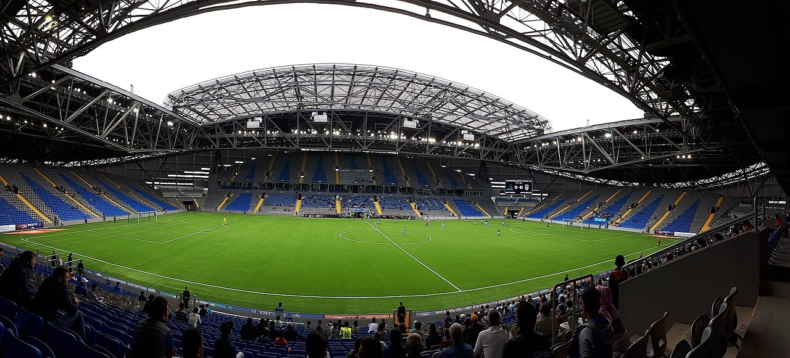

# Сборная Казахстана стартует в Лиге наций УЕФА: соперники и путь к Евро-2028

> В сентябре сборная Казахстана стартует в новом розыгрыше Лиги наций УЕФА. Разбираем соперников по группе, обновлённый формат и путь команды к отбору на Евро-2028.

- Категория: Сборные
- Тип: preview
- Источник материала: trend

**Сборная Казахстана в сентябре 2026 года стартует в Лиге наций УЕФА** – турнире, который теперь напрямую связан с отбором на чемпионат Европы 2028 года. Для команды это первый экзамен нового сезона и старт длинного пути к возможному попаданию на Евро.

## Группа и соперники

По итогам жеребьёвки Казахстан попал в группу 3 Лиги C. Соперниками команды стали сборные Словакии, Фарерских островов и Молдовы. Матчи группового этапа начнутся в сентябре 2026 года.

| Сборная | Дивизион |
|---|---|
| Словакия | Лига C, группа 3 |
| Казахстан | Лига C, группа 3 |
| Фарерские острова | Лига C, группа 3 |
| Молдова | Лига C, группа 3 |

## Новый формат отбора

Ключевое нововведение – УЕФА объединил Лигу наций и квалификацию Евро-2028 в единую систему. По информации Sports.kz, сборные разделены на условные «высшую» и «низшую» лиги, и от результатов в Лиге наций напрямую зависит путь команды к финальному турниру.

> По данным Sports.kz, УЕФА полностью объединил Лигу наций и отборочный турнир Евро-2028 в одну систему для 55 сборных.

Для Казахстана это означает, что каждый матч Лиги наций приобретает повышенное значение: именно место в группе определит, через какую систему стыковых матчей команда сможет побороться за путёвку на Евро-2028. Ошибки в, казалось бы, проходных встречах могут дорого обойтись уже на дистанции отбора.

## Расклад в группе

Соперники по группе – не самые именитые, но и не проходные. Словакия – наиболее статусный оппонент, регулярно попадающий на крупные турниры, тогда как матчи с Фарерскими островами и Молдовой можно рассматривать как принципиальные для набора очков. Именно очные встречи с прямыми конкурентами за место в таблице способны определить итоговую позицию Казахстана.

Чтобы сохранить шансы на высокие места и последующие стыковые матчи, сборной важно уверенно пройти групповой этап и не терять очки в домашних играх. В подобных группах, где команды близки по уровню, решающими часто становятся детали: реализация моментов, игровая дисциплина и надёжность обороны.

## Фактор своего поля

Домашние матчи на «Астана Арене» традиционно собирают большую аудиторию, и поддержка трибун может стать важным фактором в очных дуэлях с соперниками по группе. Для казахстанского футбола новый формат Лиги наций – это одновременно вызов и дополнительный шанс: система стыковых матчей теоретически оставляет дверь к Евро приоткрытой даже для команд из нижних дивизионов.

## Чего ждать

Старт в сентябре покажет, в какой форме команда подходит к новому циклу и насколько она готова бороться за первое место в группе. Для болельщиков в Казахстане это долгожданное возвращение большого футбола после летней паузы и начало нового этапа в истории национальной команды.

Источники: Sports.kz, Zakon.kz.

Источники (URL):
- https://www.sports.kz/news/uefa-utverdil-novuyu-sistemu-otbora-na-evro-i-kak-eto-povliyaet-na-kazahstan
- https://www.zakon.kz/sport/6518705-sbornaya-kazakhstana-uznala-novovvedeniya-v-otbore-na-evro2028-i-lige-natsiy.html
