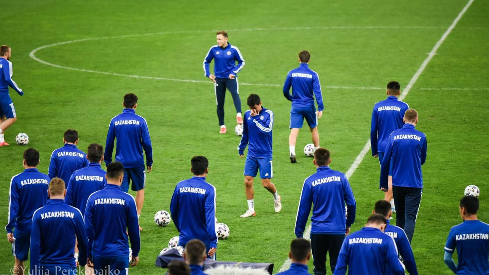

# Сборная Казахстана опустилась на 111-е место в обновлённом рейтинге ФИФА

_После июньских товарищеских матчей сборная Казахстана потеряла позицию в обновлённом рейтинге ФИФА и опустилась на 111-ю строчку. Команда Талгата Байсуфьянова уступила Венгрии и сыграла вничью с Арменией._

**type:** transfer | **category:** Сборные | **source_type:** trend | **db_slug:** kazakhstan-fifa-ranking-111-june-2026

Сборная Казахстана по футболу опустилась на 111-е место в обновлённом рейтинге ФИФА. Как сообщает Vesti.kz, по итогам июньского пересчёта национальная команда потеряла одну позицию в мировой классификации.

В свежей версии рейтинга, опубликованной 11 июня 2026 года, Казахстан расположился между Ливией (110-е место) и Танзанией (112-е). Снижение в таблице стало следствием невыразительных результатов в июньских товарищеских матчах, которые команда проводила в рамках подготовки к будущим турнирам.

## Что предшествовало

Подопечные Талгата Байсуфьянова провели два контрольных матча на выезде. 6 июня казахстанцы сыграли вничью со сборной Армении – 0:0. А 9 июня в Дебрецене команда уступила сборной Венгрии со счётом 1:3 – этот результат подтверждает «Чемпионат». Венгрия по ходу встречи действовала острее и реализовала своё преимущество, тогда как казахстанцам не хватило надёжности в обороне.

> По информации Vesti.kz со ссылкой на обновлённый рейтинг ФИФА от 11 июня 2026 года.

## Почему это важно

Сборная Казахстана не пробилась на чемпионат мира 2026 года, поэтому июньские игры носили для команды тренировочный характер и были направлены на наигрывание состава и просмотр исполнителей. Тем не менее позиция в рейтинге ФИФА напрямую влияет на корзины при жеребьёвках и посев в будущих отборочных циклах. Чем ниже команда опускается, тем выше риск попасть на сильных соперников уже на ранних стадиях квалификации, поэтому потеря даже одной строчки – неприятный сигнал перед следующими официальными турнирами.

Июньские спарринги с Арменией и Венгрией стали для тренерского штаба возможностью оценить ближайший резерв и проверить новые сочетания в обороне и центре поля. Однако результаты показали, что команде ещё предстоит большая работа: при равной игре с Арменией казахстанцы не сумели огорчить соперника, а более классная Венгрия наказала за ошибки в защите.

Болельщикам остаётся надеяться, что осенние матчи позволят команде Талгата Байсуфьянова отыграть утраченные позиции и подойти к новому отборочному циклу в более выгодном положении. Стабильность результатов и постепенное омоложение состава остаются ключевыми задачами для национальной команды на ближайшую перспективу.

Источники: Vesti.kz, «Чемпионат» (championat.com).

